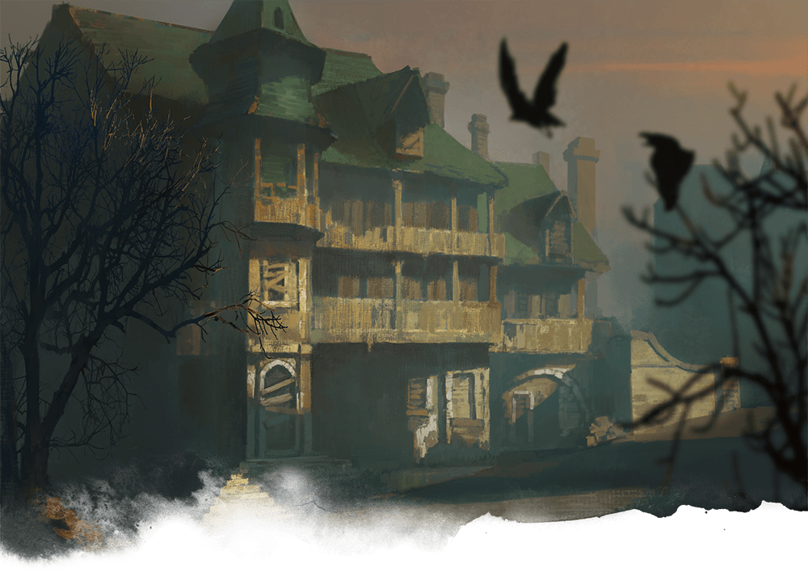

# Chapter 2: Trollskull Alley

Trollskull Alley is filled with people who can shape the characters’ day-to-day lives in Waterdeep. The characters will likely return to Trollskull Alley many times during the adventure and get to know their neighbors as time passes.

The locations described below are keyed to the map of Trollskull Alley (map 2.1). Buildings not specifically identified on the map are rowhouses that serve as private residences for upper-middle class Waterdavians who can afford housekeepers, groundskeepers, and nannies.

## Areas in the Alley

[View Player Version](./images/map-03.01-trollskull-alley.jpg)

### T1. Trollskull Manor

See [appendix C](./Handouts.md#trollskull-manor-and-tavern) for a handout showing the floor plan of this building. Give a copy of this handout to your players as their characters begin to explore Trollskull Manor.

Four stories tall and boasting balconies, a turret, and five chimneys, the abandoned building is one of the grandest in Trollskull Alley. Characters can refurnish, rebuild, rename, and otherwise personalize their new stronghold to their hearts’ content.

#### Tavern Rooms

When the characters first arrive, the tavern’s taproom is filled with broken furniture, tarnished silverware, casks of wine that have turned to vinegar, and worthless detritus. The tavern’s other rooms are all empty, except for cobwebs, dust, and harmless rats.

#### Spirit on Tap

The former tavern is haunted by the poltergeist ([specter](https://www.dndbeyond.com/monsters/17017-specter)) of the tavern’s previous barkeeper, a half-elf named Lif. Maintaining the tavern was his life’s work, and he couldn’t abandon the place in death.

The poltergeist understands Common and Elvish, but it can’t speak. It invisibly causes mischief at the expense of the new owners by smashing plates, breaking beer barrels, and so forth. If the characters don’t take the hint, it writes not-so-subtle warnings (such as “Closing time!” and “Last call!”) on dusty floors and grimy windows. To truly claim the tavern as their own, the characters must either appease the poltergeist or destroy it.

**Appeasing Lif.** If the characters work to repair and renovate the tavern with the goal of opening it to the public again, the poltergeist begins to accept them as the new owners and gradually becomes quite accommodating: pulling out a chair when a character wants to sit down, pouring a beer and delivering it to a character, taking coats when folks come in from the rain, and so forth. Once the business is up and running, Lif can also perform other helpful functions, such as locking doors, sweeping floors, and so forth.

**Destroying Lif.** Lif’s poltergeist is destroyed if its hit points are reduced to 0. If attacked, it flees to the uppermost level of the turret when reduced to half its hit points. From there it fights to the bitter end.

### T2. The Bent Nail

A small wooden sign above this shop’s main door is bare except for a large, bent nail sticking out of it. The front room contains displays of ornate wooden furniture, as well as a selection of bows and crossbows. The wall behind the counter is lined with rows of finely carved wooden canes, quarterstaffs, and shields.

[Talisolvanar “Tally” Fellbranch](https://www.dndbeyond.com/monsters/280309-talisolvanar-tally-fellbranch), the owner and chief artisan of the Bent Nail, is a male half-elf carpenter and woodcarver. He is a [commoner](https://www.dndbeyond.com/monsters/16829-commoner), with these changes:

*   Tally is chaotic good.
*   He has these racial traits: He has advantage on saving throws against being [charmed](https://www.dndbeyond.com/sources/dnd/free-rules/rules-glossary#CharmedCondition), and magic can’t put him to sleep. He has [darkvision](https://www.dndbeyond.com/sources/dnd/free-rules/rules-glossary#Darkvision) out to a range of 60 feet. He speaks Common and Elvish.

#### Services

Tally sells wooden weapons and shields at normal cost. He also crafts and sells furniture and wood sculptures.

### T3. Steam and Steel

During daylight hours, smoke and steam billow from the many windows around this indoor forge where metal weapons, armor, and tools are made. The forge is owned and operated by a married couple: a fire genasi named Embric and a water genasi named Avi. Both are members of the Most Careful Order of Skilled Smiths and Metalforgers. As an armorer, Avi also belongs to the Splendid Order of Armorers, Locksmiths, and Finesmiths.

[Embric](https://www.dndbeyond.com/monsters/280311-embric) tends the forge and is an expert weaponsmith. He claims descent from the efreet of Calimshan and is prone to extreme mood swings. He has the statistics of a [bandit captain](https://www.dndbeyond.com/monsters/16799-bandit-captain), with these changes:

*   Embric is neutral good.
*   He has these racial traits: He can cast [*produce flame*](https://www.dndbeyond.com/spells/2217-produce-flame) at will. (Constitution is his spellcasting ability, and he has a +4 bonus to hit with spell attacks.) He has [darkvision](https://www.dndbeyond.com/sources/dnd/free-rules/rules-glossary#Darkvision) out to a range of 60 feet and resistance to fire damage. He speaks Common and Primordial.

[Avi](https://www.dndbeyond.com/monsters/280314-avi) worships Eldath, god of peace, and uses his magic to quench hot steel. He is an expert armorsmith. Avi is laid back and speaks plainly. He has the statistics of a [priest](https://www.dndbeyond.com/monsters/16985-priest), with these changes:

*   Avi is neutral good.
*   He has these racial traits: At will, he can control the flow and shape of water in a 5-foot cube, or cause the water to freeze for up to 1 hour. He has a swimming speed of 30 feet, and he can breathe air and water. He has resistance to acid damage. He speaks Common and Primordial.

#### Services

The genasi couple sells all metal weapons, armor, and shields listed in [chapter 5](https://www.dndbeyond.com/compendium/rules/phb/equipment#ArmorandShields) of the [*Player’s Handbook*](https://www.dndbeyond.com/compendium/rules/phb) at normal cost.

### T4. Corellon’s Crown

[Fala Lefaliir](https://www.dndbeyond.com/monsters/280317-fala-lefaliir), an herbalist and a member of the Guild of Apothecaries and Physicians, operates out of this stately, three-story town house, the third floor of which has been converted into a greenhouse. Its translucent glass walls allow anyone on the street to see the rainbow of flowers blossoming within.

Fala Lefaliir is an outgoing wood elf with long, braided hair. Like the elven god Corellon Larethian, Fala is neither male nor female. If referred to as “he” or “she,” Fala gently requests to be addressed by name or as “they.” Fala is friends with a member of the Zhentarim named [Ziraj](https://www.dndbeyond.com/monsters/149873-ziraj-the-hunter), who saved Fala’s life. He visits Fala from time to time, and Fala has set aside a room for him on the second floor.

Fala is a [druid](https://www.dndbeyond.com/monsters/16848-druid), with these changes:

*   Fala is chaotic good.
*   Fala has these racial traits: Fala has advantage on saving throws against being [charmed](https://www.dndbeyond.com/sources/dnd/free-rules/rules-glossary#CharmedCondition), and magic can’t put Fala to sleep. Fala has a walking speed of 35 feet and [darkvision](https://www.dndbeyond.com/sources/dnd/free-rules/rules-glossary#Darkvision) out to a range of 60 feet. Fala speaks Common, Druidic, and Elvish.

#### Services

In addition to nonmagical herbal remedies, Fala sells potions of the types listed in the Fala’s Potions table. Fala keeps 1d6 vials of each potion in locked cabinets behind the shop counter.

**Fala’s Potions**

|Potion|Cost|
|-|-|
|[*Potion of animal friendship*](https://www.dndbeyond.com/magic-items/4700-potion-of-animal-friendship)|125 gp|
|[*Potion of climbing*](https://www.dndbeyond.com/magic-items/4702-potion-of-climbing)|50 gp|
|[*Potion of healing, greater*](https://www.dndbeyond.com/magic-items/5133-potion-of-healing-greater)|250 gp|
|[*Potion of healing*](https://www.dndbeyond.com/magic-items/8960641-potion-of-healing)|50 gp|
|[*Potion of water breathing*](https://www.dndbeyond.com/magic-items/4715-potion-of-water-breathing)|250 gp|

### T5. Tiger’s Eye

This private detective’s business is unremarkable on the outside, its only distinguishing mark an orange-and-black sign featuring a cat’s eyes. Inside is a regal apartment dimly lit by flickering oil lamps. The door is locked, and visitors must knock or ring the bell before being let in.

They are met by Vincent Trench, a human detective and the owner of the Tiger’s Eye. He speaks concisely, dresses in a sharp suit, and smokes a slim pipe. Vincent is in fact a [rakshasa](https://www.dndbeyond.com/monsters/16990-rakshasa) named Valantajar that always casts [*disguise self*](https://www.dndbeyond.com/spells/2069-disguise-self) on itself before seeing visitors. The rakshasa has lived in Waterdeep for years, switching identities as often as needed to keep its true nature hiden. It has grown accustomed to living among mortals and, much to its own astonishment, is rather fond of Waterdeep and its citizens.

#### Services

Trench can discover any secret in Waterdeep, for a fee. Use your judgment when pricing its services; 50 gp is sufficient for most investigations, but if the characters want to learn secrets relating to the major antagonists of this adventure, the rakshasa might require a service in payment, such as slaying enemies that are hunting it, posting advertisements for its business in their tavern, or keeping tabs on someone Vincent has been hired to spy on.

### T6. Book Wyrm’s Treasure

The front of this bookstore is adorned with a charming sign of a gold dragon curled around a treasure hoard of books and scrolls. Inside, the shop is decorated with beautiful hardwood, and the earthy scent of old books permeates the air. The library fills two floors of this three-story building, and it somehow seems to contain more shelves than the building should be able to hold.

The shop is managed by a short dragonborn of gold dragon ancestry named Rishaal the Page-Turner, who lives on the third floor. [Rishaal](https://www.dndbeyond.com/monsters/280320-rishaal), a member of the Watchful Order of Magists and Protectors, is a [mage](https://www.dndbeyond.com/monsters/16947-mage), with these changes:

*   Rishaal is neutral.
*   He has these racial traits: He can use his action to exhale a 15-foot cone of fire (but can’t do this again until he finishes a short or long rest); each creature in the cone must make a DC 10 Dexterity saving throw, taking 2d6 fire damage on a failed save, or half as much damage on a successful one. He has resistance to fire damage. He speaks Common, Draconic, Dwarvish, and Elvish.

#### Services

The shop contains books of all sorts. In addition, Rishaal has a small collection of spellbooks and allows wizards to copy spells from them at the cost listed in the Spells for Sale table. He can scribe any of these spells as a [*spell scroll*](https://www.dndbeyond.com/magic-items/5418-spell-scroll) but charges twice the listed cost for this service.

**Spells for Sale**

|Spell|Cost per Spell|
|-|-|
|[*Comprehend languages*](https://www.dndbeyond.com/spells/2035-comprehend-languages) , [*detect magic*](https://www.dndbeyond.com/spells/2065-detect-magic) , [*feather fall*](https://www.dndbeyond.com/spells/2095-feather-fall) , [*find familiar*](https://www.dndbeyond.com/spells/2097-find-familiar) , [*mage armor*](https://www.dndbeyond.com/spells/2172-mage-armor) , [*magic missile*](https://www.dndbeyond.com/spells/2176-magic-missile) , [*shield*](https://www.dndbeyond.com/spells/2247-shield) , [*unseen servant*](https://www.dndbeyond.com/spells/2288-unseen-servant)|25 gp|
|[*Arcane lock*](https://www.dndbeyond.com/spells/2003-arcane-lock) , [*continual flame*](https://www.dndbeyond.com/spells/2048-continual-flame) , [*darkvision*](https://www.dndbeyond.com/spells/2059-darkvision) , [*invisibility*](https://www.dndbeyond.com/spells/2159-invisibility) , [*magic weapon*](https://www.dndbeyond.com/spells/2178-magic-weapon) , [*misty step*](https://www.dndbeyond.com/spells/2195-misty-step) , [*rope trick*](https://www.dndbeyond.com/spells/2235-rope-trick) , [*suggestion*](https://www.dndbeyond.com/spells/2269-suggestion)|75 gp|
|[*Clairvoyance*](https://www.dndbeyond.com/spells/2028-clairvoyance) , [*counterspell*](https://www.dndbeyond.com/spells/2051-counterspell) , [*dispel magic*](https://www.dndbeyond.com/spells/2072-dispel-magic) , [*fireball*](https://www.dndbeyond.com/spells/2102-fireball) , [*fly*](https://www.dndbeyond.com/spells/2111-fly) , [*nondetection*](https://www.dndbeyond.com/spells/2199-nondetection) , [*water breathing*](https://www.dndbeyond.com/spells/2297-water-breathing)|150 gp|
|[*Arcane eye*](https://www.dndbeyond.com/spells/2001-arcane-eye) , [*fabricate*](https://www.dndbeyond.com/spells/2090-fabricate) , [*greater invisibility*](https://www.dndbeyond.com/spells/2128-greater-invisibility) , [*ice storm*](https://www.dndbeyond.com/spells/2151-ice-storm) , [*locate creature*](https://www.dndbeyond.com/spells/2169-locate-creature) , [*polymorph*](https://www.dndbeyond.com/spells/2209-polymorph)|300 gp|
|[*Bigby’s hand*](https://www.dndbeyond.com/spells/2352-bigbys-hand) , [*cone of cold*](https://www.dndbeyond.com/spells/2037-cone-of-cold) , [*modify memory*](https://www.dndbeyond.com/spells/2196-modify-memory)|750 gp|

### T7. Sewer Access

At the east end of Trollskull Alley is a removable metal grate that covers an opening. Below the grate, a ladder descends 20 feet into the Waterdeep sewer system.

## Joining Factions

Word begins to spread throughout Waterdeep that a group of adventurers helped Volothamp Geddarm and rescued Renaer Neverember. Within days, faction representatives begin to approach the characters and try to recruit them. This book’s introduction describes the various factions and what they look for in recruits. The characters need not all join the same faction, and some might not want to join a faction at all.

A character who belongs to a faction is given a mission upon gaining a level, from 2nd through 5th level. Completing the mission increases that member’s renown in the faction. Other characters who aren’t faction members can assist in the mission’s completion. A character who belongs to a faction other than the Lords’ Alliance can turn down a mission without consequence.

Each faction has a representative who serves as its primary contact. This NPC delivers mission briefings and dispenses the tangible rewards for completing a mission. An increase in renown quickly follows. The missions and the manner in which they can be completed are described in the tables throughout this section. You can use missions from these tables or replace any of them with ones of your own creation.

If a mission ends in failure, the characters can try again after 24 hours, unless the failure has created circumstances where doing so is impossible.

### Bregan D’aerthe

If one or more characters are drow, Jarlaxle Baenre has his lieutenants, three [drow gunslingers](./Monsters-and-NPCs.md#drow-gunslinger), shadow these potential new recruits while keeping a safe distance. Fel’rekt Lafeen and Krebbyg Masq’il’yr watch the characters at night, and Soluun Xibrindas watches them during the day (doing his best to stay out of the sunlight). See [appendix B](./Monsters-and-NPCs.md#felrekt-lafeen) for details on these lieutenants.

Characters who have a passive Wisdom ([Perception](https://www.dndbeyond.com/sources/dnd/free-rules/playing-the-game#Skills)) score of 18 or higher see fleeting glimpses of the drow spies over a period of several days and can, with a successful DC 15 Wisdom ([Insight](https://www.dndbeyond.com/sources/dnd/free-rules/playing-the-game#Skills)) check, ascertain that these spies are paying particular attention to the activities of the drow party members.

#### Jarlaxle Baenre

If the party reports the drow to the City Watch, Jarlaxle ends the surveillance and breaks off all contact with the characters for the time being.

On the other hand, if the characters try to confront the drow spies, they avoid contact but leave behind a black eye patch as a calling card. The next day, [**Jarlaxle Baenre**](https://www.dndbeyond.com/monsters/149550-jarlaxle-baenre) (see [appendix B](./Monsters-and-NPCs.md#jarlaxle-baenre)) shows up at the party’s headquarters, using his [*hat of disguise*](https://www.dndbeyond.com/magic-items/4651-hat-of-disguise) to appear as a haberdasher named J.B. Nevercott. In this guise, he asks to speak privately with drow characters who he thinks might make suitable Bregan D’aerthe recruits. Only drow are given serious consideration, but Jarlaxle doesn’t care if they’re male or female. As a test, he offers them their first mission.

Jarlaxle is a consummate actor who never lets down his guard. Even if the characters discern his true identity, he never admits to being anything other than what he pretends to be.

#### Bregan D’aerthe Missions

|Party Level|Mission Brief|Mission Requirements and Reward|
|-|-|-|
|2nd|“I’d like you to steal a silk handkerchief from a Waterdavian noble and give it to a tiefling girl who lives in a crate at the corner of Net Street and Dock Street, by the wharf.”|Finding a noble isn’t hard, but snatching one’s handkerchief without being detected requires a successful DC 12 Dexterity ([Sleight of Hand](https://www.dndbeyond.com/sources/dnd/free-rules/playing-the-game#Skills)) check. One can also convince a noble to surrender it with a successful DC 12 Charisma ([Deception](https://www.dndbeyond.com/sources/dnd/free-rules/playing-the-game#Skills), [Intimidation](https://www.dndbeyond.com/sources/dnd/free-rules/playing-the-game#Skills), or [Persuasion](https://www.dndbeyond.com/sources/dnd/free-rules/playing-the-game#Skills)) check. The tiefling girl in the crate thanks the characters for the hanky. *Reward:* Each Bregan D’aerthe character gains 1 renown.|
|3rd|“This mission is so easy, a gang of street urchins could pull it off. I want you to deliver an exposé to Gaxly Rudderbust, the publisher of a local broadsheet called *The Waterdeep Wazoo* , without his knowing who wrote it or where it came from. You’ll find his office at the corner of Immar Street and Stallion Street, in the North Ward. Leave the story on his desk.”|Jarlaxle has written an exposé on devil worship among unnamed Waterdavian noble families. The story mentions orgies and secret deals happening behind closed doors. (Jarlaxle never passes up a chance to rattle the nobility and sow political unrest.) A character can break into Gaxly’s office while it’s closed, either during lunch hour or after hours. Getting in and out without being seen requires two successful DC 15 Dexterity ([Stealth](https://www.dndbeyond.com/sources/dnd/free-rules/playing-the-game#Skills)) checks, and getting past a locked door requires a successful DC 10 Dexterity check using thieves’ tools (or a [*knock*](https://www.dndbeyond.com/spells/2162-knock) spell or similar magic). *Reward:* Each Bregan D’aerthe character gains 1 renown.|
|4th|“We’ve captured a member of the Xanathar Guild, and I’d like you to guard him for three nights until I or another member of Bregan D’aerthe reclaims him. You’ll find him trapped in your basement.”|Characters who search the basement of their Trollskull Alley tavern find Ott Steeltoes (see [appendix B](./Monsters-and-NPCs.md#ott-steeltoes)) bound by [*iron bands of Bilarro*](https://www.dndbeyond.com/magic-items/5354-iron-bands-of-bilarro) . How he got there is anyone’s guess; even he doesn’t know. On the first night, Xanathar sends a gang of six [bugbears](https://www.dndbeyond.com/monsters/16817-bugbear) to attack the tavern and rescue Ott. If the characters have moved Ott elsewhere, the bugbears attack the tavern anyway. On the second night, four members of the Dungsweepers’ Guild ([commoners](https://www.dndbeyond.com/monsters/16829-commoner)) with [intellect devourers](https://www.dndbeyond.com/monsters/17163-intellect-devourer) in their skulls visit the tavern. They order drinks and scope out the tavern, attacking if they find Ott or leaving if they don’t. On the third night, a [beholder zombie](https://www.dndbeyond.com/monsters/17111-beholder-zombie) attacks. After the third attack, Ott disappears as mysteriously as he arrived, along with the [*iron bands of Bilarro*](https://www.dndbeyond.com/magic-items/5354-iron-bands-of-bilarro) . *Reward:* Each Bregan D’aerthe character gains 2 renown.|
|5th|“We have a spy deep within Xanathar’s organization, but I fear he has been compromised. It breaks my heart to do this, but I’m sending you to eliminate him. Make it quick and painless, and for Lolth’s sake, be discreet.”|Jarlaxle identifies the traitor as a drow mage named Nar’l Xibrindas (see [appendix B](./Monsters-and-NPCs.md#narl-xibrindas)) and furnishes the characters with a route to Xanathar’s lair through underground passageways. (Xanathar’s lair is described in [chapter 5](./05.Spring-Madness.md#xanathars-lair). Characters who follow Jarlaxle’s route arrive at [area X1](./05.Spring-Madness.md#x1-staircase-of-eyes).) *Reward:* Each Bregan D’aerthe character gains 2 renown. Each party member who contributes to the mission receives a trophy bearing a gold statuette of Jarlaxle (worth 250 gp).|

### Emerald Enclave

The Emerald Enclave takes an interest in characters who seek to preserve the balance within Waterdeep (particularly clerics of nature, druids, and rangers). Any such character is visited by a white cat that speaks the following message in a melodious male voice:

> “Interested in joining the Emerald Enclave? Come meet us at Phaulkonmere in the Southern Ward.”

The cat is an ordinary animal upon which an [*animal messenger*](https://www.dndbeyond.com/spells/1994-animal-messenger) spell was cast. It dashes away after delivering its invitation.

#### Melannor Fellbranch

The characters’ main contact in the Emerald Enclave is Melannor Fellbranch, the friendly but humorless groundskeeper of Phaulkonmere, a compound located one block south of Kolat Towers (see [chapter 8](./08.Winter-Wizardry.md#kolat-towers)). Phaulkonmere is owned by the Tarm and Phaulkon noble families. Melannor delivers missions by way of [*animal messenger*](https://www.dndbeyond.com/spells/1994-animal-messenger) spells and is partial to using cats and pigeons as couriers. He quickly assigns new members their first mission.

Melannor is a half-elf [druid](https://www.dndbeyond.com/monsters/16848-druid), with these changes:

*   Melannor is chaotic good.
*   He has these racial traits: He has advantage on saving throws against being [charmed](https://www.dndbeyond.com/sources/dnd/free-rules/rules-glossary#CharmedCondition), and magic can’t put him to sleep. He has [darkvision](https://www.dndbeyond.com/sources/dnd/free-rules/rules-glossary#Darkvision) out to a range of 60 feet. He speaks Common and Elvish.

#### Jeryth Phaulkon

When the characters arrive at Phaulkonmere for the first time, Melannor introduces them to the lady of the estate: a noblewoman-turned-demigod and Chosen of Mielikki named Jeryth Phaulkon. Jeryth, the only member of her family who currently resides at Phaulkonmere, manifests as a disembodied female voice that can be heard by anyone in the villa gardens. She offers membership in the enclave and bestows on each new member a *charm of restoration* (see “[Supernatural Gifts](https://www.dndbeyond.com/compendium/rules/dmg/other-rewards#SupernaturalGifts)” in chapter 7 of the [*Dungeon Master’s Guide*](https://www.dndbeyond.com/compendium/rules/dmg)). Jeryth also offers Phaulkonmere as a safe haven for enclave members and their friends.

In her disembodied state, Jeryth can’t be harmed. If the need arises, Jeryth can cast any spell on the druid spell list. She uses her spells in defense of her estate and its beautiful gardens. A member of the Emerald Enclave can petition Jeryth to cast a spell, which she is happy to do if that character’s renown in the enclave equals or exceeds the spell’s level.

#### Emerald Enclave Missions

|Party Level|Mission Brief|Mission Requirements and Reward|
|-|-|-|
|2nd|“Outlying farms are being terrorized by a scarecrow come to life. It has slaughtered livestock, chased horses, and spooked farmers. No people have been killed as yet, so the City Guard is dragging its heels. Something must be done!”|Not one but three [scarecrows](https://www.dndbeyond.com/monsters/17200-scarecrow) are terrorizing Undercliff. One wears a sackcloth hood, another has a rotting pumpkin head, and the third is covered with a threadbare blanket. Characters who camp in a field for the better part of a day or night have a 10 percent chance of encountering one of the scarecrows. The attacks continue until all three scarecrows are destroyed. *Reward:* Each Emerald Enclave character gains 1 renown for ending the threat.|
|3rd|“Sir Ambrose Everdawn, a grizzled old champion of Kelemvor, has offered to help the City Guard catch a necromancer who’s stealing bones from the City of the Dead and animating them as skeletons. Sir Ambrose could use your help, if you’re not too busy.”|Convincing Ambrose Everdawn (LG male human Tethyrian [knight](https://www.dndbeyond.com/monsters/16938-knight)) that the party intends to help requires a successful DC 13 Charisma ([Persuasion](https://www.dndbeyond.com/sources/dnd/free-rules/playing-the-game#Skills)) check. If the check succeeds, Sir Ambrose asks the party to patrol the southern half of the cemetery for ten consecutive nights while he patrols the north half. The characters have a cumulative 10 percent chance each night of encountering six [skeletons](https://www.dndbeyond.com/monsters/17015-skeleton), but there’s no sign of the necromancer who animated them. Once the skeletons are destroyed, no further encounters occur. After a tenday, Sir Ambrose releases the characters from service. *Reward:* Each Emerald Enclave character gains 1 renown. Each party member who patrolled the cemetery for all ten nights receives 100 gp.|
|4th|“Doppelgangers threaten the balance of power in Waterdeep. Rumor has it a group of them are hiding in the Yawning Portal. Root them out and rid the city of them if you can.”|The characters need to confront “Bonnie” the [doppelganger](https://www.dndbeyond.com/monsters/16843-doppelganger) and, with a successful DC 15 Charisma ([Intimidation](https://www.dndbeyond.com/sources/dnd/free-rules/playing-the-game#Skills) or [Persuasion](https://www.dndbeyond.com/sources/dnd/free-rules/playing-the-game#Skills)) check, convince her to leave Waterdeep and take her gang with her. *Reward:* Each Emerald Enclave character gains 2 renown.|
|5th|“The Xanathar Guild is releasing monsters to distract the City Watch and the City Guard while its members stir up trouble elsewhere. The authorities are having trouble catching and killing a flying horror known as a grell. This aberration was latest seen snatching up an old woman in the Dock Ward. Unless we intervene, she won’t be the last.”|Locating the grell requires a successful DC 18 Intelligence ([Investigation](https://www.dndbeyond.com/sources/dnd/free-rules/playing-the-game#Skills)) check followed by a successful DC 18 Wisdom ([Survival](https://www.dndbeyond.com/sources/dnd/free-rules/playing-the-game#Skills)) check. Each check, whether successful or not, represents 1 hour of gathering information or tracking spoor. In fact, there are two [grells](https://www.dndbeyond.com/monsters/17157-grell). One grell tries to flee if the other is killed. *Reward:* Each Emerald Enclave character gains 2 renown. Jeryth bestows a *charm of heroism* (see “[Supernatural Gifts](https://www.dndbeyond.com/compendium/rules/dmg/other-rewards#SupernaturalGifts)” in chapter 7 of the [*Dungeon Master’s Guide*](https://www.dndbeyond.com/compendium/rules/dmg)) on each party member who helped slay the grells.|

### Force Grey (Gray Hands)

The Blackstaff, [Vajra Safahr](https://www.dndbeyond.com/monsters/149116-vajra-safahr) (see [appendix B](./Monsters-and-NPCs.md#vajra-safahr)), is friends with Renaer Neverember, and word of his rescue quickly reaches her ears. She uses a [*sending*](https://www.dndbeyond.com/spells/2243-sending) spell to deliver the following short message to one of the characters:

> “I am Vajra Safahr, the Blackstaff. Come to Blackstaff Tower in the Castle Ward at once. Bring your friends.”

Despite her insistent tone, Vajra doesn’t take offense if the character refuses her invitation. A day later, she casts another [*sending*](https://www.dndbeyond.com/spells/2243-sending) spell and reaches out to a different party member. If she is refused a second time, she doesn’t contact the party again until the characters gain a level.

#### Vajra Safahr

Blackstaff Tower is a fortress and a wizard training academy all in one. From here, Vajra Safahr watches over the city and asserts herself as Blackstaff. [*Sending*](https://www.dndbeyond.com/spells/2243-sending) spells are her preferred way of communicating with her operatives.

Vajra offers the characters membership in the Gray Hands, a private security force under her command. She doles out missions designed to tax the characters’ resources and test their loyalty to Waterdeep. Characters who complete these missions won’t gain enough renown to join Force Grey yet, but they will gain something valuable: the Blackstaff’s patronage. Vajra continues to take an interest in their adventuring careers, helping out when she can.

#### Force Grey (Gray Hands) Missions

|Party Level|Mission Brief|Mission Requirements and Reward|
|-|-|-|
|2nd|“Seek out Hlam, a monk who lives in a cave on the side of Mount Waterdeep. Ask him what he’s heard about threats to the city, but try not to annoy him or overstay your welcome.”|Those who climb the mountainside to reach the cave must succeed on a DC 12 Constitution saving throw or arrive with 1d4 levels of [exhaustion](https://www.dndbeyond.com/sources/dnd/free-rules/rules-glossary#ExhaustionCondition). Trying to get [Hlam](https://www.dndbeyond.com/monsters/149786-hlam) (see [appendix B](./Monsters-and-NPCs.md#hlam)) to share information requires a DC 12 Charisma ([Persuasion](https://www.dndbeyond.com/sources/dnd/free-rules/playing-the-game#Skills)) check. If the check succeeds, he tells the characters, “Evil’s twin hides its face for now. Expect that to change before winter’s end.” (This is an oblique reference to Manshoon.) The characters can descend the mountain safely. *Reward:* Each Gray Hand character gains 1 renown.|
|3rd|“A young bronze dragon has taken up residence in Deepwater Harbor. It startled a few sailors recently but hasn’t hurt anyone. Confront the dragon and learn its intentions.”|Vajra gives each character a [*potion of water breathing*](https://www.dndbeyond.com/magic-items/4715-potion-of-water-breathing) to complete this mission. They find a [young bronze dragon](https://www.dndbeyond.com/monsters/17070-young-bronze-dragon), Zelifarn, swimming around a barnacle-covered shipwreck at the bottom of the deep harbor. The friendly dragon tries to coax as much treasure as it can from the characters. Those who converse with Zelifarn can make a DC 13 Wisdom ([Insight](https://www.dndbeyond.com/sources/dnd/free-rules/playing-the-game#Skills)) check. A successful check reveals that the dragon poses no danger to Waterdeep. If no one succeeds on the check, the dragon’s true intentions can’t be gleaned. *Reward:* Each Gray Hand character gains 1 renown.|
|4th|“A member of Force Grey has been acting strangely of late. His name is Meloon Wardragon, and his happy-go-lucky demeanor has soured. He’s been hanging around the Yawning Portal more than usual. Observe him for a tenday, then report back to me.”|Characters can befriend [Meloon Wardragon](https://www.dndbeyond.com/monsters/148973-meloon-wardragon) (see [appendix B](./Monsters-and-NPCs.md#meloon-wardragon)) or watch him from afar. Each day at dawn, Meloon engages in a telepathic contest of wills with his magic axe, [*Azuredge*](https://www.dndbeyond.com/magic-items/253562-azuredge) (see [appendix A](./Magic-Items.md#azuredge)), before leaving his room at the Yawning Portal. The axe wants a new wielder, but Meloon refuses to part with it. Characters who observe Meloon during this exchange can ascertain what’s going on with a successful DC 15 Wisdom ([Insight](https://www.dndbeyond.com/sources/dnd/free-rules/playing-the-game#Skills)) check. *Reward:* Each Gray Hand character gains 2 renown. If the characters rid Meloon of the [intellect devourer](https://www.dndbeyond.com/monsters/17163-intellect-devourer) in his skull, Vajra gives the party a [*wand of secrets*](https://www.dndbeyond.com/magic-items/4797-wand-of-secrets) .|
|5th|“Xanathar is using intellect devourers to take control of Waterdavians in key positions throughout the city. We must deal with this problem at once. Infiltrate Xanathar’s lair and destroy whatever is responsible for creating these creatures.”|The characters must slay Nihiloor the [mind flayer](https://www.dndbeyond.com/monsters/17104-mind-flayer) (see [appendix B](./Monsters-and-NPCs.md#nihiloor)). They can stake out a Xanathar Guild hideout (see [chapter 1](./01.A-Friend-In-Need.md#xanathar-guild-hideout)) and wait for Nihiloor to show up there, or confront the mind flayer in Xanathar’s lair (see [chapter 5](./05.Spring-Madness.md#xanathars-lair)). *Reward:* Each Gray Hand character gains 2 renown. Every character who participated in the raid receives a [*potion of resistance*](https://www.dndbeyond.com/magic-items/5419-potion-of-resistance). In addition, Vajra covers the cost of any [*raise dead*](https://www.dndbeyond.com/spells/2224-raise-dead) spells needed to bring back dead characters.|

### Harpers

The Harpers approach good-aligned characters who show promise as spies. One such character receives the following message, written on a [*paper bird*](https://www.dndbeyond.com/magic-items/254337-paper-bird) (see [appendix A](./Magic-Items.md#paper-bird)):

> “Renaer tells us you are a good bet. He bought you tickets to the opera tonight at the Lightsinger Theater in the Sea Ward. If you are interested, meet Mirt at intermission. Private Box C. Formal attire is required for admittance.”

Enclosed are tickets for the entire party to *The Fall of Tiamat* , an opera sung in Giant describing the evil dragon queen’s defeat at the Well of Dragons.

#### Mirt

If any of the characters join the Harpers, [Mirt](https://www.dndbeyond.com/monsters/148977-mirt) (see [appendix B](./Monsters-and-NPCs.md#mirt)) becomes their main Harper contact throughout the adventure.

Lightsinger Theater is a high-end establishment located in the Castle Ward. If the characters meet Mirt in his private box during the opera’s intermission, he describes the Harpers and offers membership to eligible characters. Characters who accept receive a silver pin of a harp within a crescent moon, along with their first mission (see the [Harpers Missions](#harper-missions) table). Mirt also tells them that if they ever need to speak with him directly, they are welcome to visit his manor in the Sea Ward. If the characters do visit Mirt’s manor, there’s a 90 percent chance that Mirt isn’t home and no one answers the door.

#### Harper Missions

|Party Level|Mission Brief|Mission Requirements and Reward|
|-|-|-|
|2nd|“One of the drays working in the city is pulled by a talking mare named Maxeene. Locate her, find out if she’s learned the identity of any Zhent operatives, and if so, determine their whereabouts.”|Characters can find Maxeene, a [draft horse](https://www.dndbeyond.com/monsters/16844-draft-horse) with an Intelligence score of 10, with a successful DC 13 Intelligence ([Investigation](https://www.dndbeyond.com/sources/dnd/free-rules/playing-the-game#Skills)) check. Maxeene speaks Common, and characters must try to convince her that they’re Harpers by making a DC 13 Charisma ([Persuasion](https://www.dndbeyond.com/sources/dnd/free-rules/playing-the-game#Skills)) check. If the check succeeds, the horse recalls giving a ride to a sun elf and his half-orc bodyguard two days ago; she picked them up at an intersection (she doesn’t recall which one) and dropped them off at the Yawning Portal. They talked about hiring spies to root out Xanathar Guild hideouts in the city. Maxeene’s descriptions of the passengers match the appearances of Davil Starsong and Yagra Stonefist. *Reward:* Each Harper character gains 1 renown.|
|3rd|“Uza Solizeph is an old woman who sells books out of a narrow three-story building on Sorn Street in the Trades Ward. She claims to have trapped a monster in her shop and fears for the welfare of her books and her cat. The City Watch isn’t likely to lend a hand, given Uza’s propensity for tall tales, but the Harpers owe her a favor. You’ll find her sobbing at Felzoun’s Folly, a tavern on the corner of Sorn Street and Salabar Street. Make haste!”|Uza (LG female human Mulan [commoner](https://www.dndbeyond.com/monsters/16829-commoner)) describes the threat as a “monstrous orb of many eyes” that chased her cat, Fillipa, into the shop. The monster is, in fact, a [gazer](https://www.dndbeyond.com/monsters/17221-gazer) (see [appendix B](./Monsters-and-NPCs.md#gazer)). If the characters met a gazer in <a href="https://www.dndbeyond.com/compendium/adventures/wdh/a-friend-in-need">chapter 1</a>, they know what they’re up against. Uza lends them the keys to the front and back doors of her shop. Characters find the interior in shambles and hear a cat meowing on the third floor. The sounds are coming from the gazer, which is hunting Fillipa. The [cat](https://www.dndbeyond.com/monsters/16820-cat) has so far eluded the nasty little predator. *Reward:* Each Harper character gains 1 renown if the gazer is defeated. Uza also gives the party a used spellbook containing four 1st-level and three 2nd-level wizard spells.|
|4th|“One of our members, Mattrim Mereg, has allied himself with a gang of doppelgangers and believes the Harpers should recruit them. We need an unbiased opinion. Track down and speak with each of the doppelgangers, and gauge their trustworthiness.”|The characters must speak with five [doppelgangers](https://www.dndbeyond.com/monsters/16843-doppelganger), starting with their leader, “Bonnie,” who works at the Yawning Portal. She needs a few days to round up the other doppelgangers, who agree to meet at the tavern in human guises. Characters must interview each doppelganger and succeed on a DC 16 Wisdom ([Insight](https://www.dndbeyond.com/sources/dnd/free-rules/playing-the-game#Skills)) check to ascertain its trustworthiness. Only “Bonnie” is trustworthy. *Reward:* Each Harper character gains 2 renown. Every contributing party member receives 50 gp.|
|5th|“Lady Remallia Haventree is hosting a party at House Ulbrinter, her villa on Delzorin Street, located between Vhezoar Street and Brondar’s Way in the North Ward. We have reason to suspect that drow spies have infiltrated the guest list. Attend the party and root out the disguised drow. Dress sharply.”|[Remallia Haventree](https://www.dndbeyond.com/monsters/149049-remallia-haventree) (see [appendix B](./Monsters-and-NPCs.md#remallia-haventree)) knows of the mission, but it’s not revealed to the characters that she’s a Harper. There’s one drow spy in attendance: [Jarlaxle Baenre](https://www.dndbeyond.com/monsters/149550-jarlaxle-baenre) (see [appendix B](./Monsters-and-NPCs.md#jarlaxle-baenre)). He uses his [*hat of disguise*](https://www.dndbeyond.com/magic-items/4651-hat-of-disguise) to appear as a young actor from Luskan named Erystian Demarne. A successful DC 24 Wisdom ([Insight](https://www.dndbeyond.com/sources/dnd/free-rules/playing-the-game#Skills)) check is needed to out Jarlaxle. Impressed by the perceptive adventurers, he thanks Lady Haventree for an entertaining evening and dashes off, but not without first tipping his hat to the character or characters who exposed him. *Reward:* Each Harper character gains 2 renown. Every party member who attended the party receives 200 gp.|

### Lords’ Alliance

Characters who place the security of the city and the realm ahead of their own interests are invited to join this faction. Potential recruits must be residents of Waterdeep.

#### Jalester Silvermane

The characters’ primary contact is [**Jalester Silvermane**](https://www.dndbeyond.com/monsters/149770-jalester-silvermane) (see [appendix B](./Monsters-and-NPCs.md#jalester-silvermane)), a field agent who reports to Open Lord Laeral Silverhand. Jalester spends much of his time in the Yawning Portal and other taverns that adventurers are known to frequent.

Jalester offers membership in the Lords’ Alliance to those who qualify. Members are expected to complete whatever missions are assigned to them in a timely, professional manner. Refusing to accept or complete a mission can result in suspension or dismissal. An alliance member who is suspended receives no alliance missions until the suspension ends, while dismissal from the alliance means a loss of membership and the loss of all renown in the faction.

#### Lords’ Alliance Missions

|Party Level|Mission Brief|Mission Requirements and Reward|
|-|-|-|
|2nd|“A gang war is causing unrest throughout the city. We have offered protection to members of the Dungsweepers’ Guild, and you have been assigned to protect a group of them. Meet them at the Muleskull Tavern, on Ship Street in the Dock Ward, at six bells and guard them while they work. Do this every day for a tenday.”|Each morning, the characters meet with a team of four dungsweepers ([commoners](https://www.dndbeyond.com/monsters/16829-commoner)) and head to the Trades Ward, where the sweepers spend the day cleaning up waste in the streets. It’s boring work. On the ninth day, around highsun, a [carrion crawler](https://www.dndbeyond.com/monsters/17138-carrion-crawler) emerges from a nearby alley, pursued by two City Watch [guards](https://www.dndbeyond.com/monsters/16915-guard). The characters can help slay the carrion crawler, which came up from the sewers. *Reward:* Each Lords’ Alliance character gains 1 renown.|
|3rd|“Harko Swornhold, an evil adventurer who was exiled three years ago for attempting to bribe a city magistrate, has returned to Waterdeep illegally. We think the Xanathar Guild is using him to incite violence. He was last seen recruiting kenku in the Dock Ward. Find him and quietly put him to the sword.”|Whichever character leads the search must succeed on three DC 14 Intelligence ([Investigation](https://www.dndbeyond.com/sources/dnd/free-rules/playing-the-game#Skills)) checks before gaining three failures, with each check representing 8 hours of investigation. Other characters can assist, granting advantage on the checks. Harko ([bandit captain](https://www.dndbeyond.com/monsters/16799-bandit-captain)) has two [kenku](https://www.dndbeyond.com/monsters/17165-kenku) companions that fight by his side. *Reward:* Each Lords’ Alliance character gains 1 renown.|
|4th|“The Zhents are courting a Red Wizard of Thay named Esloon Bezant, trying to add his gang of thugs to their ranks. All we know about him is that he fled his homeland a few years back and is too smart to get caught doing anything illegal. He and his gang of bullies prowl the Dock Ward. Scuttle the deal, and do it fast!”|The characters can create a rift between the Zhentarim and Esloon’s gang by sowing rumors of betrayal. They must spend 25 gp in bribes and succeed on a DC 16 Charisma ([Deception](https://www.dndbeyond.com/sources/dnd/free-rules/playing-the-game#Skills) or [Persuasion](https://www.dndbeyond.com/sources/dnd/free-rules/playing-the-game#Skills)) check. Conversely, they can confront Esloon Bezant (LE male Thayan human [mage](https://www.dndbeyond.com/monsters/16947-mage)) and his gang of five [thugs](https://www.dndbeyond.com/monsters/17035-thug) and either defeat them or bribe them with at least 500 gp. *Reward:* Each Lords’ Alliance character gains 2 renown. The characters can also deprive Esloon of his spellbook, which contains all the spells he has prepared.|
|5th|“The City Watch is overwhelmed by the recent surge in violence and needs our help. We have reports of an assassin prowling the rooftops, picking off targets with arrows and alarming citizens. My sources say he goes to ground somewhere near Trollskull Alley. Find him, alert the City Watch to his whereabouts, and aid in his arrest if you can. Don’t kill him, since doing that could escalate the violence further.”|Whichever character leads the hunt must succeed on three DC 18 Intelligence ([Investigation](https://www.dndbeyond.com/sources/dnd/free-rules/playing-the-game#Skills)) checks before gaining three failures, with each check representing 8 hours of investigation. Other characters can assist, granting advantage on the checks. If the search succeeds, characters corner the assassin, [Ziraj the Hunter](https://www.dndbeyond.com/monsters/149873-ziraj-the-hunter) (see [appendix B](./Monsters-and-NPCs.md#ziraj-the-hunter)), in the greenhouse of Corellon’s Crown in Trollskull Alley ([area T4](#t4-corellons-crown)). Ziraj surrenders to the City Watch without a fight, believing that his fellow Zhents will find a way to free him. *Reward:* Each Lords’ Alliance character gains 2 renown. Every character who aids in Ziraj’s capture receives 50 gp.|

### Order of the Gauntlet

The Order of the Gauntlet looks for members who seek to fight evil in all its forms. Adventurers who worship Helm, Torm, or Tyr are especially sought after.

#### Savra Belabranta

If the party includes one or more likely recruits, Savra Belabranta (NG female Tethyrian human [knight](https://www.dndbeyond.com/monsters/16938-knight)) visits the characters’ residence and invites them to the Halls of Justice, the temple of Tyr (located west of the Market in the Castle Ward), where they can be sworn into the order. The swearing-in ceremony involves the recitation of an oath to find and destroy evil in all its forms. The oath is spoken while every candidate wears a silver gauntlet (a symbol of the order). After the ceremony, Savra gives new recruits their first mission.

The Belabrantas are a Waterdavian noble family that raises griffons for the Griffon Cavalry. Savra is trying to regain her honor by serving Tyr, thus atoning for the evil acts she committed as a member of an evil elemental cult called the Howling Hatred. Savra’s sins are irrelevant to this adventure, but you can learn more about her past in *<i><i><a href="https://www.dndbeyond.com//compendium/adventures/pota">Princes of the Apocalypse</a></i></i>* . Whenever she has a mission for the characters, she communicates the missive to them herself.

#### Order of the Gauntlet Missions

|Party Level|Mission Brief|Mission Requirements and Reward|
|-|-|-|
|2nd|“We hear that the Zhents are paying gangs in the Field Ward to attack suspected Xanathar Guild members. Fights are breaking out in the ward daily. Stop a fight before it happens. We need to send a message to these thugs that further altercations won’t be tolerated.”|The characters must visit the Field Ward and, as a fight threatens to break out, make three successful DC 12 Charisma ([Intimidation](https://www.dndbeyond.com/sources/dnd/free-rules/playing-the-game#Skills)) checks before failing three checks, or else defeat four [thugs](https://www.dndbeyond.com/monsters/17035-thug) (preferably without killing them) to disperse the would-be brawlers. *Reward:* Each Order of the Gauntlet character gains 1 renown.|
|3rd|“A notorious thief called the Black Viper, long thought dead, has apparently returned to Waterdeep. She has already robbed at least a dozen noble estates. No one knows her identity because she wears a mask, but it was reported in *The Waterdeep Wazoo* that she’s a noble. Find out what else the broadsheet’s publisher knows about her and report back to me.”|The characters can meet with Gaxly Rudderbust (N male Illuskan human [commoner](https://www.dndbeyond.com/monsters/16829-commoner)), the publisher of *The Waterdeep Wazoo* , and either succeed on a DC 12 Charisma ([Intimidation](https://www.dndbeyond.com/sources/dnd/free-rules/playing-the-game#Skills) or [Persuasion](https://www.dndbeyond.com/sources/dnd/free-rules/playing-the-game#Skills)) check or bribe him with at least 50 gp. If they do so, Gaxly shares his suspicions that the Black Viper is the secret, evil twin sister of [Ammalia Cassalanter](https://www.dndbeyond.com/monsters/149799-ammalia-cassalanter) (see [appendix B](./Monsters-and-NPCs.md#ammalia-cassalanter)), and that she wears a mask to hide a disfigurement. Interviewing the Cassalanters at their villa (see [chapter 6](./06.Hell-of-a-Summer.md#cassalanter-villa)) or conducting a day-long investigation and succeeding on a DC 15 Intelligence ([Investigation](https://www.dndbeyond.com/sources/dnd/free-rules/playing-the-game#Skills)) check reveals that no such person exists. *Reward:* Each Order of the Gauntlet character gains 1 renown for reporting what Gaxly said.|
|4th|“Guards at the Endshift Tavern, located on Endshift Street in the Field Ward, are being robbed nightly, and the innkeeper says he’s seen giant rats prowling around the back alleys. Sounds dull, but it’s a plea for help that we can’t ignore.”|The inn is being harassed by the Shard Shunners, a gang of halfling wererats, because the innkeeper’s guards once threatened a gang member. To end the harassment, the characters must defeat three [wererats](https://www.dndbeyond.com/monsters/17055-wererat) or scare them off with a successful DC 17 Charisma ([Intimidation](https://www.dndbeyond.com/sources/dnd/free-rules/playing-the-game#Skills)) check. *Reward:* Each Order of the Gauntlet character gains 2 renown and receives a [*potion of healing*](https://www.dndbeyond.com/magic-items/8960641-potion-of-healing).|
|5th|“I just received a report that spined devils are terrorizing citizens in Twelvedog Court, in the Field Ward. Come, let us slay them together and find their evil summoner!”|The characters must help Savra defeat five [spined devils](https://www.dndbeyond.com/monsters/17214-spined-devil), which have locals pinned down in nearby buildings. Right afterward, Gysheer Omfreys (LE female Tethyrian human [cult fanatic](https://www.dndbeyond.com/monsters/16836-cult-fanatic)) emerges from an alley and attacks Savra. Gysheer is an overzealous member of a devil-worshiping cult led by [Victoro Cassalanter](https://www.dndbeyond.com/monsters/149477-victoro-cassalanter) (see [appendix B](./Monsters-and-NPCs.md#victoro-cassalanter)). Savra tries to subdue and question her, but only magical compulsion can force her to implicate Victoro. Since devil worship isn’t illegal in Waterdeep, Savra has no grounds to stir up trouble with the Cassalanters, and she advises characters not to do so, either. *Reward:* Each Order of the Gauntlet character gains 2 renown. Every character who took part receives a [*potion of healing, greater*](https://www.dndbeyond.com/magic-items/5133-potion-of-healing-greater).|

### Zhentarim

The Doom Raiders try to contact evil-aligned or morally ambiguous characters. A [flying snake](https://www.dndbeyond.com/monsters/16864-flying-snake) with a parchment tied about its body visits one character in the dead of night. The message reads:

> “Want to be part of something big? Speak to Davil Starsong at the Yawning Portal.”

If the characters seek out Davil, Yagra Stonefist (see “[Familiar Faces](./00.Introduction.md#familiar-faces)”) greets them and leads interested parties to a table in the center of the Yawning Portal’s taproom, where her boss waits with drink in hand.

#### Davil Starsong

[**Davil Starsong**](https://www.dndbeyond.com/monsters/149845-davil-starsong) (see [appendix B](./Monsters-and-NPCs.md#davil-starsong)) is the characters’ primary contact in the Black Network, at least initially. Over drinks, he shares the following information:

*   Davil is a retired adventurer. He and his adventuring companions joined the Zhentarim a few years back. They help people in need. (More specifically, they provide loans, mercenaries, and other services.)
*   Another Black Network gang has recently infiltrated the city and tried to take over the Xanathar Guild. They failed, setting off a war in the streets. Davil and his colleagues want to end the violence and restore the peace.

Davil offers membership in the faction to interested characters, then assigns them their first mission (see the [Zhentarim Missions](#zhentarim-missions) table). Subsequent mission briefings are written on scrolls and delivered by flying snakes.

#### Tashlyn Yafeera

After the characters complete two missions for Davil, he is arrested by the City Watch and held in Castle Waterdeep while he waits to be questioned by the Lords of Waterdeep about the Black Network’s operations in the city. The characters continue to receive missions, but they come from [Tashlyn Yafeera](https://www.dndbeyond.com/monsters/149868-tashlyn-yafeera) (see [appendix B](./Monsters-and-NPCs.md#tashlyn-yafeera)). Characters first become aware of this change when they receive their next mission briefing, since it’s written in a different hand.

If the characters want to speak with Tashlyn directly, Yagra can arrange a meeting in the City of the Dead or some other quiet place. By the time the characters see her, Tashlyn has learned the following information:

*   The rumored leader of the renegade Zhent faction is Urstul Floxin, a known Black Network assassin.
*   A warrant has been issued for Urstul’s arrest, but his current whereabouts are unknown. Even magical scrying has failed to reveal his location.
*   The botched kidnapping of Renaer Neverember won’t sit well with Urstul. He might try again. (Tashlyn doesn’t actually believe this, but she knows that Renaer has ties to the Harpers and might share information of interest with the characters.)

Weeks after his arrest, Davil is released from custody once the Lords of Waterdeep are satisfied that neither he nor his associates are responsible for the recent violence.

#### Zhentarim Missions

|Party Level|Mission Brief|Mission Requirements and Reward|
|-|-|-|
|2nd|“Someone is killing elf and half-elf sailors in the Dock Ward — three dead so far, each one decapitated by a blade in the dead of night. Look into it, will you? Methinks the City Watch could use a little help.”|Characters who spend three consecutive nights loitering around the docks spot Heldar, a drunk half-elf sailor ([bandit](https://www.dndbeyond.com/monsters/16798-bandit)), leaving the Muleskull Tavern (on Ship Street in the Dock Ward). Characters who follow Heldar can save him from Soluun Xibrindas, a renegade [drow gunslinger](https://www.dndbeyond.com/monsters/149812-drow-gunslinger) (see [appendix B](./Monsters-and-NPCs.md#soluun-xibrindas)). Soluun hides in the shadows, blade drawn, waiting for the half-elf to stumble by. Spotting him before he strikes requires a successful DC 18 Wisdom ([Perception](https://www.dndbeyond.com/sources/dnd/free-rules/playing-the-game#Skills)) check. Soluun flees if reduced to half his hit points or fewer. *Reward:* Each Zhentarim character gains 1 renown. If Heldar survives Soluun’s attack, each character receives 50 gp.|
|3rd|“There’s a shop in the Trades Ward called Weirdbottle’s Concoctions. The gnome who runs it is a friend of ours named Skeemo. He’s made some *potions of mind reading* for a client. Pick up the potions and deliver them to the God Catcher, one of the enormous statues in the Castle Ward. Give the potions to the lady in the purple cloak, and keep the tip.”|[**Skeemo Weirdbottle**](https://www.dndbeyond.com/monsters/149862-skeemo-weirdbottle) (see [appendix B](./Monsters-and-NPCs.md#skeemo-weirdbottle)) has placed four *potions of poison* in a small silk-lined coffer. The potions look, smell, and taste like *potions of mind reading* . Awaiting delivery near the God Catcher is Esvele Rosznar, the [Black Viper](https://www.dndbeyond.com/monsters/149834-black-viper) (see [appendix B](./Monsters-and-NPCs.md#the-black-viper)). She wears a hooded purple cloak and is seated in the back of a hire-coach. She exchanges the coffer for a black velvet pouch, then orders her driver to depart. The coach delivers Esvele to her estate in the Sea Ward. *Reward:* Each Zhentarim character gains 1 renown. Esvele’s pouch contains 15 pp, which the characters can keep.|
|4th|“Waterdeep’s richest halfling family, the Snobeedles, is offering 500 gold pieces for information leading to the safe return of a missing family member named Dasher Snobeedle. Those dragons sure would look good in our coffers! Investigate and see what you can learn, but don’t get in any trouble. The City Watch already has it out for us.”|Any character who spends at least three days asking pertinent questions and pursuing leads in the Southern Ward or the Dock Ward can, at the end of that time, make a DC 18 Charisma ([Persuasion](https://www.dndbeyond.com/sources/dnd/free-rules/playing-the-game#Skills) or [Intimidation](https://www.dndbeyond.com/sources/dnd/free-rules/playing-the-game#Skills)) check. On a success, the character convinces some tight-lipped halflings to arrange a meeting with Dasher. The meeting is scheduled to occur at highsun in Waymoot the next day. Dasher shows up to hear what the characters have to say, but he has no intention of going home. He recently joined a gang of halfling wererats called the Shard Shunners (so named because they detest silver) and has since become a wererat himself (see [chapter 1](./01.A-Friend-In-Need.md#q12-hostel-cellar) for halfling wererat statistics). The Shard Shunners are his family now. *Reward:* Each Zhentarim character gains 2 renown.|
|5th|“Skeemo Weirdbottle has betrayed us! The little worm has been feeding information to our enemies. He must be eliminated. Make it look like an accident.”|[**Skeemo Weirdbottle**](https://www.dndbeyond.com/monsters/149862-skeemo-weirdbottle) (see [appendix B](./Monsters-and-NPCs.md#skeemo-weirdbottle)) manages to stay one step ahead of the characters. As they approach his shop, they see him ride off in a dray with five other passengers and a driver (all [commoners](https://www.dndbeyond.com/monsters/16829-commoner)). If Skeemo realizes he’s being followed, he casts [*fly*](https://www.dndbeyond.com/spells/2111-fly) and takes to the air. If the effect is dispelled or the characters maintain pursuit, he casts [*greater invisibility*](https://www.dndbeyond.com/spells/2128-greater-invisibility) on himself and uses crowds to cover his escape. If the characters fail to nab him, he takes refuge in Kolat Towers (see [chapter 8](./08.Winter-Wizardry.md#kolat-towers)). *Reward:* Each Zhentarim character gains 2 renown if Skeemo is eliminated without implicating the Black Network. In addition, characters who snatch Skeemo’s satchel find that it holds his spellbook (containing all the spells he has prepared), a [*potion of mind reading*](https://www.dndbeyond.com/magic-items/4711-potion-of-mind-reading) , and 150 gp in a silk coin purse.|

## Open for Business?

If the characters intend to fix up and reopen the tavern in Trollskull Alley, they can expect to deal with various guilds without whose support the business is likely to fail. Repairs to the walls and the roof require the approval and oversight of the Carpenters’, Roofers’, and Plaisterers’ Guild. The Cellarers’ and Plumbers’ Guild is best equipped to handle the refurbishing of the basement and plumbing. Clean bedsheets are provided by the Launderers’ Guild. The streets around the establishment are kept up by the Dungsweepers’ Guild and the Loyal Order of Street Laborers. Meat must come from the Guild of Butchers; ale and wine from the Vintners’, Distillers’, and Brewers’ Guild; and bread and pastries from the Bakers’ Guild. The list goes on.

The “[Tavern Keeping Expenses](#tavern-keeping-expenses)” sidebar lists the costs that the characters must pay to get their place ready for business, as well as the recurring obligations they must meet while the tavern is open for business.

### Sample Guild Representatives

Once it becomes known around the city that the tavern in Trollskull Alley is planning to reopen its doors to the public, the adventurers receive visits from guild representatives interested in the tavern’s welfare. This section describes a handful of these representatives.

#### Broxley Fairkettle

Fellowship of Innkeepers

Broxley (LG male strongheart halfling [commoner](https://www.dndbeyond.com/monsters/16829-commoner)) is a laid-back, law-abiding halfling with mutton chops and bushy eyebrows. Inns and taverns are few and far between in the North Ward, so he makes frequent visits to the characters’ place to see how it’s doing and to offer his well-wishes. If none of the characters are members of the guild, he strongly urges them to join “to avoid further harassment.” The cost of membership in the Fellowship of Innkeepers is included in the regular expenses outlined in the “[Tavern Keeping Expenses](#tavern-keeping-expenses)” sidebar.

Broxley has long believed the tavern to be haunted and is glad to see living souls in it once more. While lamenting the burdens of being a father of nine, he is quick to point out that the characters’ continued compliance with guild rules and regulations makes his rather difficult life “just a bitty bit easier.”

#### Hammond Kraddoc

Vintners’, Distillers’, and Brewers’ Guild

Hammond (N male Illuskan human [commoner](https://www.dndbeyond.com/monsters/16829-commoner)) doesn’t like adventurers, but he likes their coin. This effete, well-dressed man is always seen in the company of a young scribe, Jinny (NG female tiefling [commoner](https://www.dndbeyond.com/monsters/16829-commoner)), who wears spectacles and silently records notes and conversations in a small book as Hammond speaks.

Hammond likes to stop by in the middle of the month to inform the characters of new spirits that the guild has to offer, and to give them a list of which ones to push hard. To test the extent of their willingness to cooperate, he chastises them for their current selection of beverages, even if he previously sold them those goods.

#### Justyn Rassk

Guild of Butchers

Dead-eyed, slack-jawed Justyn (NE male Illuskan human [thug](https://www.dndbeyond.com/monsters/17035-thug)) grew up in the toughest neighborhood in the Field Ward and has the scars to prove it. The guild doesn’t pay him enough for him to afford a residence in the North Ward, and going to that part of the city fills his heart with resentment. He darkens the characters’ doorstep once a month to deliver a cartload of chopped meat for the tavern’s larder. Although delivery fees are covered by the guild’s monthly dues, Justyn always demands some extra coin for his service. If the characters don’t give him a gratuity of at least 3 gp, he says, “Maybe next time the meat will be someone you know.” He lets the threat hang in the air, then departs.

#### Ulkoria Stonemarrow

Watchful Order of Magists and Protectors

Ulkoria (NG female shield dwarf [archmage](https://www.dndbeyond.com/monsters/16789-archmage)) has defended Waterdeep with her magic more times than she can recall. She’s known as “the Gargoyle” because her face is frozen in a scowl that frightens adults and children alike. No one knows where she lives, but it’s believed to be underground, possibly a cellar or dungeon under one of the city’s oldest estates. She uses [*teleport*](https://www.dndbeyond.com/spells/2275-teleport) spells to enter and leave her home, and she’s never seen without her [shield guardian](https://www.dndbeyond.com/monsters/17012-shield-guardian) close by.

A little known fact is that Ulkoria once owned the tavern in Trollskull Alley. She sold it to a family of shield dwarves, who fell on hard times and sold it to a woman who made it into an orphanage. “Turned out to be a hag who was cooking and eating the children,” Ulkoria recalls. The estate passed through several more hands in the years that followed. Ulkoria hopes the new owners make something good of it.

Anytime she passes through the North Ward, Ulkoria stops by the tavern for a drink and to check out the place while her [shield guardian](https://www.dndbeyond.com/monsters/17012-shield-guardian) waits outside. If she doesn’t like what the characters have done with the establishment, she keeps her criticisms to herself. The characters can hire her to cast [*glyphs of warding*](https://www.dndbeyond.com/spells/2125-glyph-of-warding) on the place, for which she charges 300 gp apiece.

> ### TAVERN KEEPING EXPENSES
>
> This sidebar summarizes the one-time payments and continuing expenses associated with running the tavern in Trollskull Alley, as well as providing rules for determining how much coin the business makes or loses.
> 
> **One-Time Expenses** 
> 
> *   1,000 gp to renovate the tavern over 12 days
> *   250 gp for guild licenses and contracts (paid up front)
> 
> **Regular Expenses** 
> 
> *   50 gp per tenday for maintenance and wages of hirelings
> *   10 gp per tenday for all other guild expenses
> 
> **Profit or Loss** 
> 
> At the end of every tenday, roll a d100 + 10 and consult the Running a Business table in [chapter 6](https://www.dndbeyond.com/compendium/rules/dmg/between-adventures#MoreDowntimeActivities) of the [*Dungeon Master’s Guide*](https://www.dndbeyond.com/compendium/rules/dmg) to determine whether the tavern lost money or earned profit. If the characters spent coin on promoting their business during that tenday, add 1 to the roll for each 1 gp they spent. If the characters have unpaid expenses, subtract 1 from the roll for each 1 gp they owe.

### Business Rival: Emmek Frewn

Emmek Frewn, a salty northerner (NE male Illuskan [commoner](https://www.dndbeyond.com/monsters/16829-commoner)), recently tried to buy the tavern in Trollskull Alley but was outbid by Volothamp Geddarm. Stung by the loss, he bought a smaller, less impressive building in the same alley and turned it into a pub, which he calls Frewn’s Brews. If you decide to introduce Emmek as a business rival, choose an unmarked building on map 2.1 to serve as the pub.

Emmek’s family migrated to Waterdeep after its holdings in Neverwinter were destroyed by the eruption of Mount Hotenow in 1451 DR. The family struggled to make ends meet by tanning leather in the Trades Ward. After Emmek’s parents died, his sisters took over the business and bought him out. He never liked the work anyway, and he particularly hated dealing with the League of Skinners and Tanners.

Emmek is on shaky financial footing because he has sunk most of his wealth into this latest endeavor. He’s also in trouble with two of the guilds. First, he tried to save coin by fixing the roof himself, in defiance of the Carpenters’, Roofers’, and Plaisterers’ Guild. Then he offended a member of the Cellarers’ and Plumbers’ Guild by comparing the dwarf’s beard to barnacles on a ship.

#### Goals

Emmek wants his pub to be the most successful tavern in the North Ward, and he wants the characters’ business to fail spectacularly.

#### Assets

Emmek is stingy when it comes to certain kinds of expenses and foolish with his coin in other ways. He tends to spend a lot on big, showy items and cut corners on the little amenities. Because he doesn’t have much coin to throw around right now, his plan to ruin the characters’ establishment begins with borrowing some money.

#### Plans

Emmek secures a 150 gp loan from [Istrid Horn](https://www.dndbeyond.com/monsters/149851-istrid-horn) (see [appendix B](./Monsters-and-NPCs.md#istrid-horn)). He spends 50 gp for the services of the Shard Shunners, a gang of halfling wererats with which he has had nefarious dealings in the past. He pays the halflings to hinder the characters’ efforts while he works feverishly to manage his own business.

Four gang members have been assigned to work with Emmek: two males named [Kelso Fiddlewick](https://www.dndbeyond.com/monsters/280330-halfling-wererat) and [Dasher Snobeedle](https://www.dndbeyond.com/monsters/280330-halfling-wererat), and two females named [Danika Fiddlewick](https://www.dndbeyond.com/monsters/280330-halfling-wererat) (Kelso’s younger sister) and [Brynn Hilltopple](https://www.dndbeyond.com/monsters/280330-halfling-wererat). These halflings are [wererats](https://www.dndbeyond.com/monsters/17055-wererat), with these changes:

*   Each wererat is Small and has 27 (6d6 + 6) hit points.
*   It has these racial traits: It can move through the space of a Medium or larger creature. It has advantage on saving throws against being [frightened](https://www.dndbeyond.com/sources/dnd/free-rules/rules-glossary#FrightenedCondition). It speaks Common and Halfling, and it knows thieves’ cant.

Emmek’s strategy for ruining the competition and the consequences for putting it into action are summarized in the table below.

**Emmek’s Plans**

|Element|Description|
|-|-|
|Event|The wererats scope out the characters’ tavern in halfling forms and might try to get jobs there.|
|Event|The wererats plant morsels of food inside the characters’ place and bore tiny holes in the outside walls to attract rats, creating an infestation.|
|Action|Emmek spreads rumors that the characters’ tavern is rat-infested, which is why he didn’t buy it. Apply a −10 penalty on the next three rolls characters make on the Running a Business table (see “[Tavern Keeping Expenses](#tavern-keeping-expenses)”).|
|Event|The Shard Shunners claim they’ve done enough for their coin and demand more.|
|Action|Emmek pays the wererats another 50 gp to creep around the characters’ tavern at night in hybrid and rat form, carve rat faces into the doors of neighbors, and otherwise draw attention to themselves.|
|Action|Emmek convinces several local residents to sign a letter he has drafted, then dispatches it to the City Watch. The letter accuses the characters of running a front for a guild of wererat thieves and urges the Watch to close their establishment.|

## Level Advancement

In this section of the adventure, the characters should advance to 3rd level by engaging in faction missions, dealing with Emmek Frewn, or partaking in self-directed activities. This period of time represents an opportunity for the characters to make friends and gain a reputation (for good or ill) in Trollskull Alley — and in Waterdeep itself — before the events of [chapter 3](./03.Fireball.md#chapter-3-fireball) embroil them in a greater plot.