# Appendix B: Monsters and NPCs

This appendix describes various nonplayer characters and monsters that have roles to play in the adventure. These creatures are presented in alphabetical order.

## Monsters A - D

### Ahmaergo

Ahmaergo, Xanathar’s majordomo, has a fascination with minotaurs. Although outwardly civil, the shield dwarf is as devious and corrupt as the worst devil, yet also unflinchingly loyal to his beholder master.

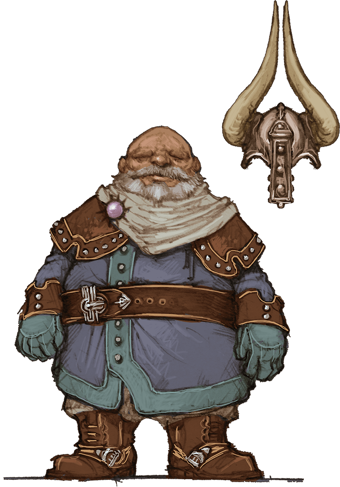

> [Ahmaergo](https://www.dndbeyond.com/monsters/149778-ahmaergo) 
> Medium humanoid (dwarf), lawful evil
> 
> ---
> **Armor Class** 18 (plate) 
> **Hit Points** 143 (22d8 + 44) 
> **Speed** 25 ft.
> 
> ---
> |STR|DEX|CON|INT|WIS|CHA|
> |-|-|-|-|-|-|
> |20 (+5)|15 (+2)|14 (+2)|15 (+2)|14 (+2)|12 (+1)|
> 
> ---
> **Saving Throws** Str +9, Con +6 
> **Skills** [Athletics](https://www.dndbeyond.com/sources/dnd/free-rules/playing-the-game#Skills) +9, [Intimidation](https://www.dndbeyond.com/sources/dnd/free-rules/playing-the-game#Skills) +5, [Perception](https://www.dndbeyond.com/sources/dnd/free-rules/playing-the-game#Skills) +6 
> **Damage Resistances** poison 
> **Senses** [darkvision](https://www.dndbeyond.com/sources/dnd/free-rules/rules-glossary#Darkvision) 60 ft., passive Perception 16 
> **Languages** Common, Dwarvish, Undercommon 
> **Challenge** 9 (5,000 XP)
> 
> ---
> ***Dwarven Resilience.*** Ahmaergo has advantage on saving throws against being [poisoned](https://www.dndbeyond.com/sources/dnd/free-rules/rules-glossary#PoisonedCondition).
> 
> ***Indomitable (2/Day).*** Ahmaergo can reroll a saving throw that he fails. He must use the new roll.
> 
> ***Second Wind (Recharges after a Short or Long Rest).*** As a bonus action, Ahmaergo can regain 20 hit points.
> 
> Actions
> ---
> ***Multiattack.*** Ahmaergo makes three attacks with his greataxe.
> 
> ***Greataxe.*** *Melee Weapon Attack:* +9 to hit, reach 5 ft., one target. *Hit:* 11 (1d12 + 5) slashing damage, plus 7 (2d6) slashing damage if Ahmaergo has more than half his hit points remaining.
> 
> ***Heavy Crossbow.*** *Ranged Weapon Attack:* +6 to hit, range 100/400 ft., one target. *Hit:* 7 (1d10 + 2) piercing damage.

### Ammalia Cassalanter

The vainglorious lady of House Cassalanter is schooled in the arcane arts. Like her husband Victoro, she worships Asmodeus. When they were young, Ammalia and Victoro signed a contract with the archdevil, trading the souls of their children for power, good health, and long life. The soul of Osvaldo, their eldest son, was taken immediately, and he was transformed into a chain devil. The souls of the younger twins, Terenzio and Elzerina, will be taken when they turn nine years old.

A provision in the contract allows the Cassalanters to buy their way out of it, but doing so requires a tremendous amount of coin and a mass sacrifice of unfortunate people. While Victoro hunts for Dagult Neverember’s lost cache of gold, Ammalia makes plans to host a poisoned feast in celebration of Founders’ Day.

Ammalia is well mannered, well read, well traveled, and exceptionally shrewd. She is known for driving a hard bargain. Her hobby is lepidopterology, and her estate has the most beautiful butterfly garden. She allows her youngest children to play in the garden under her supervision.

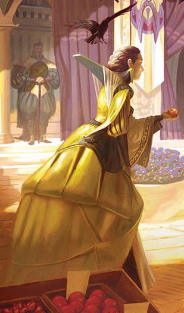

> [Ammalia Cassalanter](https://www.dndbeyond.com/monsters/149799-ammalia-cassalanter) 
> Medium humanoid (human), lawful evil
>
> ---
> **Armor Class** 12 (15 with [*mage armor*](https://www.dndbeyond.com/spells/2172-mage-armor))
> **Hit Points** 45 (10d8)
> **Speed**  30 ft.
> |STR|DEX|CON|INT|WIS|CHA|
> |-|-|-|-|-|-|
> |9 (−1)|14 (+2)|11 (+0)|17 (+3)|12 (+1)|15 (+2)|
>
> ---
> **Saving Throws** Int +6, Wis +4
> **Skills** [Arcana](https://www.dndbeyond.com/sources/dnd/free-rules/playing-the-game#Skills) +6, [History](https://www.dndbeyond.com/sources/dnd/free-rules/playing-the-game#Skills) +6, [Insight](https://www.dndbeyond.com/sources/dnd/free-rules/playing-the-game#Skills) +4, [Persuasion](https://www.dndbeyond.com/sources/dnd/free-rules/playing-the-game#Skills) +5
> **Damage Immunities** poison
> **Condition Immunities** [poisoned](https://www.dndbeyond.com/sources/dnd/free-rules/rules-glossary#PoisonedCondition)
> **Senses** passive Perception 11
> **Languages** Common, Draconic, Elvish, Infernal
> **Challenge** 5 (1,800 XP)
>
> ---
> ***Spellcasting.*** Ammalia is a 9th-level spellcaster. Her spellcasting ability is Intelligence (spell save DC 14, +6 to hit with spell attacks). She has the following wizard spells prepared:
>
> Cantrips (at will): [*friends*](https://www.dndbeyond.com/spells/2308-friends), [*mage hand*](https://www.dndbeyond.com/spells/2173-mage-hand), [mending](https://www.dndbeyond.com/spells/2187-mending), [*message*](https://www.dndbeyond.com/spells/2188-message)
>
> 1st level (4 slots): [*charm person*](https://www.dndbeyond.com/spells/2025-charm-person), [*mage armor*](https://www.dndbeyond.com/spells/2172-mage-armor), [magic missile](https://www.dndbeyond.com/spells/2176-magic-missile)
>
> 2nd level (3 slots): [*hold person*](https://www.dndbeyond.com/spells/2147-hold-person), [*invisibility*](https://www.dndbeyond.com/spells/2159-invisibility), [*suggestion*](https://www.dndbeyond.com/spells/2269-suggestion)
>
> 3rd level (3 slots): [*fireball*](https://www.dndbeyond.com/spells/2102-fireball), [haste](https://www.dndbeyond.com/spells/2138-haste), [*tongues*](https://www.dndbeyond.com/spells/2281-tongues)
>
> 4th level (3 slots): [*confusion*](https://www.dndbeyond.com/spells/2038-confusion), [*stoneskin*](https://www.dndbeyond.com/spells/2266-stoneskin)
>
> 5th level (1 slot): [hold monster](https://www.dndbeyond.com/spells/2146-hold-monster)
>
> Actions
> ---
> ***Quarterstaff.*** *Melee Weapon Attack: *+2 to hit, reach 5 ft., one target. *Hit:* 2 (1d6 − 1) bludgeoning damage, or 3 (1d8 − 1) bludgeoning damage if used with two hands.

### Apprentice Wizard

Apprentice wizards are novice arcane spellcasters who serve more experienced wizards or attend school. They perform menial work, such as cooking and cleaning, in exchange for education in the ways of magic.

> [Apprentice Wizard](https://www.dndbeyond.com/monsters/17325-apprentice-wizard) 
> Medium humanoid (any race), any alignment
>
> ---
> **Armor Class**  10
> **Hit Points**  9 (2d8)
> **Speed**   30 ft.
> |STR|DEX|CON|INT|WIS|CHA|
> |-|-|-|-|-|-|
> |10 (+0)|10 (+0)|10 (+0)|14 (+2)|10 (+0)|11 (+0)|
>
> ---
> **Skills** [Arcana](https://www.dndbeyond.com/sources/dnd/free-rules/playing-the-game#Skills) +4, [History](https://www.dndbeyond.com/sources/dnd/free-rules/playing-the-game#Skills) +4
> **Senses** passive Perception 10
> **Languages** any one language (usually Common)
> **Challenge** 1/4 (50 XP)
>
> ---
> ***Spellcasting.*** The apprentice is a 1st-level spellcaster. Its spellcasting ability is Intelligence (spell save DC 12, +4 to hit with spell attacks). It has the following wizard spells prepared:
>
> Cantrips (at will): [*fire bolt*](https://www.dndbeyond.com/spells/2103-fire-bolt), [*mending*](https://www.dndbeyond.com/spells/2187-mending), [prestidigitation](https://www.dndbeyond.com/spells/2213-prestidigitation)
>
> 1st level (2 slots): [*burning hands*](https://www.dndbeyond.com/spells/2021-burning-hands), [disguise self](https://www.dndbeyond.com/spells/2069-disguise-self), [*shield*](https://www.dndbeyond.com/spells/2247-shield)
>
> Actions
> ---
> ***Dagger.*** *Melee or Ranged Weapon Attack: *+2 to hit, reach 5 ft. or range 20/60 ft., one target. *Hit:* 2 (1d4) piercing damage.

### Aurinax
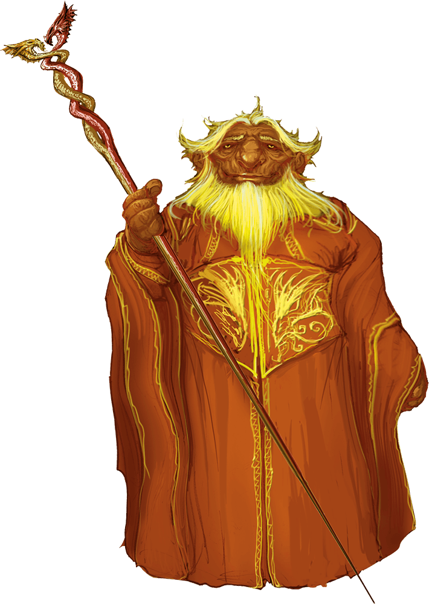

Aurinax is a male adult gold dragon who can freely ignore *Ahghairon’s dragonward* (see “[Ahghairon’s Dragonward](./00.Introduction.md#story-overview),” in the Introduction) and reside in the city. Maaril, the archmage who last wielded the [*dragonstaff of Ahghairon*](https://www.dndbeyond.com/magic-items/253611-dragonstaff-of-ahghairon), was Aurinax’s friend, and invited the dragon to stay with him in the city’s Dragon Tower. Shortly before the Spellplague, Maaril went mad and left Waterdeep, entrusting the [*dragonstaff of Ahghairon*](https://www.dndbeyond.com/magic-items/253611-dragonstaff-of-ahghairon) to Aurinax. (See [appendix A](./Magic-Items.md#dragonstaff-of-ahghairon) for information on the *dragonstaff*.)

When Dagult Neverember became the Open Lord of Waterdeep, he cut a deal with the dragon. Under its terms, Aurinax could keep the [*dragonstaff of Ahghairon*](https://www.dndbeyond.com/magic-items/253611-dragonstaff-of-ahghairon) in exchange for guarding a vault beneath the city. When Neverember eventually removed the treasure from the vault, Aurinax and the *dragonstaff* could return to the Dragon Tower. As it happens, no one has come to remove the treasure, and the faithful Aurinax has remained in the vault. The vault is warded against scrying magic, and there’s no one left in Waterdeep who knows about Aurinax or the whereabouts of the *dragonstaff*.

#### Game Statistics

Aurinax is an [**adult gold dragon**](https://www.dndbeyond.com/monsters/16769-adult-gold-dragon). He often assumes the form of an elderly gold dwarf named Barok Clanghammer, who uses the *dragonstaff* as a walking stick.

### Bard

Bards are gifted poets, storytellers, and entertainers who travel far and wide, commonly found performing in taverns or in the company of jolly bands of adventurers, rough-and-tumble mercenaries, or wealthy patrons.

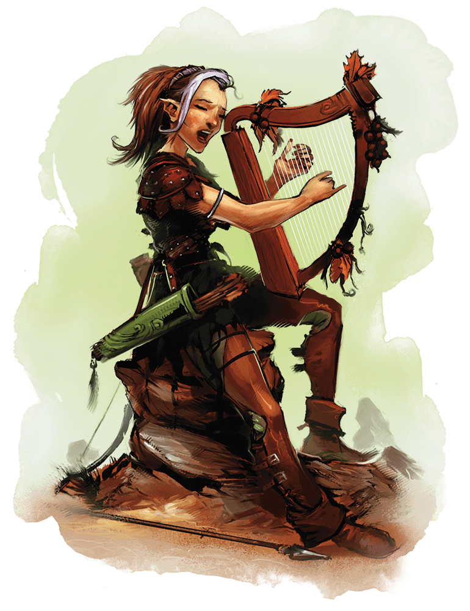

> [Bard](https://www.dndbeyond.com/monsters/17328-bard) 
> Medium humanoid (any race), any alignment
>
> ---
> **Armor Class**  15 (chain shirt)
> **Hit Points**  44 (8d8 + 8)
> **Speed**   30 ft.
> |STR|DEX|CON|INT|WIS|CHA|
> |-|-|-|-|-|-|
> |11 (+0)|14 (+2)|12 (+1)|10 (+0)|13 (+1)|14 (+2)|
>
> ---
> **Saving Throws** Dex +4, Wis +3
> **Skills** [Acrobatics](https://www.dndbeyond.com/sources/dnd/free-rules/playing-the-game#Skills) +4, [Perception](https://www.dndbeyond.com/sources/dnd/free-rules/playing-the-game#Skills) +5, [Performance](https://www.dndbeyond.com/sources/dnd/free-rules/playing-the-game#Skills) +6
> **Senses** passive Perception 15
> **Languages** any two languages
> **Challenge** 2 (450 XP)
>
> ---
> ***Spellcasting.*** The bard is a 4th-level spellcaster. Its spellcasting ability is Charisma (spell save DC 12, +4 to hit with spell attacks). It has the following bard spells prepared:
>
> Cantrips (at will): [*friends*](https://www.dndbeyond.com/spells/2308-friends), [*mage hand*](https://www.dndbeyond.com/spells/2173-mage-hand), [*vicious mockery*](https://www.dndbeyond.com/spells/2290-vicious-mockery)
>
> 1st level (4 slots): [*charm person*](https://www.dndbeyond.com/spells/2025-charm-person), [*healing word*](https://www.dndbeyond.com/spells/2140-healing-word), [*heroism*](https://www.dndbeyond.com/spells/2144-heroism), [*sleep*](https://www.dndbeyond.com/spells/2254-sleep), [*thunderwave*](https://www.dndbeyond.com/spells/2278-thunderwave)
>
> 2nd level (3 slots): [*invisibility*](https://www.dndbeyond.com/spells/2159-invisibility), [*shatter*](https://www.dndbeyond.com/spells/2246-shatter)
>
> ***Song of Rest.*** The bard can perform a song while taking a short rest. Any ally who hears the song regains an extra 1d6 hit points if it spends any Hit Dice to regain hit points at the end of that rest. The bard can confer this benefit on itself as well.
>
> ***Taunt (2/Day).*** The bard can use a bonus action on its turn to target one creature within 30 feet of it. If the target can hear the bard, the target must succeed on a DC 12 Charisma saving throw or have disadvantage on ability checks, attack rolls, and saving throws until the start of the bard’s next turn.
>
> Actions
> ---
> ***Shortsword.*** *Melee Weapon Attack: *+4 to hit, reach 5 ft., one target. *Hit:* 5 (1d6 + 2) piercing damage.
>
> ***Shortbow.*** *Ranged Weapon Attack: *+4 to hit, range 80/320 ft., one target. *Hit:* 5 (1d6 + 2) piercing damage.

### Barnibus Blastwind

Barnibus works for the Watchful Order of Magists and Protectors, investigating crimes that involve the use of magic. He comes across as prickly and secretive, confiding only in [Saeth Cromley](https://www.dndbeyond.com/monsters/280428-saeth-cromley), a retired sergeant of the City Watch who assists in many of his investigations.

A lifelong bachelor, Barnibus has a small, tidy estate in the Sea Ward that he inherited from his grandmother. When not serving the Watchful Order, he spends his days reading and writing books in his library.

Barnibus uses spells that help him investigate crimes, pry secrets from the minds of suspects, and locate missing persons. He finds violence appalling and would never use his magic to inflict harm on others — even those who harm him.

> [Barnibus Blastwind](https://www.dndbeyond.com/monsters/149820-barnibus-blastwind) 
> Medium humanoid (human), lawful good
>
> ---
> **Armor Class**  10 (13 with [*mage armor*](https://www.dndbeyond.com/spells/2172-mage-armor))
> **Hit Points**  24 (7d8 − 7)
> **Speed**   30 ft.
> |STR|DEX|CON|INT|WIS|CHA|
> |-|-|-|-|-|-|
> |9 (−1)|10 (+0)|9 (−1)|17 (+3)|15 (+2)|11 (+0)|
>
> ---
> **Saving Throws** Int +5, Wis +4
> **Skills** [Arcana](https://www.dndbeyond.com/sources/dnd/free-rules/playing-the-game#Skills) +5, [Insight](https://www.dndbeyond.com/sources/dnd/free-rules/playing-the-game#Skills) +6, [Investigation](https://www.dndbeyond.com/sources/dnd/free-rules/playing-the-game#Skills) +7, [Perception](https://www.dndbeyond.com/sources/dnd/free-rules/playing-the-game#Skills) +4
> **Senses** passive Perception 14
> **Languages** Common, Draconic, Dwarvish, Halfling
> **Challenge** 2 (450 XP)
>
> ---
> ***Special Equipment.*** Barnibus carries a [wand of magic detection](https://www.dndbeyond.com/magic-items/4793-wand-of-magic-detection).
>
> ***Spellcasting.*** Barnibus is a 7th-level spellcaster. His spellcasting ability is Intelligence (spell save DC 13, +5 to hit with spell attacks). He has the following wizard spells prepared:
>
> Cantrips (at will): [*blade ward*](https://www.dndbeyond.com/spells/2307-blade-ward), [*light*](https://www.dndbeyond.com/spells/2166-light), [mage hand](https://www.dndbeyond.com/spells/2173-mage-hand), [*message*](https://www.dndbeyond.com/spells/2188-message)
>
> 1st level (4 slots): [*comprehend languages*](https://www.dndbeyond.com/spells/2035-comprehend-languages), [*identify*](https://www.dndbeyond.com/spells/2152-identify), [mage armor](https://www.dndbeyond.com/spells/2172-mage-armor), [*shield*](https://www.dndbeyond.com/spells/2247-shield)
>
> 2nd level (3 slots): [*detect thoughts*](https://www.dndbeyond.com/spells/2067-detect-thoughts), [*suggestion*](https://www.dndbeyond.com/spells/2269-suggestion)
>
> 3rd level (3 slots): [clairvoyance](https://www.dndbeyond.com/spells/2028-clairvoyance), [*sending*](https://www.dndbeyond.com/spells/2243-sending)
>
> 4th level (1 slot): [*locate creature*](https://www.dndbeyond.com/spells/2169-locate-creature), [Otiluke’s resilient sphere](https://www.dndbeyond.com/spells/2349-otilukes-resilient-sphere)
>
> Actions
> ---
> ***Dagger.*** *Melee or Ranged Weapon Attack: *+2 to hit, reach 5 ft. or range 20/60 ft., one target. *Hit:* 2 (1d4) piercing damage.

### The Black Viper

The Black Viper was a notorious burglar, pickpocket, mugger, and assassin who died a century ago, after a long and nefarious career. Esvele Rosznar, a brash young noble, has recently adopted the Black Viper’s persona to lead a secret life of crime. Like many other nobles, Esvele gossips about the Black Viper’s exploits to lend credence to the villain’s mystique.

The Rosznar family was convicted of slave trading — highly illegal in Waterdeep — and banished over a hundred years ago, but has since returned. The Rosznars’ inability to regain the respect they feel they deserve rankles them. The slave trade has continued in Amn and elsewhere, and it’s not like other noble houses don’t have skeletons in their closets. But just because of a little family squabble that went public, the Rosznar name has been said with a sneer for a century. As part of the family’s constant effort to prove this conception wrong and win others’ respect, Esvele has been brought up to be the most proper noble possible, partaking in lessons of etiquette, dance, and poise as befits someone of her station.

In her younger days, Esvele openly rebelled, but that behavior led to locked doors at night and house guards watching her every move during the day. So she taught herself how to pick locks, pluck keys from belts and pouches, clamber up walls, and sneak past guards — playing the perfect daughter by day while cutting loose at night. To hide her identity from those she met, she wore a hood and mask, exchanging her fine clothes for the kind of practical clothing her parents would never let her wear.

One of the things Esvele has learned is to embrace the legend of the Black Viper. When she throws back her cloak to reveal the costume she has put together, most folk toss their purses and flee. If that doesn’t work, she usually needs only to draw her dagger. Of course, some of the nobles she targets are made of sterner stuff, so Esvele has learned how to fight as well. She knows she’s playing a dangerous game, but is satisfied that at least one member of the Rosznar family is earning the respect of Waterdeep’s nobility.

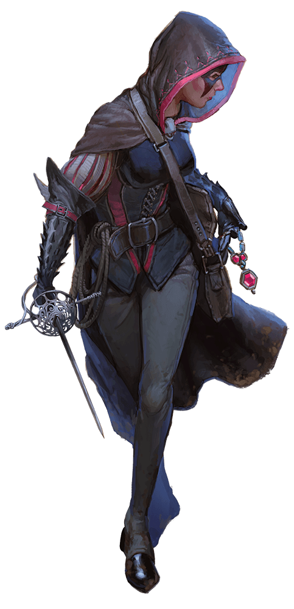

> [Black Viper](https://www.dndbeyond.com/monsters/149834-black-viper) 
> Medium humanoid (human), chaotic neutral
>
> ---
> **Armor Class**  16 (studded leather)
> **Hit Points**  84 (13d8 + 26)
> **Speed**   30 ft.
> |STR|DEX|CON|INT|WIS|CHA|
> |-|-|-|-|-|-|
> |11 (+0)|18 (+4)|14 (+2)|11 (+0)|11 (+0)|12 (+1)|
>
> ---
> **Saving Throws** Dex +7, Int +3
> **Skills** [Acrobatics](https://www.dndbeyond.com/sources/dnd/free-rules/playing-the-game#Skills) +7, [Athletics](https://www.dndbeyond.com/sources/dnd/free-rules/playing-the-game#Skills) +3, [Perception](https://www.dndbeyond.com/sources/dnd/free-rules/playing-the-game#Skills) +3, [Sleight of Hand](https://www.dndbeyond.com/sources/dnd/free-rules/playing-the-game#Skills) +7, [Stealth](https://www.dndbeyond.com/sources/dnd/free-rules/playing-the-game#Skills) +7
> **Senses** passive Perception 13
> **Languages** Common, thieves’ cant
> **Challenge** 5 (1,800 XP)
>
> ---
> ***Cunning Action.*** On each of her turns, the Black Viper can use a bonus action to take the Dash, Disengage, or [Hide](https://www.dndbeyond.com/sources/dnd/free-rules/rules-glossary#HideAction) action.
>
> ***Evasion.*** If the Black Viper is subjected to an effect that allows her to make a Dexterity saving throw to take only half damage, she instead takes no damage if she succeeds on the saving throw, and only half damage if she fails. She can’t use this trait if she’s [incapacitated](https://www.dndbeyond.com/sources/dnd/free-rules/rules-glossary#IncapacitatedCondition).
>
> ***Sneak Attack (1/Turn). ***The Black Viper deals an extra 14 (4d6) damage when she hits a target with a weapon attack and has advantage on the attack roll, or when the target is within 5 feet of an ally of the Black Viper that isn’t [incapacitated](https://www.dndbeyond.com/sources/dnd/free-rules/rules-glossary#IncapacitatedCondition) and the Black Viper doesn’t have disadvantage on the attack roll.
>
> Actions
> ---
> ***Multiattack.*** The Black Viper makes three attacks with her rapier.
>
> ***Rapier.*** *Melee Weapon Attack: *+7 to hit, reach 5 ft., one target. *Hit:* 7 (1d6 + 4) piercing damage.
>
> ***Hand Crossbow.*** *Ranged Weapon Attack:* +7 to hit, range 30/120 ft., one target. *Hit:* 7 (1d6 + 4) piercing damage.
>
> Reactions
> ---
> ***Uncanny Dodge.*** The Black Viper halves the damage that she takes from an attack that hits her. She must be able to see the attacker.

### City Guard

The City Guard is Waterdeep’s army, charged with protecting the city’s walls and gates, government buildings, harbor, and officials. The City Guard also patrols the roads to Amphail, Goldenfields, and Daggerford.

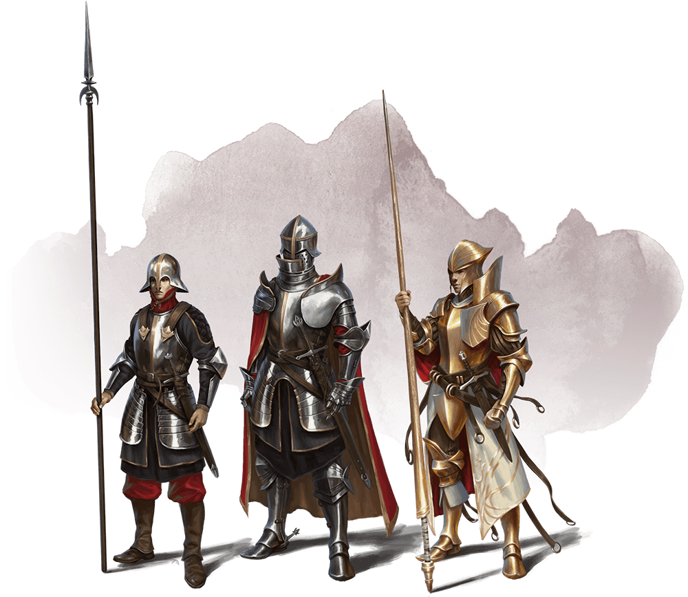
*City Guard Private, Captain, and Griffon Cavalry Rider*

#### Ranks in the City Guard

Members of the City Guard have ranks. From lowest to highest, they are:

*   Private
*   Sergeant (armar)
*   Lieutenant (civilar)
*   Captain (senior civilar)
*   Multiple command positions, some perennial (Seneschal of Castle Waterdeep, Defender of the Harbor, Master of the North Towers, Master of the South Towers, Master Armorer), others bestowed as needed in wartime (the Lords’ Hand and the Lords’ Champion)
*   Warden of Waterdeep

The current Warden of Waterdeep is Elminster, who answers to the Open Lord, Laeral Silverhand.

The Griffon Cavalry is a special branch of the City Guard whose members are veteran soldiers trained to fly griffon mounts.

> [Griffon Cavalry Rider](https://www.dndbeyond.com/monsters/149838-griffon-cavalry-rider) 
> Medium humanoid (any race), any alignment
>
> ---
> **Armor Class**  17 (half plate)
> **Hit Points**  58 (9d8 + 18)
> **Speed**   30 ft.
> |STR|DEX|CON|INT|WIS|CHA|
> |-|-|-|-|-|-|
> |14 (+2)|15 (+2)|14 (+2)|10 (+0)|12 (+1)|10 (+0)|
>
> ---
> **Skills** [Animal Handling](https://www.dndbeyond.com/sources/dnd/free-rules/playing-the-game#Skills) +3, [Athletics](https://www.dndbeyond.com/sources/dnd/free-rules/playing-the-game#Skills) +4, [Perception](https://www.dndbeyond.com/sources/dnd/free-rules/playing-the-game#Skills) +3
> **Senses** passive Perception 13
> **Languages** any one language (usually Common)
> **Challenge** 2 (450 XP)
>
> Actions
> ---
> ***Lance.*** *Melee Weapon Attack: *+4 to hit (with disadvantage against a target within 5 ft.), reach 10 ft., one target. *Hit:* 8 (1d12 + 2) piercing damage, or 11 (1d12 + 5) piercing damage while mounted.
>
> ***Dagger.*** *Melee or Ranged Weapon Attack:* +4 to hit, reach 5 ft. or range 20/60 ft., one target. *Hit:* 4 (1d4 + 2) piercing damage.
>
> ***Light Crossbow.*** *Ranged Weapon Attack:* +4 to hit, range 80/320 ft., one target. *Hit:* 6 (1d8 + 2) piercing damage.
>
> Reactions
> ---
> ***Feather Fall.*** The rider wears a magic ring with which it can cast the [*feather fall*](https://www.dndbeyond.com/spells/2095-feather-fall) spell on itself once as a reaction to falling. After the spell is cast, the ring becomes nonmagical.

#### Game Statistics

City Guard privates and sergeants are **[guard](https://www.dndbeyond.com/monsters/16915-guard)s**. Members of lieutenant rank and higher are typically **[veteran](https://www.dndbeyond.com/monsters/17045-veteran)s**.

### City Watch

The City Watch is Waterdeep’s police force, charged with keeping the peace and apprehending criminals. City Watch patrols are usually four to twelve persons strong. A patrol expecting trouble might also have reinforcement in the form of a [**priest**](https://www.dndbeyond.com/monsters/16985-priest) (on loan from one of the local temples) or a [**mage**](https://www.dndbeyond.com/monsters/16947-mage) (from the Watchful Order of Magists and Protectors).

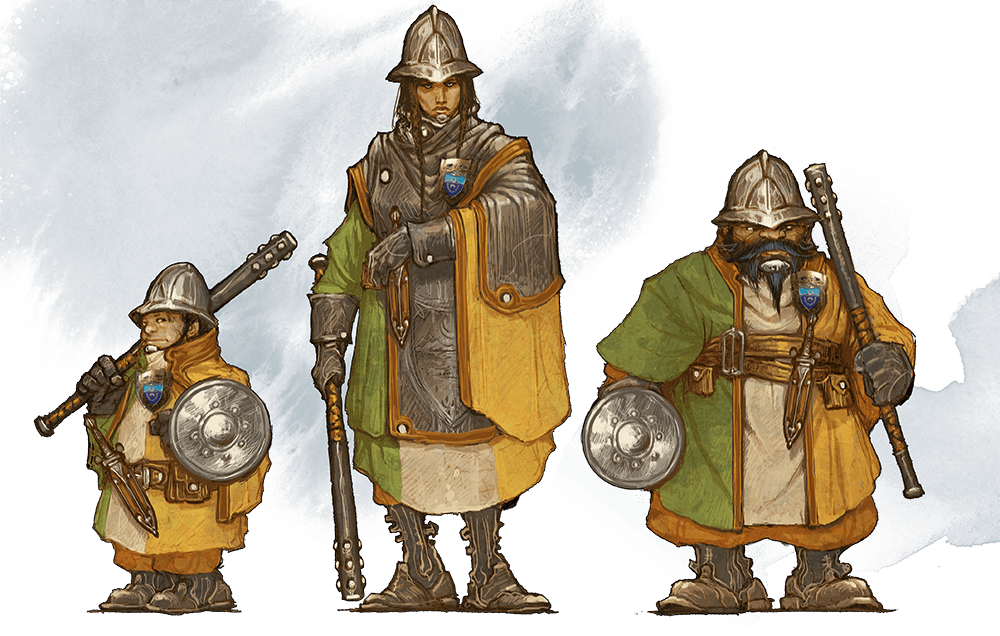
*Members of the City Watch*

### Ranks in the City Watch

Members of the City Watch are called officers. Their ranks are, from lowest to highest:

*   Constable
*   Sergeant (armar)
*   Lieutenant (civilar)
*   Captain (senior civilar; leader of a watch station)
*   Major (ward civilar; one per city ward)
*   Commander of the Watch

The Watch also includes a Senior Armsmaster, who reports to the Commander of the Watch and is in charge of supplies. The Commander of the Watch reports to the Open Lord, Laeral Silverhand.

#### Game Statistics

Most City Watch members are **[veteran](https://www.dndbeyond.com/monsters/17045-veteran)s**. Some of the highest-ranked members are **[knight](https://www.dndbeyond.com/monsters/16938-knight)s**. All City Watch members wear helmets and carry clubs while on duty.

### The Doom Raiders

The Doom Raiders were five unscrupulous adventurers who liked to plunder lich lairs (called “dooms” by some). They gave up adventuring to join the Black Network and came to Waterdeep three years ago with plans to establish a Zhentarim foothold in the city. In that time, they have forged alliances with various nobles and guilds and run afoul of others, all the while fending off Harper spies.

### Davil Starsong

Within the Waterdeep division of the Black Network, Davil is accorded the title of Master of Opportunities and Negotiations because he’s good at sniffing out lucrative business deals, and he makes friends easily.

Like many sun elves, Davil has an affinity for magic and is gifted with the kind of patience that comes with a long life span. Unlike most, he’s not the least bit pretentious or aloof. He keeps a room at the Yawning Portal and does all his business in the establishment’s taproom. He negotiates deals with grace and aplomb, even while drunk, and uses an elven lute as a spellcasting focus.

Davil can put the characters in contact with other leaders of the Black Network’s Waterdeep division, namely Istrid Horn (if they need a loan), Skeemo Weirdbottle (if they need magic), Tashlyn Yafeera (if they need weapons or mercenaries), and Ziraj the Hunter (if they need a highly skilled assassin).

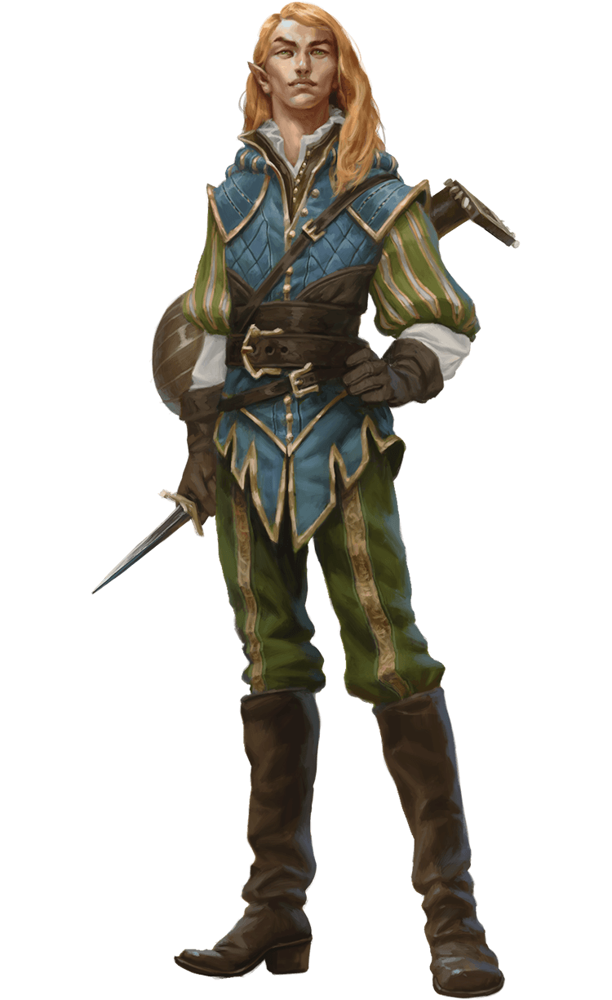

> [Davil Starsong](https://www.dndbeyond.com/monsters/149845-davil-starsong) 
> Medium humanoid (elf), neutral
>
> ---
> **Armor Class**  15 (chain shirt)
> **Hit Points**  82 (15d8 + 15)
> **Speed**   30 ft.
> |STR|DEX|CON|INT|WIS|CHA|
> |-|-|-|-|-|-|
> |10 (+0)|14 (+2)|12 (+1)|16 (+3)|12 (+1)|17 (+3)|
>
> ---
> **Saving Throws** Dex +5, Cha +6
> **Skills** [Arcana](https://www.dndbeyond.com/sources/dnd/free-rules/playing-the-game#Skills) +6, [History](https://www.dndbeyond.com/sources/dnd/free-rules/playing-the-game#Skills) +6, [Insight](https://www.dndbeyond.com/sources/dnd/free-rules/playing-the-game#Skills) +4, [Perception](https://www.dndbeyond.com/sources/dnd/free-rules/playing-the-game#Skills) +4, [Performance](https://www.dndbeyond.com/sources/dnd/free-rules/playing-the-game#Skills) +6
> **Senses** [darkvision](https://www.dndbeyond.com/sources/dnd/free-rules/rules-glossary#Darkvision) 60 ft., passive Perception 14
> **Languages** Common, Draconic, Dwarvish, Elvish
> **Challenge** 6 (2,300 XP)
>
> ---
> ***Fey Ancestry.*** Davil has advantage on saving throws against being [charmed](https://www.dndbeyond.com/sources/dnd/free-rules/rules-glossary#CharmedCondition), and magic can’t put him to sleep.
>
> ***Spellcasting.*** Davil is a 12th-level spellcaster. His spellcasting ability is Charisma (spell save DC 14, +6 to hit with spell attacks). He has the following bard spells prepared:
>
> Cantrips (at will): [*mage hand*](https://www.dndbeyond.com/spells/2173-mage-hand), [*mending*](https://www.dndbeyond.com/spells/2187-mending), [*minor illusion*](https://www.dndbeyond.com/spells/2191-minor-illusion), [vicious mockery](https://www.dndbeyond.com/spells/2290-vicious-mockery)
>
> 1st level (4 slots): [*cure wounds*](https://www.dndbeyond.com/spells/2056-cure-wounds), [disguise self](https://www.dndbeyond.com/spells/2069-disguise-self), [*sleep*](https://www.dndbeyond.com/spells/2254-sleep)
>
> 2nd level (3 slots): [*crown of madness*](https://www.dndbeyond.com/spells/2329-crown-of-madness), [*invisibility*](https://www.dndbeyond.com/spells/2159-invisibility), [*suggestion*](https://www.dndbeyond.com/spells/2269-suggestion)
>
> 3rd level (3 slots): [*nondetection*](https://www.dndbeyond.com/spells/2199-nondetection), [sending](https://www.dndbeyond.com/spells/2243-sending), [*tongues*](https://www.dndbeyond.com/spells/2281-tongues)
>
> 4th level (3 slots): [*compulsion*](https://www.dndbeyond.com/spells/2036-compulsion), [*freedom of movement*](https://www.dndbeyond.com/spells/2116-freedom-of-movement), [*polymorph*](https://www.dndbeyond.com/spells/2209-polymorph)
>
> 5th level (2 slots): [*dominate person*](https://www.dndbeyond.com/spells/2078-dominate-person), [greater restoration](https://www.dndbeyond.com/spells/2129-greater-restoration)
>
> 6th level (1 slot): [Otto’s irresistible dance](https://www.dndbeyond.com/spells/2160-ottos-irresistible-dance)
>
> Actions
> ---
> ***Dagger.*** *Melee or Ranged Weapon Attack: *+5 to hit, reach 5 ft. or range 20/60 ft., one target. *Hit:* 4 (1d4 + 2) piercing damage.

### Istrid Horn

Istrid is regarded as the Black Network’s Master of Trade and Coin in Waterdeep. The shield dwarf operates an illegal lending operation out of a heavily guarded warehouse in the Dock Ward, offering loans to those in need of coin. Her interest rates are comparable to those of her competitors (including noble families of bankers such as the Cassalanters and the Irlingstars), but the penalties for not paying back Istrid’s loans are severe.

Istrid worships Vergadain, the dwarven god of wealth and luck. She likes having others indebted to her, and she employs thugs and enforcers to collect on her loans. If those resources prove inadequate, Istrid can call on her old adventuring companions for assistance.

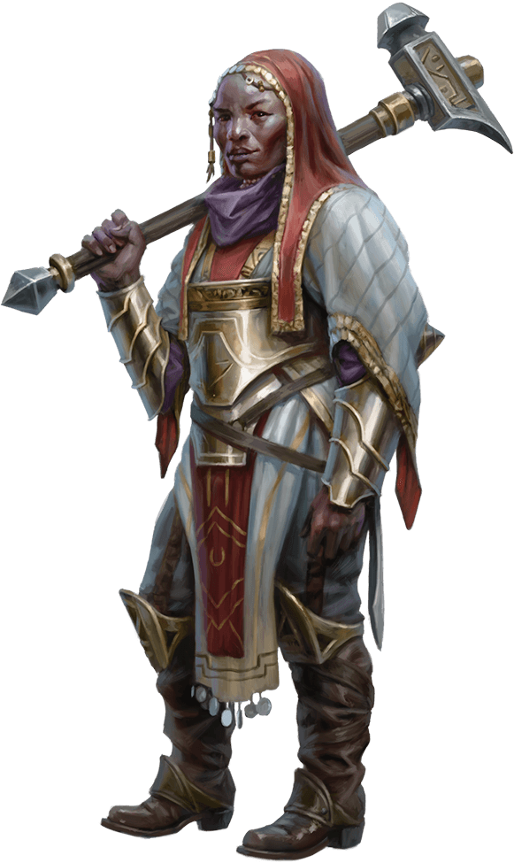

> [Istrid Horn](https://www.dndbeyond.com/monsters/149851-istrid-horn) 
> Medium humanoid (dwarf), neutral evil
>
> ---
> **Armor Class**  18 (plate)
> **Hit Points**  117 (18d8 + 36)
> **Speed**   25 ft.
> |STR|DEX|CON|INT|WIS|CHA|
> |-|-|-|-|-|-|
> |12 (+1)|10 (+0)|14 (+2)|11 (+0)|17 (+3)|13 (+1)|
>
> ---
> **Saving Throws** Con +5, Wis +6
> **Skills** [Intimidation](https://www.dndbeyond.com/sources/dnd/free-rules/playing-the-game#Skills) +4, [Religion](https://www.dndbeyond.com/sources/dnd/free-rules/playing-the-game#Skills) +3
> **Damage Resistances** poison
> **Senses** [darkvision](https://www.dndbeyond.com/sources/dnd/free-rules/rules-glossary#Darkvision) 60 ft., passive Perception 13
> **Languages** Common, Dwarvish
> **Challenge** 8 (3,900 XP)
>
> ---
> ***Dwarven Resilience.*** Istrid has advantage on saving throws against being [poisoned](https://www.dndbeyond.com/sources/dnd/free-rules/rules-glossary#PoisonedCondition).
>
> ***Spellcasting.*** Istrid is a 9th-level spellcaster. Her spellcasting ability is Wisdom (spell save DC 14, +6 to hit with spell attacks). She has the following cleric spells prepared:
>
> Cantrips (at will): [*light*](https://www.dndbeyond.com/spells/2166-light), [*mending*](https://www.dndbeyond.com/spells/2187-mending), [*sacred flame*](https://www.dndbeyond.com/spells/2236-sacred-flame), [spare the dying](https://www.dndbeyond.com/spells/2257-spare-the-dying)
>
> 1st level (4 slots): [*divine favor*](https://www.dndbeyond.com/spells/2074-divine-favor), [*guiding bolt*](https://www.dndbeyond.com/spells/2133-guiding-bolt), [*healing word*](https://www.dndbeyond.com/spells/2140-healing-word), [shield of faith](https://www.dndbeyond.com/spells/2248-shield-of-faith)
>
> 2nd level (3 slots): [*lesser restoration*](https://www.dndbeyond.com/spells/2164-lesser-restoration), [*magic weapon*](https://www.dndbeyond.com/spells/2178-magic-weapon), [*hold person*](https://www.dndbeyond.com/spells/2147-hold-person), [*silence*](https://www.dndbeyond.com/spells/2251-silence), [spiritual weapon](https://www.dndbeyond.com/spells/2263-spiritual-weapon)
>
> 3rd level (3 slots): [*beacon of hope*](https://www.dndbeyond.com/spells/2012-beacon-of-hope), [*crusader’s mantle*](https://www.dndbeyond.com/spells/2336-crusaders-mantle), [*dispel magic*](https://www.dndbeyond.com/spells/2072-dispel-magic), [*revivify*](https://www.dndbeyond.com/spells/2234-revivify), [*spirit guardians*](https://www.dndbeyond.com/spells/2264-spirit-guardians), [*water walk*](https://www.dndbeyond.com/spells/2298-water-walk)
>
> 4th level (3 slots): [*banishment*](https://www.dndbeyond.com/spells/2010-banishment), [*freedom of movement*](https://www.dndbeyond.com/spells/2116-freedom-of-movement), [*guardian of faith*](https://www.dndbeyond.com/spells/2130-guardian-of-faith), [*stoneskin*](https://www.dndbeyond.com/spells/2266-stoneskin)
>
> 5th level (1 slot): [*flame strike*](https://www.dndbeyond.com/spells/2107-flame-strike), [mass cure wounds](https://www.dndbeyond.com/spells/2181-mass-cure-wounds), [hold monster](https://www.dndbeyond.com/spells/2146-hold-monster)
>
> Actions
> ---
> ***Multiattack.*** Istrid makes two melee attacks.
>
> ***Maul.*** *Melee Weapon Attack: *+4 to hit, reach 5 ft., one target. *Hit:* 8 (2d6 + 1) bludgeoning damage.
>
> ***Treasure Sense (3/Day).*** Istrid magically pinpoints precious metals and stones, such as coins and gems, within 60 feet of her.

### Skeemo Weirdbottle

Skeemo (see below for his stat block) became the Master of Magic for the Black Network in Waterdeep, setting up a cover in the Trades Ward in the form of a cramped little shop called Weirdbottle’s Concoctions. Most of his potions and elixirs are nonmagical, but he crafts magical ones for his Zhent friends.

Skeemo can add “sellout” to his credentials, his services having been bought by House Gralhund and the Black Network operatives loyal to Manshoon. The rock gnome uses *[paper bird](https://www.dndbeyond.com/magic-items/254337-paper-bird)s* (see [appendix A](./Magic-Items.md#paper-bird)) to send messages both to his new friends and his old ones.

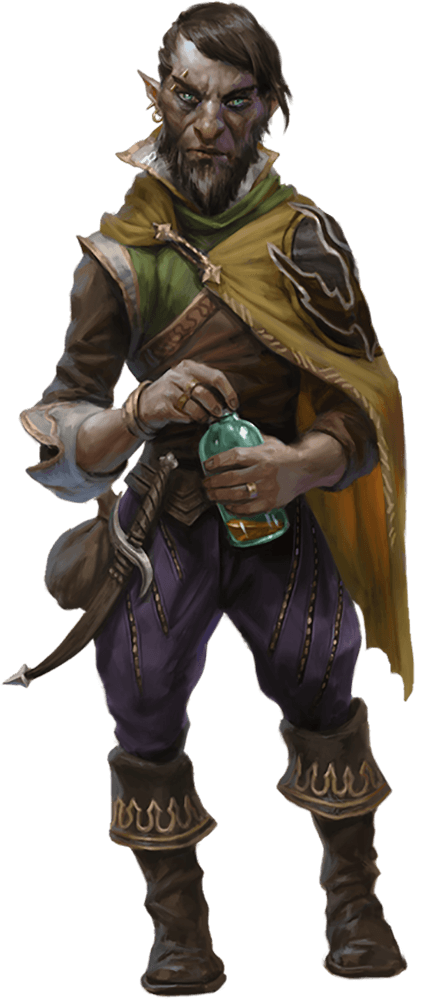

> [Skeemo Weirdbottle](https://www.dndbeyond.com/monsters/149862-skeemo-weirdbottle) 
> Small humanoid (gnome), neutral evil
>
> ---
> **Armor Class**  12 (15 with [*mage armor*](https://www.dndbeyond.com/spells/2172-mage-armor))
> **Hit Points**  72 (16d6 + 16)
> **Speed**   25 ft.
> |STR|DEX|CON|INT|WIS|CHA|
> |-|-|-|-|-|-|
> |9 (−1)|14 (+2)|12 (+1)|17 (+3)|12 (+1)|15 (+2)|
>
> ---
> **Saving Throws** Int +6, Wis +4
> **Skills** [Arcana](https://www.dndbeyond.com/sources/dnd/free-rules/playing-the-game#Skills) +6, [History](https://www.dndbeyond.com/sources/dnd/free-rules/playing-the-game#Skills) +6, [Perception](https://www.dndbeyond.com/sources/dnd/free-rules/playing-the-game#Skills) +4, [Performance](https://www.dndbeyond.com/sources/dnd/free-rules/playing-the-game#Skills) +5
> **Senses** [darkvision](https://www.dndbeyond.com/sources/dnd/free-rules/rules-glossary#Darkvision) 60 ft., passive Perception 14
> **Languages** Abyssal, Common, Gnomish, Undercommon
> **Challenge** 6 (2,300 XP)
>
> ---
> ***Gnome Cunning.*** Skeemo has advantage on Intelligence, Wisdom, and Charisma saving throws against magic.
>
> ***Spellcasting.*** Skeemo is a 9th-level spellcaster. His spellcasting ability is Intelligence (spell save DC 14, +6 to hit with spell attacks). He has the following wizard spells prepared:
>
> Cantrips (at will): [*fire bolt*](https://www.dndbeyond.com/spells/2103-fire-bolt), [*light*](https://www.dndbeyond.com/spells/2166-light), [*mage hand*](https://www.dndbeyond.com/spells/2173-mage-hand), [prestidigitation](https://www.dndbeyond.com/spells/2213-prestidigitation)
>
> 1st level (4 slots): [*detect magic*](https://www.dndbeyond.com/spells/2065-detect-magic), [*mage armor*](https://www.dndbeyond.com/spells/2172-mage-armor), [magic missile](https://www.dndbeyond.com/spells/2176-magic-missile), [*shield*](https://www.dndbeyond.com/spells/2247-shield)
>
> 2nd level (3 slots): [*misty step*](https://www.dndbeyond.com/spells/2195-misty-step), [*suggestion*](https://www.dndbeyond.com/spells/2269-suggestion)
>
> 3rd level (3 slots): [*counterspell*](https://www.dndbeyond.com/spells/2051-counterspell), [fireball](https://www.dndbeyond.com/spells/2102-fireball), [*fly*](https://www.dndbeyond.com/spells/2111-fly)
>
> 4th level (3 slots): [*greater invisibility*](https://www.dndbeyond.com/spells/2128-greater-invisibility), [*ice storm*](https://www.dndbeyond.com/spells/2151-ice-storm)
>
> 5th level (1 slot): [cone of cold](https://www.dndbeyond.com/spells/2037-cone-of-cold)
>
> Actions
> ---
> ***Dagger.*** *Melee or Ranged Weapon Attack: *+5 to hit, reach 5 ft. or range 20/60 ft., one target. *Hit:* 4 (1d4 + 2) piercing damage.

### Tashlyn Yafeera

Tashlyn (see below for her stat block) is Master of Arms and Mercenaries for the Waterdeep Zhentarim. In this role, she provides armor, weapons, and training to sellswords on the Black Network’s payroll.

Tashlyn has established a useful cover by serving as a bodyguard to Vorondar Levelstone, a dwarf magister stationed at the South Gate. She likes the dwarf and has earned his confidence, allowing her to reach the rank of captain in the City Guard. In that position, she watches over traffic that passes through the gate — and ensures that her associates in the Black Network can come and go freely.

Born to a well-off family in Calimshan, Tashlyn has an unfettered sense of superiority. Quick to anger, she hates to back down from a fight. She respects anyone who can best her in melee combat.

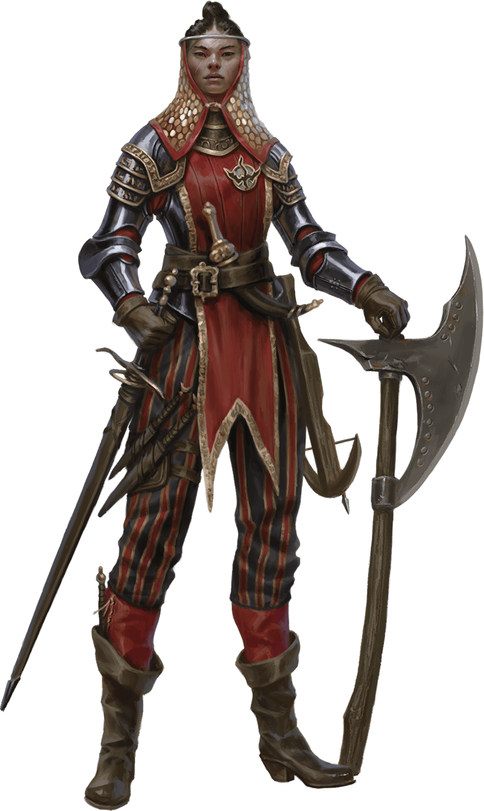

> [Tashlyn Yafeera](https://www.dndbeyond.com/monsters/149868-tashlyn-yafeera) 
> Medium humanoid (human), neutral
>
> ---
> **Armor Class**  18 (plate)
> **Hit Points**  149 (23d8 + 46)
> **Speed**   30 ft.
> |STR|DEX|CON|INT|WIS|CHA|
> |-|-|-|-|-|-|
> |18 (+4)|15 (+2)|14 (+2)|10 (+0)|14 (+2)|12 (+1)|
>
> ---
> **Saving Throws** Str +8, Con +6
> **Skills** [Athletics](https://www.dndbeyond.com/sources/dnd/free-rules/playing-the-game#Skills) +8, [Intimidation](https://www.dndbeyond.com/sources/dnd/free-rules/playing-the-game#Skills) +5, [Perception](https://www.dndbeyond.com/sources/dnd/free-rules/playing-the-game#Skills) +6
> **Senses** passive Perception 16
> **Languages** Common
> **Challenge** 9 (5,000 XP)
>
> ---
> ***Indomitable (2/Day).*** Tashlyn can reroll a saving throw that she fails. She must use the new roll.
>
> ***Second Wind (Recharges after a Short or Long Rest).*** As a bonus action, Tashlyn can regain 20 hit points.
>
> Actions
> ---
> ***Multiattack.*** Tashlyn makes three attacks with her greatsword or her shortbow.
>
> ***Greatsword.*** *Melee Weapon Attack: *+8 to hit, reach 5 ft., one target. *Hit:* 11 (2d6 + 4) slashing damage, plus 7 (2d6) slashing damage if Tashlyn has more than half her hit points remaining.
>
> ***Shortbow.*** *Ranged Weapon Attack:* +6 to hit, range 80/320 ft., one target. *Hit:* 5 (1d6 + 2) piercing damage, plus 7 (2d6) piercing damage if Tashlyn has more than half her hit points remaining.

### Ziraj the Hunter

Ziraj is a half-orc hunter who wields an oversized bow that shoots correspondingly large arrows. He is the Master of Assassination for the Black Network. If Ziraj sets out to kill someone, it’s because one of his friends (Davil, Istrid, Skeemo, or Tashlyn) asked him to. The characters might become Ziraj’s prey, or Ziraj might come to their aid to eliminate a common enemy. He’s the strong, silent type.

The City Watch has received reports of a figure who haunts the rooftops of Waterdeep — a hulking shadow that glares from its perch, rains down death in the form of long black arrows, and slinks off without so much as a whisper. Where he comes from — if he even has a home — remains a mystery, as does the question of where he might show up next.

***Treasure.*** Ziraj wears [*+2 leather armor*](https://www.dndbeyond.com/magic-items/5102-leather-2) and carries an oversized longbow. This unique weapon can be used only by a Medium or larger creature that has a Strength of 18 or higher. The bow shoots oversized arrows that deal piercing damage equal to 2d6 + the wielder’s Strength modifier. Its range is the same as an ordinary longbow.

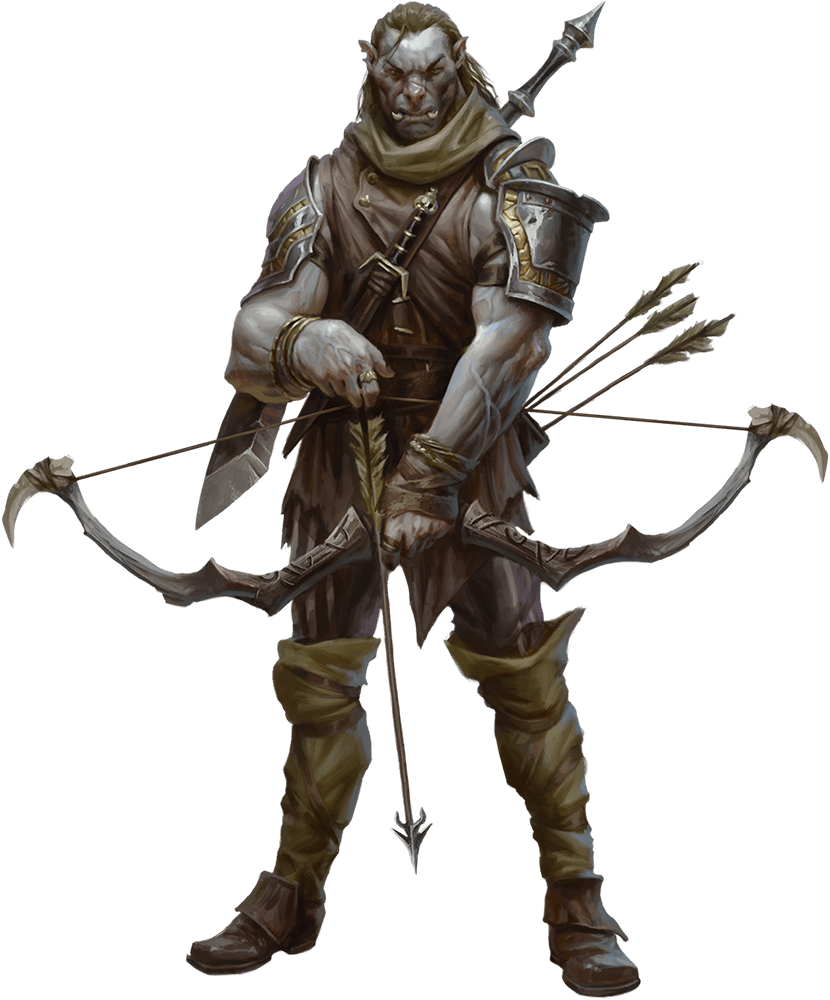

> [Ziraj the Hunter](https://www.dndbeyond.com/monsters/149873-ziraj-the-hunter) 
> Medium humanoid (half-orc), neutral evil
>
> ---
> **Armor Class**  17 (_[+2 leather armor](https://www.dndbeyond.com/magic-items/5102-leather-2)_)
> **Hit Points**  153 (18d8 + 72)
> **Speed**   30 ft.
> |STR|DEX|CON|INT|WIS|CHA|
> |-|-|-|-|-|-|
> |18 (+4)|18 (+4)|18 (+4)|11 (+0)|14 (+2)|15 (+2)|
>
> ---
> **Saving Throws** Wis +5, Cha +5
> **Skills** [Athletics](https://www.dndbeyond.com/sources/dnd/free-rules/playing-the-game#Skills) +7, [Intimidation](https://www.dndbeyond.com/sources/dnd/free-rules/playing-the-game#Skills) +5, [Stealth](https://www.dndbeyond.com/sources/dnd/free-rules/playing-the-game#Skills) +7, [Survival](https://www.dndbeyond.com/sources/dnd/free-rules/playing-the-game#Skills) +5
> **Senses** [darkvision](https://www.dndbeyond.com/sources/dnd/free-rules/rules-glossary#Darkvision) 60 ft., passive Perception 12
> **Languages** Common, Orc
> **Challenge** 8 (3,900 XP)
>
> ---
> ***Spellcasting.*** Ziraj is a 10th-level spellcaster. His spellcasting ability is Charisma (spell save DC 13, +5 to hit with spell attacks). He has the following paladin spells prepared:
>
> 1st level (4 slots): [*command*](https://www.dndbeyond.com/spells/2032-command), [*protection from evil and good*](https://www.dndbeyond.com/spells/2221-protection-from-evil-and-good), [thunderous smite](https://www.dndbeyond.com/spells/2322-thunderous-smite)
>
> 2nd level (3 slots): [*branding smite*](https://www.dndbeyond.com/spells/2326-branding-smite), [*find steed*](https://www.dndbeyond.com/spells/2098-find-steed)
>
> 3rd level (2 slots): [*blinding smite*](https://www.dndbeyond.com/spells/2334-blinding-smite), [dispel magic](https://www.dndbeyond.com/spells/2072-dispel-magic)
>
> Actions
> ---
> ***Multiattack.*** Ziraj makes three attacks with his glaive or with his oversized longbow.
>
> ***Glaive.*** *Melee Weapon Attack: *+7 to hit, reach 5 ft., one target. *Hit:* 9 (1d10 + 4) slashing damage.
>
> ***Oversized Longbow.*** *Ranged Weapon Attack:* +7 to hit, range 150/600 ft., one target. *Hit:* 11 (2d6 + 4) piercing damage.
>
> ***Dreadful Aspect (Recharges after a Short or Long Rest).*** Ziraj exudes magical menace. Each enemy within 30 feet of him must succeed on a DC 13 Wisdom saving throw or be [frightened](https://www.dndbeyond.com/sources/dnd/free-rules/rules-glossary#FrightenedCondition) of Ziraj for 1 minute. If a [frightened](https://www.dndbeyond.com/sources/dnd/free-rules/rules-glossary#FrightenedCondition) enemy ends its turn more than 30 feet away from Ziraj, the enemy can repeat the saving throw, ending the effect on itself on a success.

### Drow Gunslinger

Firearms aren’t widely available in the North, but some members of Bregan D’aerthe are equipped with Lantanese pistols, bullets, and packets of [*smokepowder*](https://www.dndbeyond.com/magic-items/254340-smokepowder). These drow gunslingers are expert pistoleers, as skilled with their guns as the best archers are with their bows.

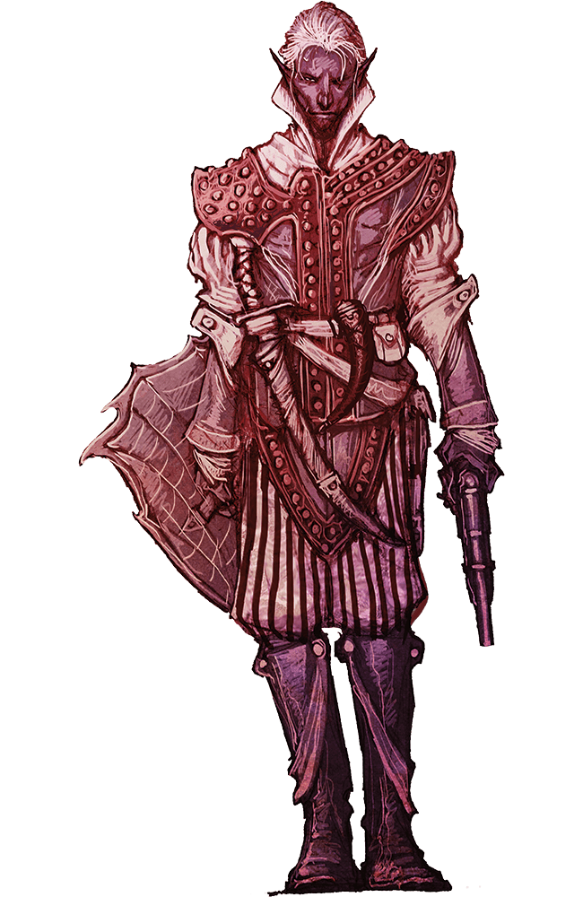

> [Drow Gunslinger](https://www.dndbeyond.com/monsters/149812-drow-gunslinger) 
> Medium humanoid (elf), any alignment
>
> ---
> **Armor Class**  18 (studded leather, shield)
> **Hit Points**  84 (13d8 + 26)
> **Speed**   30 ft.
> |STR|DEX|CON|INT|WIS|CHA|
> |-|-|-|-|-|-|
> |13 (+1)|18 (+4)|14 (+2)|11 (+0)|13 (+1)|14 (+2)|
>
> ---
> **Saving Throws** Dex +6, Con +4, Wis +3
> **Skills** [Perception](https://www.dndbeyond.com/sources/dnd/free-rules/playing-the-game#Skills) +3, [Stealth](https://www.dndbeyond.com/sources/dnd/free-rules/playing-the-game#Skills) +8
> **Senses** [darkvision](https://www.dndbeyond.com/sources/dnd/free-rules/rules-glossary#Darkvision) 120 ft., passive Perception 13
> **Languages** Elvish, Undercommon
> **Challenge** 4 (1,100 XP)
>
> ---
> ***Fey Ancestry.*** The drow has advantage on saving throws against being [charmed](https://www.dndbeyond.com/sources/dnd/free-rules/rules-glossary#CharmedCondition), and magic can’t put the drow to sleep.
>
> ***Gunslinger.*** Being within 5 feet of a hostile creature or attacking at long range doesn’t impose disadvantage on the drow’s ranged attack rolls with a pistol. In addition, the drow ignores half cover and three-quarters cover when making ranged attacks with a pistol.
>
> ***Innate Spellcasting.*** The drow’s spellcasting ability is Charisma (spell save DC 12). It can innately cast the following spells, requiring no material components:
>
> At will: [dancing lights](https://www.dndbeyond.com/spells/2057-dancing-lights)
>
> 1/day each: [*darkness*](https://www.dndbeyond.com/spells/2058-darkness), [*faerie fire*](https://www.dndbeyond.com/spells/2091-faerie-fire), [*levitate*](https://www.dndbeyond.com/spells/2165-levitate) (self only)
>
> ***Sunlight Sensitivity.*** While in sunlight, the drow has disadvantage on attack rolls, as well as on Wisdom ([Perception](https://www.dndbeyond.com/sources/dnd/free-rules/playing-the-game#Skills)) checks that rely on sight.
>
> Actions
> ---
> ***Multiattack.*** The drow makes two shortsword attacks.
>
> ***Shortsword.*** *Melee Weapon Attack: *+6 to hit, reach 5 ft., one target. *Hit:* 7 (1d6 + 4) piercing damage.
>
> ***Poisonous Pistol.*** *Ranged Weapon Attack:* +6 to hit, range 30/90 ft., one target. *Hit:* 9 (1d10 + 4) piercing damage plus 11 (2d10) poison damage.

#### Fel’rekt Lafeen

Fel’rekt is a male drow who was born female. Unhappy with the treatment of males in his society, he petitioned to join Bregan D’aerthe. Jarlaxle took a shine to Fel’rekt almost immediately, and the young drow has since become one of Jarlaxle’s most loyal lieutenants. Eager to prove himself, Fel’rekt is quick to volunteer for tasks and hurls himself into combat with verve.

Fel’rekt and Krebbyg Masq’il’yr are close friends and work as a team, trading banter and jokes at their enemies’ expense. Fel’rekt lacks the cruelty common to most drow, and he won’t kill an adversary unless he is left with no other choice.

***Game Statistics.*** Fel’rekt Lafeen is a neutral good [**drow gunslinger**](#drow-gunslinger). In addition to his weapons, he carries four packets of [*smokepowder*](https://www.dndbeyond.com/magic-items/254340-smokepowder) (see [appendix A](./Magic-Items.md#smokepowder)) and a pouch containing twenty pistol bullets.

#### Krebbyg Masq’il’yr

Krebbyg’s house was destroyed long ago, leaving him with no connection to his old life in the Underdark. He is young and rash.

Krebbyg works closely with Fel’rekt Lafeen, and the two collaborate well despite their disparate alignments. Krebbyg prefers to follow Fel’rekt’s lead, letting him do most of the thinking and talking.

***Game Statistics.*** Krebbyg Masq’il’yr is a chaotic neutral [**drow gunslinger**](#drow-gunslinger). In addition to his weapons, he carries four packets of [*smokepowder*](https://www.dndbeyond.com/magic-items/254340-smokepowder) (see [appendix A](./Magic-Items.md#smokepowder)) and a pouch containing twenty pistol bullets.

#### Soluun Xibrindas

Soluun is a sadistic, fanatical bully who is fiercely loyal to Bregan D’aerthe, and to Jarlaxle in particular. His younger brother, Nar’l, has infiltrated the Xanathar Guild*.* Soluun considers Nar’l a weakling who turned to arcane magic by way of compensation, and he has never had much faith in his brother or his abilities.

Soluun has a burning hatred of surface elves and half-elves, having been taught from a young age to kill them as opportunity permits. When not engaged in a Bregan D’aerthe operation, Soluun spends his nights haunting the darkened streets and alleys of Waterdeep, looking for solitary elves or half-elves to pick off. He conceals his nighttime escapades as well as he can, but Jarlaxle, Fel’rekt, and Krebbyg know what he’s up to.

***Game Statistics.*** [Soluun Xibrindas](https://www.dndbeyond.com/monsters/280387-soluun-xibrindas) is a neutral evil [**drow gunslinger**](#drow-gunslinger), with these changes:

*   Soluun wields a scimitar instead of a shortsword (it deals slashing damage instead of piercing damage).
*   He wears a pair of drow-made [boots of elvenkind](https://www.dndbeyond.com/magic-items/4587-boots-of-elvenkind).
*   In addition to his weapons, he carries four packets of [*smokepowder*](https://www.dndbeyond.com/magic-items/254340-smokepowder) (see [appendix A](./Magic-Items.md#smokepowder)) and a pouch containing twenty pistol bullets.

### Durnan

Durnan is the owner and proprietor of the Yawning Portal. Although he looks like a middle-aged man whose best days are behind him, Durnan has a sharp mind and can still swing a sword when he must. He doesn’t like talking about his past, and he won’t reveal anything about his time as an adventurer.

If Durnan has any living family members, he doesn’t speak of them. He rarely says two words when one will do. He has a dark sense of humor and spares no pity on those who take the risk of entering Undermountain.

He keeps Grimvault, his magic greatsword, within reach under the bar, and can chop tables in half with it if he so desires. He also can pull out a double crossbow (a heavy crossbow with reduced range that fires two bolts at the same target). Still, if he gets involved in a brawl, he prefers fighting with fists or a well-flung tankard.

Durnan doesn’t often venture far from the Yawning Portal, using his employees to run errands for him as needed. If he’s feeling charitable, he might gently discourage likable “nobodies” from venturing into Undermountain, if he thinks they wouldn’t survive. He can also direct adventurers toward tavern regulars who might be able to help them or offer useful information.

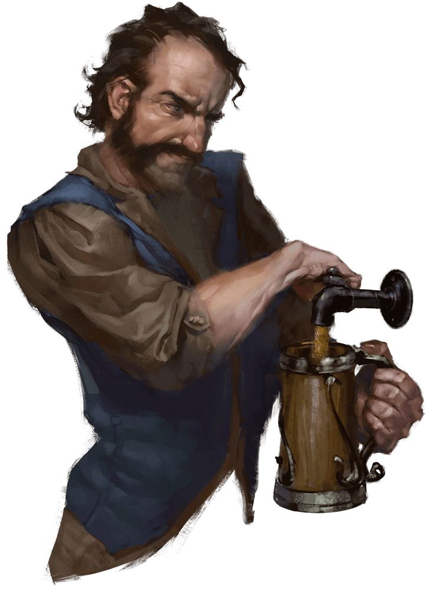

> [Durnan](https://www.dndbeyond.com/monsters/149798-durnan) 
> Medium humanoid (human), neutral
>
> ---
> **Armor Class**  16 ([elven chain](https://www.dndbeyond.com/magic-items/4631-elven-chain))
> **Hit Points**  144 (17d8 + 68)
> **Speed**   30 ft.
> |STR|DEX|CON|INT|WIS|CHA|
> |-|-|-|-|-|-|
> |18 (+4)|15 (+2)|18 (+4)|13 (+1)|12 (+1)|10 (+0)|
>
> ---
> **Saving Throws** Str +8, Con +8
> **Skills** [Athletics](https://www.dndbeyond.com/sources/dnd/free-rules/playing-the-game#Skills) +8, [Perception](https://www.dndbeyond.com/sources/dnd/free-rules/playing-the-game#Skills) +5
> **Senses** passive Perception 15
> **Languages** Common, Dwarvish
> **Challenge** 9 (5,000 XP)
>
> ---
> ***Special Equipment.*** Durnan wields a [*sword of sharpness*](https://www.dndbeyond.com/magic-items/5391-sword-of-sharpness) (great­sword) called Grimvault. He wears [*boots of striding and springing*](https://www.dndbeyond.com/magic-items/4590-boots-of-striding-and-springing), [*elven chain*](https://www.dndbeyond.com/magic-items/4631-elven-chain), and a [ring of spell turning](https://www.dndbeyond.com/magic-items/4731-ring-of-spell-turning).
>
> ***Indomitable (Recharges after a Long Rest).*** Durnan can reroll a saving throw that he fails. He must use the new roll.
>
> ***Spell Turning.*** While wearing his [*ring of spell turning*](https://www.dndbeyond.com/magic-items/4731-ring-of-spell-turning), Durnan has advantage on saving throws against any spell that targets only him (not in an area of effect). If Durnan rolls a 20 for the save and the spell is 7th level or lower, the spell has no effect on him and instead targets the caster, using the slot level, spell save DC, attack bonus, and spellcasting ability of the caster.
>
> Actions
> ---
> ***Multiattack.*** Durnan makes four melee weapon attacks.
>
> ***Grimvault.*** *Melee Weapon Attack: *+8 to hit, reach 5 ft., one target. *Hit:* 11 (2d6 + 4) slashing damage. If the target is an object, the hit instead deals 16 slashing damage. If the target is a creature and Durnan rolls a 20 on the d20 for the attack roll, the target takes an extra 14 slashing damage, and Durnan rolls another d20. On a roll of 20, he lops off one of the target’s limbs, or some other part of its body if it is limbless.
>
> ***Double Crossbow.*** *Ranged Weapon Attack:* +6 to hit, range 60/240 ft., one target. *Hit:* 13 (2d10 + 2) piercing damage.

## Monsters F - J
### Floon Blagmaar

Floon, a native Waterdavian in his early thirties, is a handsome fellow but not very bright. He used to work as an escort in festhalls but is currently unemployed. Several months ago, he came upon a married noble engaging in some indiscreet behavior, and now lives off the generous bribe he is being paid to keep silent.

With friends all over the city, Floon spends most of his time drinking and carousing. He gets by on his looks and doesn’t know what to do with his life, and has shown little interest in working for a living.

#### Game Statistics

[Floon](https://www.dndbeyond.com/monsters/280395-floon-blagmaar) is a chaotic good Illuskan human [**commoner**](https://www.dndbeyond.com/monsters/16829-commoner) with an Intelligence of 7 (−2) and a Charisma of 13 (+1). He speaks Common.

### Gazer

A gazer is a tiny manifestation of a beholder’s dreams. It resembles the beholder who dreamed it into existence, but its body is only 8 inches wide, and it has only four eyestalks. The beholder can see through the gazer’s eyes and uses it to spy on enemies as well as its other minions.

A gazer can’t speak any languages but can approximate mimicking words and sentences in a high-pitched, mocking manner. A lone gazer avoids picking fights with creatures that are Medium or larger, but a pack of them might take on larger prey. A gazer might follow humanoids in its territory, noisily mimicking their speech and generally being a nuisance, until they leave the area, but it flees if confronted by something it can’t kill.

> [Gazer](https://www.dndbeyond.com/monsters/17221-gazer) 
> Tiny aberration, neutral evil
>
> ---
> **Armor Class**  13
> **Hit Points**  13 (3d4 + 6)
> **Speed**   0 ft., fly 30 ft. (hover)
> |STR|DEX|CON|INT|WIS|CHA|
> |-|-|-|-|-|-|
> |3 (−4)|17 (+3)|14 (+2)|3 (−4)|10 (+0)|7 (−2)|
>
> ---
> **Saving Throws** Wis +2
> **Skills** [Perception](https://www.dndbeyond.com/sources/dnd/free-rules/playing-the-game#Skills) +4, [Stealth](https://www.dndbeyond.com/sources/dnd/free-rules/playing-the-game#Skills) +5
> **Condition Immunities** [prone](https://www.dndbeyond.com/sources/dnd/free-rules/rules-glossary#ProneCondition)
> **Senses** [darkvision](https://www.dndbeyond.com/sources/dnd/free-rules/rules-glossary#Darkvision) 60 ft., passive Perception 14
> **Languages** —
> **Challenge** 1/2 (100 XP)
>
> ---
> ***Aggressive.*** As a bonus action, the gazer can move up to its speed toward a hostile creature that it can see.
>
> ***Mimicry.*** The gazer can mimic simple sounds of speech it has heard, in any language. A creature that hears the sounds can tell they are imitations with a successful DC 10 Wisdom ([Insight](https://www.dndbeyond.com/sources/dnd/free-rules/playing-the-game#Skills)) check.
>
> Actions
> ---
> ***Bite.*** *Melee Weapon Attack: *+5 to hit, reach 5 ft., one target. *Hit:* 1 piercing damage.
>
> ***Eye Rays.*** The gazer shoots two of the following magical eye rays at random (reroll duplicates), choosing one or two targets it can see within 60 feet of it:
> 
> 1. *Dazing Ray.* The targeted creature must succeed on a DC 12 Wisdom saving throw or be [charmed](https://www.dndbeyond.com/sources/dnd/free-rules/rules-glossary#CharmedCondition) until the start of the gazer’s next turn. While the target is [charmed](https://www.dndbeyond.com/sources/dnd/free-rules/rules-glossary#CharmedCondition) in this way, its speed is halved, and it has disadvantage on attack rolls.
> 2. *Fear Ray.* The targeted creature must succeed on a DC 12 Wisdom saving throw or be [frightened](https://www.dndbeyond.com/sources/dnd/free-rules/rules-glossary#FrightenedCondition) until the start of the gazer’s next turn.
> 3. *Frost Ray.* The targeted creature must succeed on a DC 12 Dexterity saving throw or take 10 (3d6) cold damage.
> 4. *Telekinetic Ray.* If the target is a creature that is Medium or smaller, it must succeed on a DC 12 Strength saving throw or be moved up to 30 feet directly away from the gazer. 
> If the target is an object weighing 10 pounds or less that isn’t being worn or carried, the gazer moves it up to 30 feet in any direction. The gazer can also exert fine control on objects with this ray, such as manipulating a simple tool or opening a container.

### Hlam

This venerable human monk lives in a cave halfway up the side of Mount Waterdeep. Hlam is the grand master of the Order of the Even-Handed, a small monastic group devoted to Tyr. Would-be students periodically visit him to learn the Way of the Sacred Fists, which combines cleric magic and monk training. They usually return to the city confused, bruised, and not inclined to visit again.

In times of great peril, Hlam can be called on to help. Sometimes he offers pearls of wisdom, and sometimes he descends from his cave to set things right with fisticuffs. He can show up at any point in the story as a helpful figure, and the characters can visit him in his cave if they need guidance or training. The Order of the Gauntlet considers him a staunch ally.

Hlam is immune to disease and doesn’t require food or water. Although he ages, he suffers none of the frailty of old age.

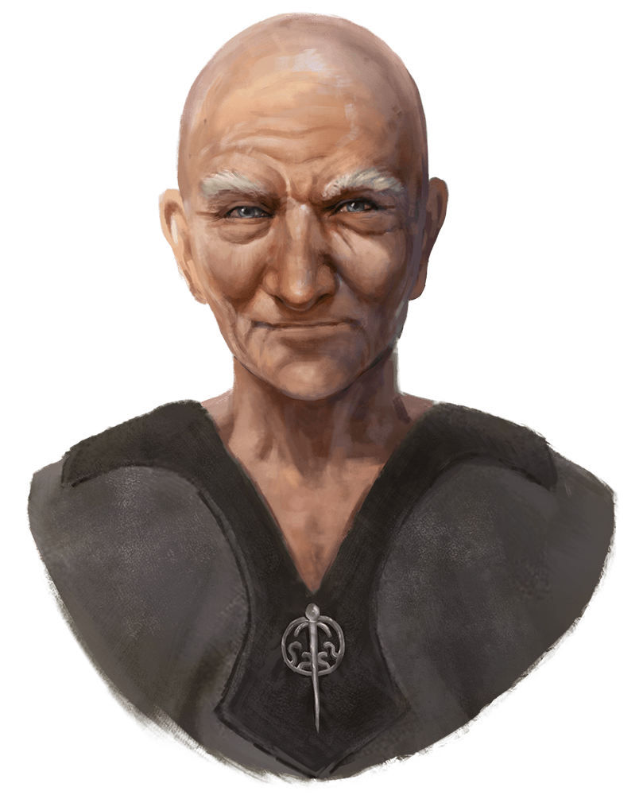

> [HLAM](https://www.dndbeyond.com/monsters/149786-hlam) 
> Medium humanoid (human), lawful good
>
> ---
> **Armor Class**  22
> **Hit Points**  137 (25d8 + 25)
> **Speed**   60 ft.
> |STR|DEX|CON|INT|WIS|CHA|
> |-|-|-|-|-|-|
> |11 (+0)|24 (+7)|13 (+1)|14 (+2)|21 (+5)|14 (+2)|
>
> ---
> **Saving Throws** Str +5, Dex +12
> **Skills** [Athletics](https://www.dndbeyond.com/sources/dnd/free-rules/playing-the-game#Skills) +5, [Religion](https://www.dndbeyond.com/sources/dnd/free-rules/playing-the-game#Skills) +7
> **Damage Immunities** poison
> **Condition Immunities** [charmed](https://www.dndbeyond.com/sources/dnd/free-rules/rules-glossary#CharmedCondition), [frightened](https://www.dndbeyond.com/sources/dnd/free-rules/rules-glossary#FrightenedCondition), [poisoned](https://www.dndbeyond.com/sources/dnd/free-rules/rules-glossary#PoisonedCondition)
> **Senses** passive Perception 15
> **Languages** all spoken languages
> **Challenge** 16 (15,000 XP)
>
> ---
> ***Spellcasting.*** Hlam is a 5th-level spellcaster. His spellcasting ability is Wisdom (spell save DC 18, +10 to hit with spell attacks). He has the following cleric spells prepared:
>
> Cantrips (at will): [guidance](https://www.dndbeyond.com/spells/2132-guidance), [light](https://www.dndbeyond.com/spells/2166-light), [sacred flame](https://www.dndbeyond.com/spells/2236-sacred-flame), [spare the dying](https://www.dndbeyond.com/spells/2257-spare-the-dying)
>
> 1st level (4 slots): [detect evil and good](https://www.dndbeyond.com/spells/2064-detect-evil-and-good), [healing word](https://www.dndbeyond.com/spells/2140-healing-word), [sanctuary](https://www.dndbeyond.com/spells/2237-sanctuary), [shield of faith](https://www.dndbeyond.com/spells/2248-shield-of-faith)
>
> 2nd level (3 slots): [calm emotions](https://www.dndbeyond.com/spells/2023-calm-emotions), [prayer of healing](https://www.dndbeyond.com/spells/2212-prayer-of-healing), [silence](https://www.dndbeyond.com/spells/2251-silence)
>
> 3rd level (2 slots): [protection from energy](https://www.dndbeyond.com/spells/2220-protection-from-energy), [remove curse](https://www.dndbeyond.com/spells/2229-remove-curse), [sending](https://www.dndbeyond.com/spells/2243-sending)
>
> ***Evasion.*** If Hlam is subjected to an effect that allows him to make a Dexterity saving throw to take only half damage, he instead takes no damage if he succeeds on the saving throw, and only half damage if he fails. He can’t use this trait if he’s [incapacitated](https://www.dndbeyond.com/sources/dnd/free-rules/rules-glossary#IncapacitatedCondition).
>
> ***Magic Unarmed Strikes.*** Hlam’s unarmed strikes are magical.
>
> ***Unarmored Defense.*** While Hlam is wearing no armor and wielding no shield, his AC includes his Wisdom modifier.
>
> Actions
> ---
>
> ***Multiattack.*** Hlam attacks three times using his unarmed strike, darts, or both.
>
> ***Unarmed Strike.*** *Melee Weapon Attack: *+12 to hit, reach 5 ft., one target. *Hit:* 12 (1d10 + 7) bludgeoning damage. If the target is a creature, Hlam can choose one of the following additional effects:
>
> *   The target must succeed on a DC 18 Strength saving throw or drop one item it is holding (Hlam’s choice).
> *   The target must succeed on a DC 18 Dexterity saving throw or be knocked [prone](https://www.dndbeyond.com/sources/dnd/free-rules/rules-glossary#ProneCondition).
> *   The target must succeed on a DC 18 Constitution saving throw or be [stunned](https://www.dndbeyond.com/sources/dnd/free-rules/rules-glossary#StunnedCondition) until the end of Hlam’s next turn.
>
> ***Dart.*** *Ranged Weapon Attack:* +12 to hit, range 20/60 ft., one target. *Hit:* 9 (1d4 + 7) piercing damage.
>
> ***Quivering Palm (Recharge 6).** Melee Weapon Attack:* +12 to hit, reach 5 ft., one creature. *Hit:* The target must make a DC 18 Constitution saving throw. On a failed save, the target is reduced to 0 hit points. On a successful save, the target takes 55 (10d10) necrotic damage.
>
> ***Wholeness of Body (Recharges after a Long Rest).*** Hlam regains 60 hit points.
>
> Reactions
> ---
>
> ***Deflect Missile.*** In response to being hit by a ranged weapon attack, Hlam deflects the missile. The damage he takes from the attack is reduced by 1d10 + 27. If the damage is reduced to 0, Hlam catches the missile if it’s small enough to hold in one hand and he has a hand free.
>
> ***Slow Fall.*** Hlam reduces the bludgeoning damage he takes from a fall by 100.
>
> Legendary Actions
> ---
> Hlam can take 3 legendary actions, choosing from the options below. Only one legendary action option can be used at a time and only at the end of another creature’s turn. Hlam regains spent legendary actions at the start of his turn.
>
> **Quick Step.** Hlam moves up to his speed without provoking opportunity attacks.
>
> **Unarmed Strike (Costs 2 Actions).** Hlam makes one unarmed strike.
>
> **Invisibility (Costs 3 Actions).** Hlam becomes [invisible](https://www.dndbeyond.com/sources/dnd/free-rules/rules-glossary#InvisibleCondition) until the end of his next turn. The effect ends if Hlam attacks or casts a spell.

### Hrabbaz

Hrabbaz is a muscle-bound half-orc with a cleft palate who serves the lord and lady of House Gralhund as a bodyguard. He is well mannered and dresses impeccably — a disarming appearance that belies a murderous heart. Though he has great respect for [Lady Yalah Gralhund](https://www.dndbeyond.com/monsters/280438-yalah-gralhund), he is less fond of her moody husband, and wouldn’t be sad to see [Orond](https://www.dndbeyond.com/monsters/280415-orond-gralhund) knocked down a peg or two.

> [Hrabbaz](https://www.dndbeyond.com/monsters/149774-hrabbaz) 
> Medium humanoid (half-orc), neutral evil
>
> ---
> **Armor Class**  12
> **Hit Points**  112 (15d8 + 45)
> **Speed**   30 ft.
> |STR|DEX|CON|INT|WIS|CHA|
> |-|-|-|-|-|-|
> |20 (+5)|15 (+2)|17 (+3)|10 (+0)|14 (+2)|12 (+1)|
>
> ---
> **Saving Throws** Str +8, Con +6
> **Skills** [Athletics](https://www.dndbeyond.com/sources/dnd/free-rules/playing-the-game#Skills) +8, [Intimidation](https://www.dndbeyond.com/sources/dnd/free-rules/playing-the-game#Skills) +4, [Perception](https://www.dndbeyond.com/sources/dnd/free-rules/playing-the-game#Skills) +5
> **Senses** [darkvision](https://www.dndbeyond.com/sources/dnd/free-rules/rules-glossary#Darkvision) 60 ft., passive Perception 15
> **Languages** Common, Orc
> **Challenge** 5 (1,800 XP)
>
> ---
> ***Indomitable (2/Day).*** Hrabbaz can reroll a saving throw that he fails. He must use the new roll.
>
> **Relentless Endurance (Recharges after a Long Rest).*** When Hrabbaz is reduced to 0 hit points but not killed outright, he drops to 1 hit point instead.
>
> Actions
> ---
> ***Multiattack.*** Hrabbaz makes three attacks with his morningstar.
>
> ***Morningstar.*** *Melee Weapon Attack: *+8 to hit, reach 5 ft., one target. *Hit:* 9 (1d8 + 5) piercing damage, plus 3 (1d6) piercing damage if Hrabbaz has more than half his hit points remaining.

### Jalester Silvermane

An earnest man in his mid-twenties, Jalester hails from the distant land of Cormyr, where he earned his spurs working for a mercenary company called the Steel Shadows. A few years ago, Jalester left the Dales and traveled to Waterdeep with several other members of the company, one of whom — Faerrel Dunblade — would become his best friend and lover.

The wizard Elminster befriended the two young men and brought them to the attention of Laeral Silverhand, who put them to work as deputies and spies. Jalester and Faerrel helped the Open Lord expose a plot to overthrow the government, but Faerrel was killed while helping bring the perpetrators to justice. Jalester remained in Waterdeep afterward, becoming one of Laeral’s field operatives in the service of Waterdeep and the Lords’ Alliance. He has been romantically unattached ever since Faerrel’s death but longs again for love.

### Treasure

Jalester carries a [*badge of the Watch*](https://www.dndbeyond.com/magic-items/253567-badge-of-the-watch) (see [appendix A](./Magic-Items.md#badge-of-the-watch)). If the badge is lost or taken from him, it returns to Laeral Silverhand.

> [Jalester Silvermane](https://www.dndbeyond.com/monsters/149770-jalester-silvermane) 
> Medium humanoid (human), lawful good
>
> ---
> **Armor Class**  18 (chain mail, [*badge of the Watch*](https://www.dndbeyond.com/magic-items/253567-badge-of-the-watch))
> **Hit Points**  71 (13d8 + 13)
> **Speed**   30 ft.
> |STR|DEX|CON|INT|WIS|CHA|
> |-|-|-|-|-|-|
> |14 (+2)|14 (+2)|13 (+1)|12 (+1)|14 (+2)|13 (+1)|
>
> ---
> **Saving Throws** Str +4, Con +3
> **Skills** [Athletics](https://www.dndbeyond.com/sources/dnd/free-rules/playing-the-game#Skills) +4, [Survival](https://www.dndbeyond.com/sources/dnd/free-rules/playing-the-game#Skills) +4
> **Senses** passive Perception 12
> **Languages** Common, Elvish
> **Challenge** 4 (1,100 XP)
>
> ---
> ***Special Equipment.*** Jalester carries a [badge of the Watch](https://www.dndbeyond.com/magic-items/253567-badge-of-the-watch).
>
> **Second Wind (Recharges after a Short or Long Rest).*** As a bonus action, Jalester can regain 16 (1d10 + 11) hit points.
>
> Actions
> ---
> ***Multiattack.*** Jalester makes two weapon attacks.
>
> ***Longsword.*** *Melee Weapon Attack: *+4 to hit, reach 5 ft., one target. *Hit:* 6 (1d8 + 2) slashing damage, or 7 (1d10 + 2) slashing damage when used with two hands.
>
> ***Dagger.*** *Melee or Ranged Weapon Attack:* +4 to hit, reach 5 ft. or range 20/60 ft., one target. *Hit:* 4 (1d4 + 2) piercing damage.
>
> Reactions
> ---
> ***Riposte.*** When a creature that Jalester can see misses him with a melee attack, he can use his reaction to make a melee weapon attack against that creature. On a hit, the target takes an extra 4 damage from the weapon.

### Jarlaxle Baenre

Jarlaxle is a flamboyant, swashbuckling drow iconoclast. He leads a renegade drow faction called Bregan D’aerthe, made up of disenfranchised male drow, most of them culled from destroyed or disgraced houses. Gifted with a sharp mind, a sense of humor, puissant skill with a blade, and a wealth of useful magic items, Jarlaxle infiltrated the city of Luskan, brought a kind of order to its lawlessness, and declared himself its secret lord.

Jarlaxle likes to weave a tangled web of schemes that leave his enemies baffled — the latest of which is a plan to legitimize Luskan by making it a member of the Lords’ Alliance. The city’s unsavory reputation has thwarted all previous efforts, and the current leaders of the Lords’ Alliance have voiced their opposition to Luskan’s admittance. A few have flatly declared that the city will never be welcome in the alliance. Nonetheless, Jarlaxle aims to persuade Laeral Silverhand, the Open Lord of Waterdeep, to champion Luskan’s cause — even if that means losing other alliance members in the process. Tying Luskan’s fortunes to those of Waterdeep would increase Jarlaxle’s political and economic power on the Sword Coast.

Jarlaxle has come to Waterdeep in the guise of an Illuskan human named Zardoz Zord. “Captain Zord” is the master of the Sea Maidens Faire, a carnival that travels up and down the Sword Coast in three ships: the *Eyecatcher*, the *Heartbreaker*, and the *Hellraiser *(all words that describe Jarlaxle). He spends most of his time aboard the *Eyecatcher*, his personal ship. The other two vessels carry members of the carnival and their parade wagons.

Jarlaxle has forged an alliance with Lantan (an island to the south), and has armed his Bregan D’aerthe lieutenants with Lantanese firearms that rely on magical [*smokepowder*](https://www.dndbeyond.com/magic-items/254340-smokepowder) to function. He has also acquired a Lantanese submarine called the *Scarlet Marpenoth*. This underwater vessel is mounted below the *Eyecatcher* and kept out of sight. Jarlaxle plans on using the submarine to flee Waterdeep if his scheme unravels.

Jarlaxle’s loyalties are to himself first and foremost, and to Bregan D’aerthe secondarily.

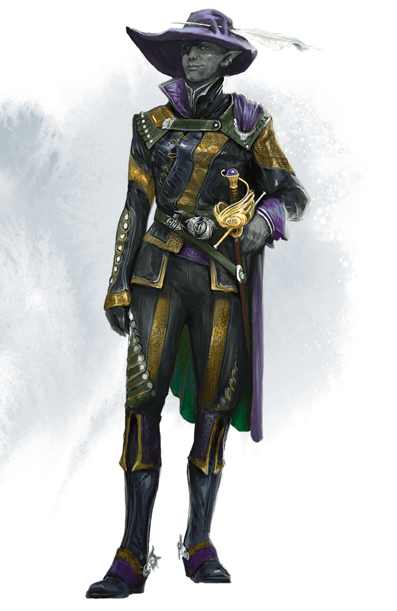

> [JARLAXLE BAENRE](https://www.dndbeyond.com/monsters/149550-jarlaxle-baenre) 
> Medium humanoid (elf), chaotic neutral
>
> ---
> **Armor Class**  24 (+3 leather armor, Suave Defense)
> **Hit Points**  123 (19d8 + 38)
> **Speed**   30 ft.
> |STR|DEX|CON|INT|WIS|CHA|
> |-|-|-|-|-|-|
> |12 (+1)|22 (+6)|14 (+2)|20 (+5)|16 (+3)|19 (+4)|
>
> ---
> **Saving Throws** Dex +11, Wis +8
> **Skills** [Acrobatics](https://www.dndbeyond.com/sources/dnd/free-rules/playing-the-game#Skills) +11, [Athletics](https://www.dndbeyond.com/sources/dnd/free-rules/playing-the-game#Skills) +6, [Deception](https://www.dndbeyond.com/sources/dnd/free-rules/playing-the-game#Skills) +14, [Perception](https://www.dndbeyond.com/sources/dnd/free-rules/playing-the-game#Skills) +8, [Sleight of Hand](https://www.dndbeyond.com/sources/dnd/free-rules/playing-the-game#Skills) +11, [Stealth](https://www.dndbeyond.com/sources/dnd/free-rules/playing-the-game#Skills) +16
> **Senses** [darkvision](https://www.dndbeyond.com/sources/dnd/free-rules/rules-glossary#Darkvision) 120 ft., passive Perception 18
> **Languages** Abyssal, Common, Draconic, Dwarvish, Elvish, Undercommon
> **Challenge** 15 (13,000 XP)
>
> ***Special Equipment.*** Jarlaxle wears [+3 leather armor](https://www.dndbeyond.com/magic-items/5114-leather-3), a [hat of disguise](https://www.dndbeyond.com/magic-items/4651-hat-of-disguise), a [bracer of flying daggers](https://www.dndbeyond.com/magic-items/253604-bracer-of-flying-daggers) (see [appendix A](./Magic-Items.md#bracer-of-flying-daggers)), a [cloak of invisibility](https://www.dndbeyond.com/magic-items/5347-cloak-of-invisibility), a [knave’s eye patch](https://www.dndbeyond.com/magic-items/254335-knaves-eye-patch) (see [appendix A](./Magic-Items.md#knaves-eye-patch)), and a [ring of truth telling](https://www.dndbeyond.com/magic-items/254338-ring-of-truth-telling) (see [appendix A](./Magic-Items.md#ring-of-truth-telling)). He wields a [+3 rapier](https://www.dndbeyond.com/magic-items/5327-rapier-3) and carries a [portable hole](https://www.dndbeyond.com/magic-items/4699-portable-hole) and a [wand of web](https://www.dndbeyond.com/magic-items/4799-wand-of-web). His hat is adorned with a [feather of diatryma summoning](https://www.dndbeyond.com/magic-items/253617-feather-of-diatryma-summoning) (see [appendix A](./Magic-Items.md#feather-of-diatryma-summoning)).
>
> ***Evasion.*** If he is subjected to an effect that allows him to make a Dexterity saving throw to take only half damage, Jarlaxle instead takes no damage if he succeeds on the saving throw, and only half damage if he fails. He can’t use this trait if he’s [incapacitated](https://www.dndbeyond.com/sources/dnd/free-rules/rules-glossary#IncapacitatedCondition).
>
> ***Fey Ancestry.*** Jarlaxle has advantage on saving throws against being [charmed](https://www.dndbeyond.com/sources/dnd/free-rules/rules-glossary#CharmedCondition), and magic can’t put him to sleep.
>
> ***Innate Spellcasting.*** Jarlaxle’s innate spellcasting ability is Charisma (spell save DC 17, +9 to hit with spell attacks). He can innately cast the following spells, requiring no material components:
>
> At will: [dancing lights](https://www.dndbeyond.com/spells/2057-dancing-lights) 1/day each: [darkness](https://www.dndbeyond.com/spells/2058-darkness), [faerie fire](https://www.dndbeyond.com/spells/2091-faerie-fire), [levitate](https://www.dndbeyond.com/spells/2165-levitate) (self only)
>
> ***Legendary Resistance (1/Day).*** If Jarlaxle fails a saving throw, he can choose to succeed instead.
>
> ***Master Attuner.*** Jarlaxle can attune to up to five magic items, and he can attune to magic items that normally require attunement by a sorcerer, warlock, or wizard.
>
> ***Sneak Attack (1/Turn).*** Jarlaxle deals an extra 24 (7d6) damage when he hits a target with a weapon attack and has advantage on the attack roll, or when the target is within 5 feet of an ally of Jarlaxle’s that isn’t [incapacitated](https://www.dndbeyond.com/sources/dnd/free-rules/rules-glossary#IncapacitatedCondition) and Jarlaxle doesn’t have disadvantage on the attack roll.
>
> ***Suave Defense.*** While Jarlaxle is wearing light or no armor and wielding no shield, his AC includes his Charisma modifier.
>
> ***Sunlight Sensitivity.*** When not wearing his knave’s eye patch, Jarlaxle has disadvantage on attack rolls, as well as on Wisdom ([Perception](https://www.dndbeyond.com/sources/dnd/free-rules/playing-the-game#Skills)) checks that rely on sight.
>
> Actions
> ---
> ***Multiattack.*** Jarlaxle makes three attacks with his [+3 rapier](https://www.dndbeyond.com/magic-items/5327-rapier-3) or two attacks with daggers created by his [bracer of flying daggers](https://www.dndbeyond.com/magic-items/253604-bracer-of-flying-daggers).
>
> ***+3 Rapier.*** *Melee Weapon Attack:* +14 to hit, reach 5 ft., one target. *Hit:* 13 (1d8 + 9) piercing damage.
>
> ***Flying Dagger.** Ranged Weapon Attack:* +11 to hit, range 20/60 ft., one target. *Hit:* 8 (1d4 + 6) piercing damage.
>
> Legendary Actions
> ---
> Jarlaxle can take 3 legendary actions, choosing from the options below. Only one legendary action option can be used at a time and only at the end of another creature’s turn. Jarlaxle regains spent legendary actions at the start of his turn.
>
> **Quick Step.** Jarlaxle moves up to his speed without provoking opportunity attacks.
>
> **Attack (Costs 2 Actions).** Jarlaxle makes one attack with his [+3 rapier](https://www.dndbeyond.com/magic-items/5327-rapier-3) or two attacks with daggers created by his [bracer of flying daggers](https://www.dndbeyond.com/magic-items/253604-bracer-of-flying-daggers).

## Monsters L - O
### Laeral Silverhand

Anamanué Laeral Silverhand was born in the Year of the Cowl (765 DR), the fifth of seven daughters of the goddess Mystra. Each of the Seven Sisters is a powerful and ageless beauty with a penchant for arcane magic.

Long ago, Laeral ruled a kingdom called Stornanter and held the title of Witch-Queen of the North. After that, she led a band of adventurers called the Nine. She met and married Khelben Arunsun, who would later become the Blackstaff, the Lord Mage of Waterdeep. After Khelben died, Laeral retired from public life. She resurfaced after the Spellplague and the Sundering, weakened by Mystra’s death, rebirth, and withdrawal from the world.

Laeral’s magic isn’t as great as it once was, though she does her utmost to hide this fact. Only Elminster, her trusted friend and advisor, knows the extent of her decline. Despite her diminished abilities, Laeral remains a formidable, clear-headed wizard with plenty of magic at her disposal.

A few years ago, Dagult Neverember was ousted as Open Lord of Waterdeep. Laeral reluctantly stepped into the vacancy at the request of the Masked Lords, and has served as Waterdeep’s Open Lord ever since. Initially overwhelmed by the demands of the nobles and guildmasters, she has settled nicely into her new role. She uses her magic sparingly and relies on trusted advisors and deputies. As time allows, she likes to venture outside the Palace of Waterdeep in disguise, just to clear her head or check up on old friends (and enemies).

Laeral’s relationship with Vajra Safahr, the current Blackstaff, has its challenges. For one thing, Laeral is much older, much wiser, and much more powerful than Vajra, whom she views as an insecure child. In addition, Vajra wields the [*Blackstaff*](https://www.dndbeyond.com/magic-items/253576-blackstaff), which has Khelben Arunsun’s soul and the souls of all the other Blackstaffs bound inside it. Laeral covets the staff, because it contains all that’s left of her husband. Not surprisingly, the two mages avoid each other as much as possible.

In times of great need, Laeral can command Vajra to unleash Force Grey. Until that order is given, Force Grey isn’t allowed to conduct operations in Waterdeep, though Laeral’s spies tell her that Vajra has secretly activated members of the elite order and sent them on a number of unauthorized missions. Laeral is reluctant to confront Vajra on the matter, and rationalizes her inaction by framing it as a test of Vajra’s competence.

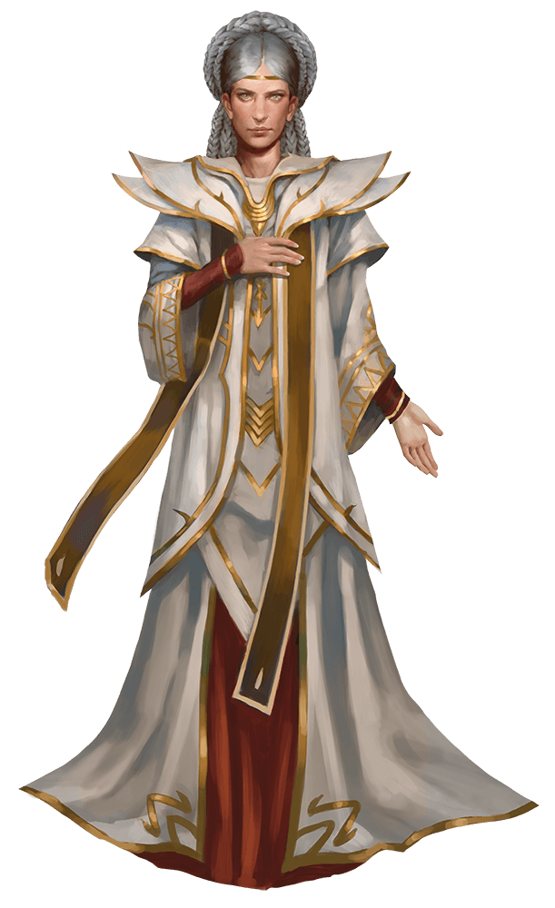

> [Laeral Silverhand](https://www.dndbeyond.com/monsters/148474-laeral-silverhand) 
> Medium humanoid (human), chaotic good
>
> ---
> **Armor Class**  18 ([robe of the archmagi](https://www.dndbeyond.com/magic-items/11422918-robe-of-the-archmagi))
> **Hit Points**  228 (24d8 + 120)
> **Speed**   30 ft.
> |STR|DEX|CON|INT|WIS|CHA|
> |-|-|-|-|-|-|
> |13 (+1)|17 (+3)|20 (+5)|20 (+5)|20 (+5)|19 (+4)|
>
> ---
> **Saving Throws** Int +11, Wis +11
> **Skills** [Arcana](https://www.dndbeyond.com/sources/dnd/free-rules/playing-the-game#Skills) +17, [History](https://www.dndbeyond.com/sources/dnd/free-rules/playing-the-game#Skills) +17, [Insight](https://www.dndbeyond.com/sources/dnd/free-rules/playing-the-game#Skills) +11, [Perception](https://www.dndbeyond.com/sources/dnd/free-rules/playing-the-game#Skills) +11, [Persuasion](https://www.dndbeyond.com/sources/dnd/free-rules/playing-the-game#Skills) +10
> **Damage Resistances** fire
> **Damage Immunities** poison
> **Condition Immunities** [poisoned](https://www.dndbeyond.com/sources/dnd/free-rules/rules-glossary#PoisonedCondition)
> **Senses** [truesight](https://www.dndbeyond.com/sources/dnd/free-rules/rules-glossary#Truesight) 60 ft., passive Perception 21
> **Languages** Common, Draconic, Dwarvish, Elvish, Giant, Infernal
> **Challenge** 17 (18,000 XP)
>
> ***Special Equipment.*** Laeral wears a white [robe of the archmagi](https://www.dndbeyond.com/magic-items/11422918-robe-of-the-archmagi) (accounted for in her statistics). She wields a [flame tongue longsword](https://www.dndbeyond.com/magic-items/4895-flame-tongue-longsword).
>
> ***Magic Resistance.*** While wearing her [robe of the archmagi](https://www.dndbeyond.com/magic-items/11422918-robe-of-the-archmagi), Laeral has advantage on saving throws against spells and other magical effects.
>
> ***Spellcasting.*** Laeral is a 19th-level spellcaster. Her spellcasting ability is Intelligence (spell save DC 21, +13 to hit with spell attacks). Laeral has the following wizard spells prepared:
>
> Cantrips (at will): [light](https://www.dndbeyond.com/spells/2166-light), [mage hand](https://www.dndbeyond.com/spells/2173-mage-hand), [minor illusion](https://www.dndbeyond.com/spells/2191-minor-illusion), [prestidigitation](https://www.dndbeyond.com/spells/2213-prestidigitation), [ray of frost](https://www.dndbeyond.com/spells/2226-ray-of-frost) 1st level (at will): [detect magic](https://www.dndbeyond.com/spells/2065-detect-magic), [disguise self](https://www.dndbeyond.com/spells/2069-disguise-self), [magic missile](https://www.dndbeyond.com/spells/2176-magic-missile), [shield](https://www.dndbeyond.com/spells/2247-shield) 2nd level (at will): [detect thoughts](https://www.dndbeyond.com/spells/2067-detect-thoughts), [invisibility](https://www.dndbeyond.com/spells/2159-invisibility), [misty step](https://www.dndbeyond.com/spells/2195-misty-step) 3rd level (3 slots): [counterspell](https://www.dndbeyond.com/spells/2051-counterspell), [fly](https://www.dndbeyond.com/spells/2111-fly), [sending](https://www.dndbeyond.com/spells/2243-sending), [tongues](https://www.dndbeyond.com/spells/2281-tongues) 4th level (3 slots): [banishment](https://www.dndbeyond.com/spells/2010-banishment), [greater invisibility](https://www.dndbeyond.com/spells/2128-greater-invisibility), [Otiluke’s resilient sphere](https://www.dndbeyond.com/spells/2349-otilukes-resilient-sphere) 5th level (3 slots): [cone of cold](https://www.dndbeyond.com/spells/2037-cone-of-cold), [geas](https://www.dndbeyond.com/spells/2120-geas), [Rary’s telepathic bond](https://www.dndbeyond.com/spells/2356-rarys-telepathic-bond) 6th level (2 slots): [globe of invulnerability](https://www.dndbeyond.com/spells/2124-globe-of-invulnerability), [mass suggestion](https://www.dndbeyond.com/spells/2184-mass-suggestion) 7th level (1 slot): [prismatic spray](https://www.dndbeyond.com/spells/2214-prismatic-spray), [teleport](https://www.dndbeyond.com/spells/2275-teleport) 8th level (1 slot): [feeblemind](https://www.dndbeyond.com/spells/2096-feeblemind), [power word stun](https://www.dndbeyond.com/spells/2211-power-word-stun) 9th level (1 slot): [time stop](https://www.dndbeyond.com/spells/2279-time-stop)
>
> Actions
> ---
> ***Multiattack.*** Laeral makes three attacks with her silver hair and [flame tongue longsword](https://www.dndbeyond.com/magic-items/4895-flame-tongue-longsword), in any combination. She can cast one of her cantrips or 1st-level spells before or after making these attacks.
>
> ***Silver Hair.*** *Melee Weapon Attack:* +11 to hit, reach 5 ft., one target. *Hit:* 7 (2d6) force damage, and the target must succeed on a DC 19 Constitution saving throw or be [paralyzed](https://www.dndbeyond.com/sources/dnd/free-rules/rules-glossary#ParalyzedCondition) for 1 minute. The target can repeat the saving throw at the end of each of its turns, ending the effect on itself on a success.
>
> ***Flame Tongue.*** *Melee Weapon Attack:* +7 to hit, reach 5 ft., one target. *Hit:* 5 (1d8 + 1) slashing damage plus 7 (2d6) fire damage, or 6 (1d10 + 1) slashing damage plus 7 (2d6) fire damage when used with two hands.
>
> ***Spellfire (Recharges after a Long Rest).*** Magical, heatless, silver fire harmlessly erupts from Laeral and surrounds her until she is [incapacitated](https://www.dndbeyond.com/sources/dnd/free-rules/rules-glossary#IncapacitatedCondition) or until she uses an action to quench it. She gains one of the following benefits of her choice, which lasts until the silver fire ends:
>
> * She can breathe underwater.
> * She can survive without food and water.
> * She is immune to magic that would ascertain her thoughts, truthfulness, alignment, or creature type.
> * She gains resistance to cold damage, and she is unharmed by temperatures as low as −50 degrees Fahrenheit.
> 
> While the silver fire is present, she has the following additional action options:
> 
> * Cast the [cure wounds](https://www.dndbeyond.com/spells/2056-cure-wounds) spell. The target regains 1d8 + 5 hit points. After Laeral takes this action, roll a d6. On a roll of 1, the silver fire disappears.
> * Cast the [revivify](https://www.dndbeyond.com/spells/2234-revivify) spell without material components. After Laeral takes this action, roll a d6. On a roll of 1–2, the silver fire disappears.
> * Release a 60-foot line of silver fire that is 5 feet wide or a 30-foot cone of silver fire. Objects in the area that aren’t being worn or carried take 26 (4d12) fire damage. Each creature in the area must succeed on a DC 21 Dexterity saving throw, taking 26 (4d12) fire damage on a failed save, or half as much damage on a successful one. After Laeral takes this action, roll a d6. On a roll of 1–3, the silver fire disappears.

### Manshoon

Referred to in this adventure simply as “Manshoon,” this clone of the ancient archwizard infiltrated Waterdeep years ago and has been hiding out in Kolat Towers ever since, in the city’s Southern Ward.

The original Manshoon was one of the founders of the Zhentarim. Evil to the core, he made enemies all across Faerûn, including other powerful spellcasters such as Khelben Arunsun and Elminster. Fearing that he might be destroyed by his foes, Manshoon magically crafted several clones — but a mishap caused all of them to be awakened at once, whereupon they tried to destroy one another in a series of conflicts that came to be known as the Manshoon Wars.

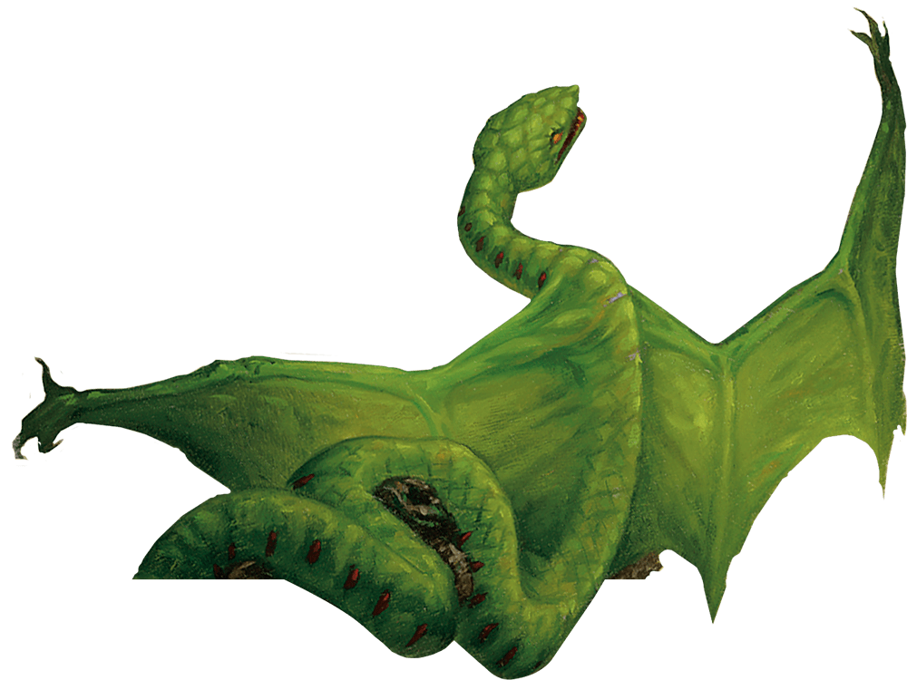
*A Flying Snake of the Zhentarim*

Now the original Manshoon is dead, and it’s widely believed that all his clones were destroyed as well. In fact, at least three are still alive. The one presently in Waterdeep escaped death by hiding out in Undermountain, where he eventually ran afoul of Halaster Blackcloak. After a brief spell duel, Halaster captured Manshoon and amputated his left arm at the elbow for reasons unknown. Manshoon escaped imprisonment and fled Undermountain, taking refuge in the city above. Attempts to magically regenerate his severed limb failed, forcing him to craft an artificial arm and hand for himself.

Manshoon took control of Kolat Towers, a crumbling residence in the Southern Ward that was abandoned years ago by the two wizards who built it. The edifice is surrounded by a magical barrier that has the properties of a [*wall of force*](https://www.dndbeyond.com/spells/2292-wall-of-force). Manshoon rarely leaves the towers and uses a teleportation circle when he must do so, and thus is never seen entering or leaving.

Manshoon aims to rule Waterdeep and replace the City Watch with Black Network mercenaries that are loyal to him alone. By bribing and blackmailing the Masked Lords, he hopes to oust Laeral Silverhand as Open Lord and take her place, kill the Blackstaff, reduce the Masked Lords to mere vassals, and declare himself the Wizard-King of Waterdeep. Once the city is firmly in his clutches, Manshoon will then turn his attention toward Undermountain, destroy Halaster once and for all, and claim the dungeon’s riches.

> [Manshoon](https://www.dndbeyond.com/monsters/148481-manshoon) 
> Medium humanoid (human), lawful evil
>
> ---
> **Armor Class**  19 (_[robe of the archmagi](https://www.dndbeyond.com/magic-items/11422918-robe-of-the-archmagi)_, [*staff of power*](https://www.dndbeyond.com/magic-items/4764-staff-of-power))
> **Hit Points**  126 (23d8 + 23)
> **Speed**   30 ft.
> |STR|DEX|CON|INT|WIS|CHA|
> |-|-|-|-|-|-|
> |10 (+0)|14 (+2)|12 (+1)|23 (+6)|15 (+2)|16 (+3)|
>
> ---
> **Saving Throws** Str +2, Dex +4, Con +3, Int +13, Wis +9, Cha +5
> **Skills** [Arcana](https://www.dndbeyond.com/sources/dnd/free-rules/playing-the-game#Skills) +11, [History](https://www.dndbeyond.com/sources/dnd/free-rules/playing-the-game#Skills) +11
> **Senses** [darkvision](https://www.dndbeyond.com/sources/dnd/free-rules/rules-glossary#Darkvision) 60 ft., passive Perception 12
> **Languages** Common, Draconic, Goblin, Infernal, Orc, Undercommon
> **Challenge** 13 (10,000 XP)
>
> ---
> ***Special Equipment.*** Manshoon wears a black [*robe of the archmagi*](https://www.dndbeyond.com/magic-items/11422918-robe-of-the-archmagi) and wields a [*staff of power*](https://www.dndbeyond.com/magic-items/4764-staff-of-power) (both accounted for in his statistics). Roll 2d10 to determine how many charges the staff has remaining.
>
> ***Magic Resistance.*** While wearing his [*robe of the archmagi*](https://www.dndbeyond.com/magic-items/11422918-robe-of-the-archmagi), Manshoon has advantage on saving throws against spells and other magical effects.
>
> ***Spellcasting.*** Manshoon is an 18th-level spellcaster. His spellcasting ability is Intelligence (spell save DC 21, +15 to hit with spell attacks). He has the following wizard spells prepared:
>
> Cantrips (at will): [*fire bolt*](https://www.dndbeyond.com/spells/2103-fire-bolt), [*light*](https://www.dndbeyond.com/spells/2166-light), [*mage hand*](https://www.dndbeyond.com/spells/2173-mage-hand), [*prestidigitation*](https://www.dndbeyond.com/spells/2213-prestidigitation), [shocking grasp](https://www.dndbeyond.com/spells/2250-shocking-grasp)
>
> 1st level (4 slots): [*detect magic*](https://www.dndbeyond.com/spells/2065-detect-magic), [*mage armor*](https://www.dndbeyond.com/spells/2172-mage-armor), [magic missile](https://www.dndbeyond.com/spells/2176-magic-missile), [*shield*](https://www.dndbeyond.com/spells/2247-shield)
>
> 2nd level (3 slots): [*detect thoughts*](https://www.dndbeyond.com/spells/2067-detect-thoughts), [*mirror image*](https://www.dndbeyond.com/spells/2193-mirror-image), [*misty step*](https://www.dndbeyond.com/spells/2195-misty-step)
>
> 3rd level (3 slots): [*counterspell*](https://www.dndbeyond.com/spells/2051-counterspell), [*lightning bolt*](https://www.dndbeyond.com/spells/2167-lightning-bolt), [*sending*](https://www.dndbeyond.com/spells/2243-sending)
>
> 4th level (3 slots): [*fire shield*](https://www.dndbeyond.com/spells/2104-fire-shield), [*greater invisibility*](https://www.dndbeyond.com/spells/2128-greater-invisibility), [*polymorph*](https://www.dndbeyond.com/spells/2209-polymorph)
>
> 5th level (3 slots): [Bigby’s hand](https://www.dndbeyond.com/spells/2352-bigbys-hand), [*scrying*](https://www.dndbeyond.com/spells/2239-scrying), [wall of force](https://www.dndbeyond.com/spells/2292-wall-of-force)
>
> 6th level (1 slot): [*flesh to stone*](https://www.dndbeyond.com/spells/2109-flesh-to-stone), [globe of invulnerability](https://www.dndbeyond.com/spells/2124-globe-of-invulnerability)
>
> 7th level (1 slot): [*finger of death*](https://www.dndbeyond.com/spells/2101-finger-of-death), [*simulacrum*](https://www.dndbeyond.com/spells/2253-simulacrum)
>
> 8th level (1 slot): [*feeblemind*](https://www.dndbeyond.com/spells/2096-feeblemind), [*mind blank*](https://www.dndbeyond.com/spells/2190-mind-blank)
>
> 9th level (1 slot): [*imprisonment*](https://www.dndbeyond.com/spells/2154-imprisonment), [power word kill](https://www.dndbeyond.com/spells/2210-power-word-kill)
>
> Actions
> ---
> ***Metal Fist.*** *Melee Weapon Attack:* +6 to hit, reach 5 ft., one target. *Hit:* 4 (1d4 + 2) bludgeoning damage.
>
> ***Staff of Power.*** *Melee Weapon Attack:* +7 to hit, reach 5 ft., one target. *Hit:* 5 (1d6 + 2) bludgeoning damage, or 6 (1d8 + 2) bludgeoning damage when used with two hands. Manshoon can expend 1 of the staff’s charges to deal an extra 3 (1d6) force damage on a hit.
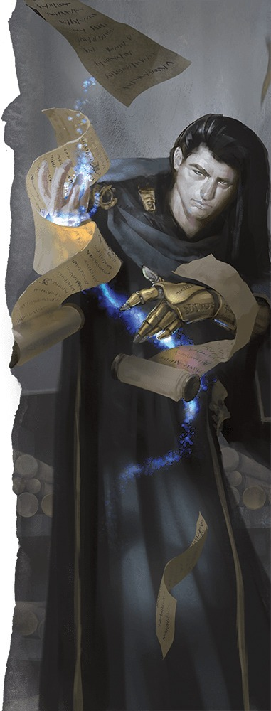

### Manshoon Simulacrum

Manshoon uses the [*simulacrum*](https://www.dndbeyond.com/spells/2253-simulacrum) spell to create a magical duplicate of himself as needed. He has customized the spell to increase his simulacrum’s hit points at the expense of its spellcasting ability.

Manshoon can have only one simulacrum at any given time, and he uses it as a subordinate to command his Zhentarim minions in the field. If his simulacrum is destroyed, Manshoon creates another. Each simulacrum has the statistics of [**Manshoon**](https://www.dndbeyond.com/monsters/148481-manshoon), with these changes:

*   The simulacrum has no special equipment. Consequently, it has AC 12 and lacks the Magic Resistance trait and the [*Staff of Power*](https://www.dndbeyond.com/magic-items/4764-staff-of-power) action option.
*   It loses all spell slots of 6th level and higher.
*   It has a challenge rating of 8 (3,900 XP).

### Martial Arts Adept

Martial arts adepts are disciplined monks who have extensive training in hand-to-hand combat. Some protect monasteries; others travel the world seeking enlightenment or new forms of combat to master. A few become bodyguards, trading their combat prowess and loyalty for food and lodging.

> [Martial Arts Adept](https://www.dndbeyond.com/monsters/17337-martial-arts-adept) 
> Medium humanoid (any race), any alignment
>
> ---
> **Armor Class**  16
> **Hit Points**  60 (11d8 + 11)
> **Speed**   40 ft.
> |STR|DEX|CON|INT|WIS|CHA|
> |-|-|-|-|-|-|
> |11 (+0)|17 (+3)|13 (+1)|11 (+0)|16 (+3)|10 (+0)|
>
> ---
> **Skills** [Acrobatics](https://www.dndbeyond.com/sources/dnd/free-rules/playing-the-game#Skills) +5, [Insight](https://www.dndbeyond.com/sources/dnd/free-rules/playing-the-game#Skills) +5, [Stealth](https://www.dndbeyond.com/sources/dnd/free-rules/playing-the-game#Skills) +5
> **Senses** passive Perception 13
> **Languages** any one language (usually Common)
> **Challenge** 3 (700 XP)
>
> ---
> ***Unarmored Defense.*** While the adept is wearing no armor and wielding no shield, its AC includes its Wisdom modifier.
>
> Actions
> ---
> ***Multiattack.*** The adept makes three unarmed strikes or three dart attacks.
>
> ***Unarmed Strike.*** *Melee Weapon Attack: *+5 to hit, reach 5 ft., one target. *Hit:* 7 (1d8 + 3) bludgeoning damage. If the target is a creature, the adept can choose one of the following additional effects:
>
> * The target must succeed on a DC 13 Strength saving throw or drop one item it is holding (adept’s choice).
> * The target must succeed on a DC 13 Dexterity saving throw or be knocked [prone](https://www.dndbeyond.com/sources/dnd/free-rules/rules-glossary#ProneCondition).
> * The target must succeed on a DC 13 Constitution saving throw or be [stunned](https://www.dndbeyond.com/sources/dnd/free-rules/rules-glossary#StunnedCondition) until the end of the adept’s next turn.
>
> ***Dart.*** *Ranged Weapon Attack:* +5 to hit, range 20/60 ft., one target. *Hit:* 5 (1d4 + 3) piercing damage.
>
> Reactions
> ---
> ***Deflect Missile.*** In response to being hit by a ranged weapon attack, the adept deflects the missile. The damage it takes from the attack is reduced by 1d10 + 3. If the damage is reduced to 0, the adept catches the missile if it’s small enough to hold in one hand and the adept has a hand free.

### Meloon Wardragon

Meloon is a handsome, formidable warrior in his prime, who serves the goddess Tymora and loves a good fight. His friends — among them Renaer Neverember and Vajra Safahr — describe him as honest, optimistic, and extraordinarily lucky. Until recently, he was a member of Force Grey and reported directly to the Blackstaff. In recent months, Meloon has spent much of his time at the Yawning Portal.

Three months ago, out of boredom, Meloon accompanied a fledgling band of adventurers on an expedition to Undermountain. There, his luck ran out. While resting in the dungeon, the adventuring party was attacked by monsters unleashed by Xanathar — including a number of intellect devourers. One of the creatures succeeded in magically devouring and replacing Meloon’s brain, turning the champion of Tymora into a puppet. After finishing off his unsuspecting companions, Meloon returned to Waterdeep as a Xanathar Guild spy.

The intellect devourer that inhabits Meloon’s skull was bred by Nihiloor, a mind flayer in Xanathar’s employ. It knows everything Meloon knew, and Meloon behaves much as he did before his descent into Undermountain. He hangs out at the Yawning Portal, tries to bond with adventurers, and offers a helping hand whenever doing so feels appropriate. The intellect devourer’s primary goals are to steer adventurers away from Undermountain and get them to undertake quests that further the aims of Xanathar. Such quests usually involve the eradication of Xanathar’s enemies, and Meloon is all too eager to fight alongside those who fall for his ruse.

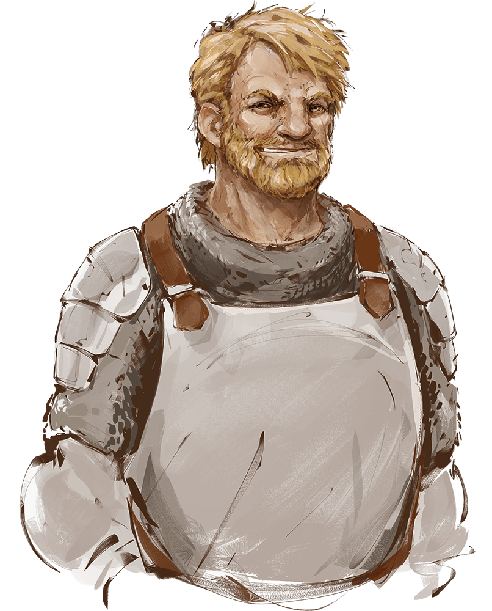

> [Meloon Wardragon](https://www.dndbeyond.com/monsters/148973-meloon-wardragon) 
> Medium humanoid (human), neutral evil
>
> ---
> **Armor Class**  18 (plate)
> **Hit Points**  143 (22d8 + 44)
> **Speed**   30 ft.
> |STR|DEX|CON|INT|WIS|CHA|
> |-|-|-|-|-|-|
> |20 (+5)|15 (+2)|14 (+2)|10 (+0)|14 (+2)|15 (+2)|
>
> ---
> **Saving Throws** Str +9, Con +6
> **Skills** [Athletics](https://www.dndbeyond.com/sources/dnd/free-rules/playing-the-game#Skills) +9, [Survival](https://www.dndbeyond.com/sources/dnd/free-rules/playing-the-game#Skills) +6
> **Senses** [darkvision](https://www.dndbeyond.com/sources/dnd/free-rules/rules-glossary#Darkvision) 60 ft., passive Perception 12
> **Languages** Common, Deep Speech, telepathy 60 ft.
> **Challenge** 9 (5,000 XP)
>
> ---
> ***Special Equipment.*** Meloon wields [*Azuredge*](https://www.dndbeyond.com/magic-items/253562-azuredge) (see [appendix A](./Magic-Items.md#azuredge)) but can’t attune to it, and thus gains none of its benefits.
>
> ***Indomitable (2/Day).*** Meloon can reroll a saving throw that he fails. He must use the new roll.
>
> ***Second Wind (Recharges after a Short or Long Rest).*** As a bonus action, Meloon can regain 20 hit points.
>
> Actions
> ---
> ***Multiattack.*** Meloon makes four attacks with [*Azuredge*](https://www.dndbeyond.com/magic-items/253562-azuredge).
>
> ***Azuredge.*** *Melee Attack: *+9 to hit, reach 5 ft., one target. *Hit:* 11 (1d12 + 5) slashing damage.

### Adjusted Game Statistics

If Meloon is killed and raised from the dead, his true self is restored and his statistics change as follows:

*   Meloon is neutral good.
*   He loses his telepathy, and his ability to speak and understand Deep Speech.
*   He can attune to [*Azuredge*](https://www.dndbeyond.com/magic-items/253562-azuredge) (see [appendix A](./Magic-Items.md#azuredge)).

### Mirt

Once known as Mirt the Merciless and the Old Wolf, Mirt made a fortune and carved out a reputation as an adventurer and philanderer. Today, an older and wiser Mirt serves as one of the Masked Lords, a Harper, and a close advisor to Laeral Silverhand. The years have not worn him down, and though he has grown soft in the flesh, he remains deceptively strong, vigorous, and clear of mind. Mirt has survived the passing of centuries by means of magic, and of all the Masked Lords, he is the least concerned with concealing his identity.

Despite his prodigious girth, Mirt can move with good speed when he must, and he hasn’t let his adventuring skills wither. His wife, Asper, passed away several years ago, and his rambling mansion has seen better days. Mirt spends his days embroiled in politics and whiles away his nights in drink and debauchery.

### Treasure

Mirt has access to magic items of all kinds, but keeps only a few on his person. He can equip himself with other magic items as the need arises.

In addition to his other magical gear, Mirt owns a [*Lord’s ensemble*](https://www.dndbeyond.com/magic-items/254336-lords-ensemble) (see [appendix A](./Magic-Items.md#lords-ensemble)). He dons the ensemble only when meeting with other Masked Lords in an official capacity.

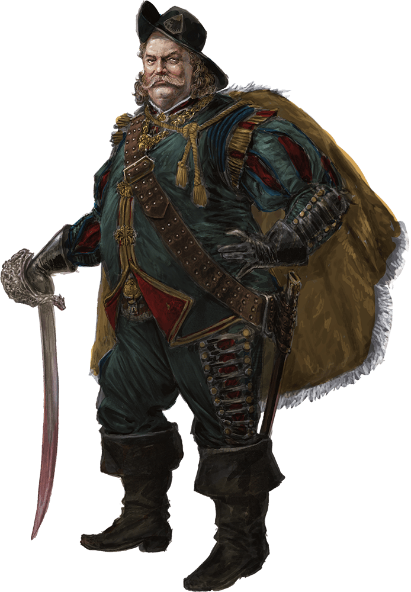

> [Mirt](https://www.dndbeyond.com/monsters/148977-mirt) 
> Medium humanoid (human), chaotic good
>
> ---
> **Armor Class**  16 (_[bracers of defense](https://www.dndbeyond.com/magic-items/4594-bracers-of-defense)_)
> **Hit Points**  153 (18d8 + 72)
> **Speed**   30 ft.
> |STR|DEX|CON|INT|WIS|CHA|
> |-|-|-|-|-|-|
> |18 (+4)|18 (+4)|18 (+4)|15 (+2)|12 (+1)|15 (+2)|
>
> ---
> **Saving Throws** Dex +8, Wis +5
> **Skills** [Acrobatics](https://www.dndbeyond.com/sources/dnd/free-rules/playing-the-game#Skills) +8, [Athletics](https://www.dndbeyond.com/sources/dnd/free-rules/playing-the-game#Skills) +8, [Perception](https://www.dndbeyond.com/sources/dnd/free-rules/playing-the-game#Skills) +5, [Persuasion](https://www.dndbeyond.com/sources/dnd/free-rules/playing-the-game#Skills) +6, [Stealth](https://www.dndbeyond.com/sources/dnd/free-rules/playing-the-game#Skills) +8
> **Senses** passive Perception 15
> **Languages** Common, Dwarvish
> **Challenge** 9 (5,000 XP)
>
> ---
> ***Special Equipment.*** Mirt wears [*bracers of defense*](https://www.dndbeyond.com/magic-items/4594-bracers-of-defense) and a [*ring of regeneration*](https://www.dndbeyond.com/magic-items/4727-ring-of-regeneration). He wields a *+1 longsword* and a *+1 dagger*.
>
> ***Brute.*** A melee weapon deals one extra die of its damage when Mirt hits with it (included in the attacks below).
>
> ***Evasion.*** If he is subjected to an effect that allows him to make a Dexterity saving throw to take only half damage, Mirt instead takes no damage if he succeeds on the saving throw, and only half damage if he fails. He can’t use this trait if he’s [incapacitated](https://www.dndbeyond.com/sources/dnd/free-rules/rules-glossary#IncapacitatedCondition).
>
> ***Sneak Attack (1/Turn).*** Mirt deals an extra 14 (4d6) damage when he hits a target with a weapon attack and has advantage on the attack roll, or when the target is within 5 feet of an ally of Mirt’s that isn’t [incapacitated](https://www.dndbeyond.com/sources/dnd/free-rules/rules-glossary#IncapacitatedCondition) and Mirt doesn’t have disadvantage on the attack roll.
>
> Actions
> ---
> ***Multiattack.*** Mirt makes three attacks: two with his *+1 longsword* and one with his *+1 dagger*.
>
> ***+1 Longsword.*** *Melee Weapon Attack: *+9 to hit, reach 5 ft., one target. *Hit:* 14 (2d8 + 5) slashing damage, or 16 (2d10 + 5) slashing damage when used with two hands.
>
> ***+1 Dagger.*** *Melee or Ranged Weapon Attack:* +9 to hit, reach 5 ft. or range 20/60 ft., one target. *Hit:* 10 (2d4 + 5) piercing damage when used as a melee weapon, or 7 (1d4 + 5) piercing damage when used as a ranged weapon.
>
> Reactions
> ---
> ***Parry.*** Mirt adds 2 to his AC against one melee attack that would hit him. To do so, Mirt must see the attacker and be wielding a melee weapon.

### Nar’l Xibrindas

Xanathar’s advisor is a nervous and conniving male drow named Nar’l Xibrindas. Nar’l’s house was wiped out long ago, but he and his elder brother [Soluun](https://www.dndbeyond.com/monsters/280387-soluun-xibrindas) survived and joined Bregan D’aerthe. A year ago, Nar’l was given the difficult task of infiltrating the Xanathar Guild and getting as close to the beholder as possible. Not only did he succeed, but in the course of gaining Xanathar’s trust, he managed to convince the beholder to eliminate its other advisors. The beholder’s paranoia will eventually cause Xanathar to question the drow’s loyalty, though, and Nar’l has become increasingly worried about his future. If forced to decide between himself and Bregan D’aerthe, he’ll choose the former and betray his drow allies to save his own skin.

Xanathar is aware that something is off with Nar’l, and recently assigned him a [**grell**](https://www.dndbeyond.com/monsters/17157-grell) bodyguard. The grell has instructions to dispose of Nar’l at the first sign of disloyalty.

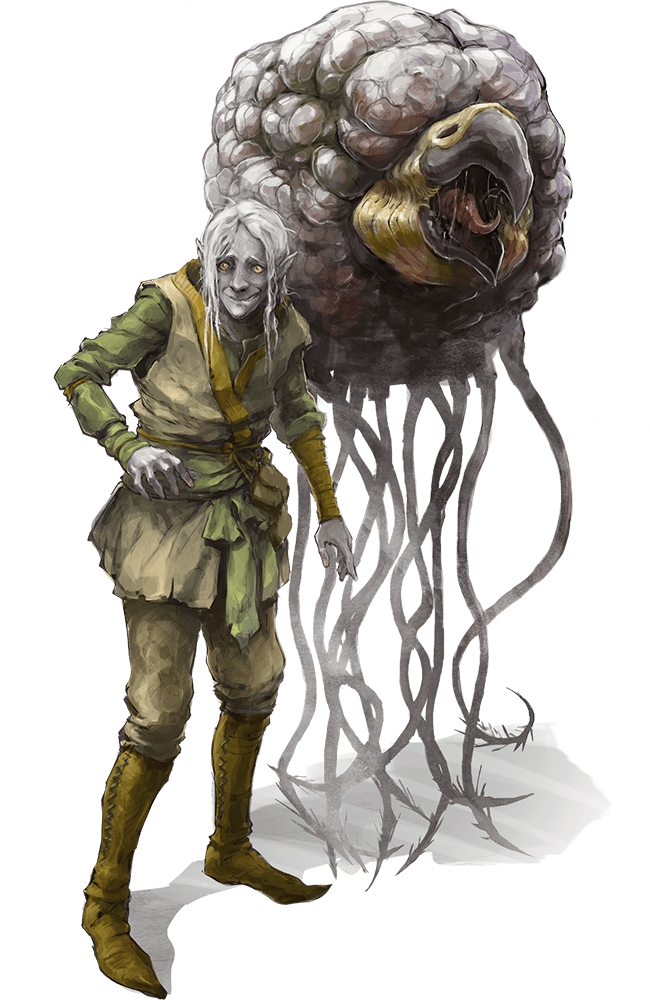
*Nar'l Xibrindas and Grell Bodyguard*

#### Game Statistics

Nar’l Xibrindas is a [**drow mage**](https://www.dndbeyond.com/monsters/17135-drow-mage). He prepares and casts the *[sending](https://www.dndbeyond.com/spells/2243-sending) *spell whenever he needs to communicate with his brother. In addition to his other gear, Nar’l carries a vial containing three doses of eyescratch, a contact poison. A creature that comes into contact with the poison must succeed on a DC 14 Constitution saving throw or be [poisoned](https://www.dndbeyond.com/sources/dnd/free-rules/rules-glossary#PoisonedCondition) for 1 hour and [blinded](https://www.dndbeyond.com/sources/dnd/free-rules/rules-glossary#BlindedCondition) while [poisoned](https://www.dndbeyond.com/sources/dnd/free-rules/rules-glossary#PoisonedCondition) in this way. A [*lesser restoration*](https://www.dndbeyond.com/spells/2164-lesser-restoration) spell or similar magic ends the effect.

### Nihiloor

The illithid Nihiloor works for Xanathar, spending its days creating intellect devourers and setting them loose in the sewers of Waterdeep. Each intellect devourer attacks the first humanoid it encounters, using its victim as a puppet to spy on the city and relay information back to Nihiloor. Occasionally, an intellect devourer is instructed to seek out a particular kind of target, such as a member of the City Guard or the City Watch. Sometimes its instructions will include orders to capture specific Waterdavians and bring them to Skullport, where they can be enslaved or ransomed.

Nihiloor has an alien mind, and it considers itself Xanathar’s equal. It has no interest in supplanting the beholder, however, preferring to operate in the shadows and pursue its own fell schemes.

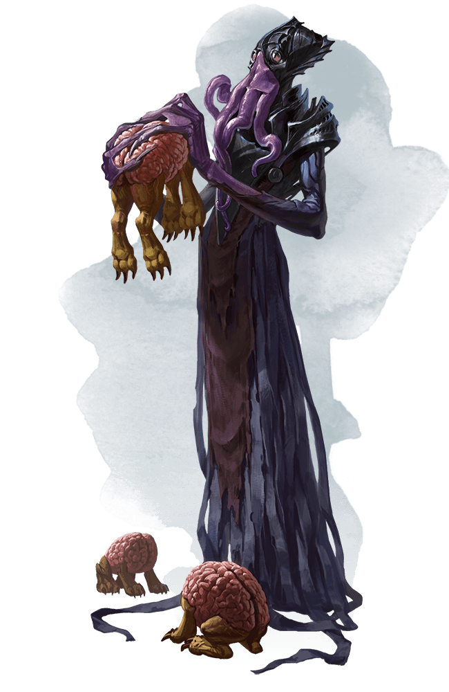

#### Game Statistics

Nihiloor is a [mind flayer](https://www.dndbeyond.com/monsters/17104-mind-flayer).

### Nimblewright

A nimblewright is a magical construct created to serve as a guard or assassin. Composed predominantly of lightweight wood and powered by magic, it can pass for humanoid while wearing clothing. Some nimblewrights wear plain clothing, while others are clad in flashier attire. A nimblewright is emotionless, its face frozen in whatever expression was given to it by its creator.

***Duelist.*** A nimblewright moves like a dancer and fights like a swashbuckler, using dodges and parries to avoid damage while deftly skewering its foes.

***Constructed Nature.*** A nimblewright doesn’t require air, food, drink, or sleep. Damage it takes can be repaired with [*mending*](https://www.dndbeyond.com/spells/2187-mending) spells, but a nimblewright reduced to 0 hit points is permanently destroyed.

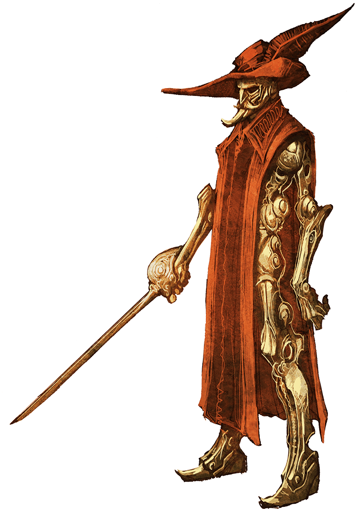

> [Nimblewright](https://www.dndbeyond.com/monsters/148992-nimblewright) 
> Medium construct, unaligned
>
> ---
> **Armor Class**  18 (natural armor)
> **Hit Points**  45 (6d8 + 18)
> **Speed**   60 ft.
> |STR|DEX|CON|INT|WIS|CHA|
> |-|-|-|-|-|-|
> |12 (+1)|18 (+4)|17 (+3)|8 (−1)|10 (+0)|6 (−2)|
>
> ---
> **Saving Throws** Dex +6
> **Skills** [Acrobatics](https://www.dndbeyond.com/sources/dnd/free-rules/playing-the-game#Skills) +8, [Perception](https://www.dndbeyond.com/sources/dnd/free-rules/playing-the-game#Skills) +2
> **Damage Resistances** bludgeoning, piercing, and slashing from nonmagical attacks
> **Condition Immunities** [exhaustion](https://www.dndbeyond.com/sources/dnd/free-rules/rules-glossary#ExhaustionCondition), [frightened](https://www.dndbeyond.com/sources/dnd/free-rules/rules-glossary#FrightenedCondition), [petrified](https://www.dndbeyond.com/sources/dnd/free-rules/rules-glossary#PetrifiedCondition), [poisoned](https://www.dndbeyond.com/sources/dnd/free-rules/rules-glossary#PoisonedCondition)
> **Senses** [darkvision](https://www.dndbeyond.com/sources/dnd/free-rules/rules-glossary#Darkvision) 60 ft., passive Perception 12
> **Languages** understands one language known to its creator but can’t speak
> **Challenge** 4 (1,100 XP)
>
> ---
> ***Magic Resistance.*** The nimblewright has advantage on saving throws against spells and other magical effects.
>
> ***Magic Weapons.*** The nimblewright’s weapon attacks are magical.
>
> ***Repairable.*** As long as it has at least 1 hit point remaining, the nimblewright regains 1 hit point when a [*mending*](https://www.dndbeyond.com/spells/2187-mending) spell is cast on it.
>
> ***Sure-Footed.*** The nimblewright has advantage on Strength and Dexterity saving throws made against effects that would knock it [prone](https://www.dndbeyond.com/sources/dnd/free-rules/rules-glossary#ProneCondition).
>
> Actions
> ---
> ***Multiattack.*** The nimblewright makes three attacks: two with its rapier and one with its dagger.
>
> ***Rapier.*** *Melee Weapon Attack: *+6 to hit, reach 5 ft., one target. *Hit:* 8 (1d8 + 4) piercing damage.
>
> ***Dagger.*** *Melee or Ranged Weapon Attack:* +6 to hit, reach 5 ft. or range 20/60 ft., one target. *Hit:* 6 (1d4 + 4) piercing damage.
>
> Reactions
> ---
> ***Parry.*** The nimblewright adds 2 to its AC against one melee attack that would hit it. To do so, the nimblewright must see the attacker and be wielding a melee weapon.

### Noska Ur’gray

Noska is a ruthless enforcer in the Xanathar Guild. A green slime in Undermountain dissolved his left hand and forearm, and the lost appendage has been replaced with a heavy crossbow that attaches to the stump.

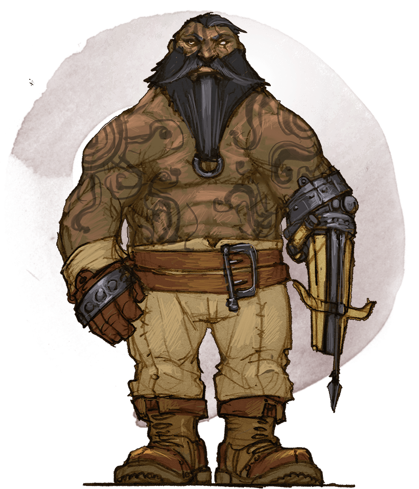

#### Game Statistics

[Noska Ur’gray](https://www.dndbeyond.com/monsters/280407-noska-urgray) is a shield dwarf [**thug**](https://www.dndbeyond.com/monsters/17035-thug), with these changes:

*   Noska is neutral evil.
*   He has these racial traits: His walking speed is 25 feet. He has advantage on saving throws against poison and resistance to poison damage. He has [darkvision](https://www.dndbeyond.com/sources/dnd/free-rules/rules-glossary#Darkvision) out to a range of 60 feet. He speaks Common and Dwarvish.
*   He has disadvantage on Strength checks made to climb, due to his disability.

### Orond Gralhund

The Gralhunds are nobles who trade in arms and mercenaries, and whose family motto is “We see both sides.” [Orond](https://www.dndbeyond.com/monsters/280415-orond-gralhund) is the patriarch, but he’s not a quick-thinking or cultured sort — and deep down, he knows it. He leaves most of the plotting and socializing to his wife, Yalah, to whom he is devoted.

When several of the Masked Lords were assassinated in quick succession some years ago, Lord Gralhund had expected his wife to fill one of the vacancies. That never happened, though, despite many promises and bribes. After she was passed over, Orond became insanely angry, and he has remained that way ever since.

Less than a year ago, the Gralhunds were approached by agents of the Zhentarim loyal to Manshoon, and the nobles formed an alliance with them. House Gralhund gives the Zhents coin and allows them to use the family’s noble villa as a refuge. In exchange, the house reaps all the benefits that the Black Network offers, including intelligence that its spies have gathered. So while the Zhents use House Gralhund as a shield, the Gralhunds are using the Zhents to ascertain the identities and weaknesses of the Masked Lords.

Orond doesn’t fully grasp how entwined the Black Network and his family have become — it is now next to impossible to separate one from the other. It’s no secret in Waterdeep that the Black Network has firmly rooted itself in House Gralhund. But what’s not generally known is that the Zhents in House Gralhund are agents of Manshoon. Neither Orond nor any other member of his family knows about the wizard’s clone. As far as Orond and his wife are concerned, the local leaders of the Black Network (with [Urstul Floxin](https://www.dndbeyond.com/monsters/280435-urstul-floxin) chief among them) reside with them in the family villa.

Orond is a short, stocky man who dresses well and is easy on the eyes. When he opens his mouth, his boorish nature, inflated sense of self-importance, fragile ego, and despicable opinions about “the common rabble” come to the fore, and his charm quickly dissipates. When not in his wife’s company, he is prone to excessive boasting and temper tantrums. When he must speak to strangers, he keeps his half-orc bodyguard Hrabbaz close by, for fear that others might attack and rob him at any moment. While in Yalah’s presence, Orond becomes an altogether different person: quiet, almost timid, and happy to let his wife have the spotlight.

Orond relies on Yalah to manage the Zhentarim. He spends his days watching mercenaries train, paying bills, and ranting about the cost of doing business in the city. Although he is human, Orond was born with a tiefling’s tail. The tail was amputated when he was a young boy, but the scar on his backside remains.

#### Game Statistics

[Orond Gralhund](https://www.dndbeyond.com/monsters/280415-orond-gralhund) is a Tethyrian human [**noble**](https://www.dndbeyond.com/monsters/16966-noble), with these changes:

*   Orond is neutral evil.
*   He has an Intelligence of 9 (−1).
*   Never one to bother learning other languages, he speaks only Common.

### Osvaldo Cassalanter

Ammalia and Victoro Cassalanter traded the soul of their eldest child for power. Stripped of his humanity, Osvaldo was chained up in Cassalanter Villa and slowly transformed into a devil (and an insane one at that). Now a creature of pure evil and hate, he has no hope of regaining what was taken from him.

#### Game Statistics

Osvaldo is a [**chain devil**](https://www.dndbeyond.com/monsters/16822-chain-devil).

### Ott Steeltoes

The dwarf [Ott Steeltoes](https://www.dndbeyond.com/monsters/280417-ott-steeltoes) has the nerve-wracking task of tending to Xanathar’s pet fish, Sylgar. In his spare time, he worships Zuggtmoy, the demon queen of fungi, and cultivates mushrooms, spores, and molds. He wears a leather skullcap stitched with fake beholder eyestalks.

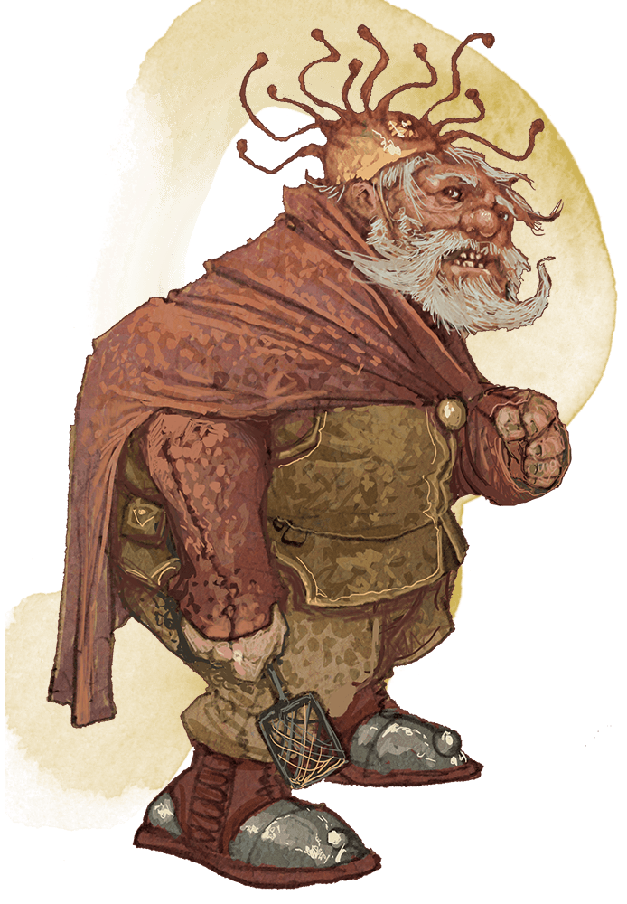

#### Game Statistics

[Ott](https://www.dndbeyond.com/monsters/280417-ott-steeltoes) is a shield dwarf [**cultist**](https://www.dndbeyond.com/monsters/16835-cultist), with these changes:

*   Ott is chaotic evil.
*   He has these racial traits: His walking speed is 25 feet. He has advantage on saving throws against poison and resistance to poison damage. He has [darkvision](https://www.dndbeyond.com/sources/dnd/free-rules/rules-glossary#Darkvision) out to a range of 60 feet. He speaks Common and Dwarvish.
*   He has an Intelligence of 6 (−2) and [Religion](https://www.dndbeyond.com/sources/dnd/free-rules/playing-the-game#Skills) +0.

## Monsters R - W
### Remallia Haventree

Remallia (Remi to her friends) is the lady of House Ulbrinter and a guiding light for the Harpers in Waterdeep. She became an active force for good in the city after assassins killed her husband, Arthagast Ulbrinter, and destroyed his remains. A sun elf, she has two adult children (a half-elf son named Arthius, who is studying music in Silverymoon, and a half-elf daughter named Serenore, who lives on the Moonshae island of Alaron with her husband and daughter). Lady Haventree retains a handful of loyal servants and spies.

Remi holds secret Harper meetings in her villa, which is warded by all manner of spells. She uses a silver raven [*figurine of wondrous power*](https://www.dndbeyond.com/magic-items/5413-figurine-of-wondrous-power) to deliver messages to Harper spies scattered throughout the city.

> [Remallia Haventree](https://www.dndbeyond.com/monsters/149049-remallia-haventree) 
> Medium humanoid (elf), chaotic good
>
> ---
> **Armor Class**  12 (15 with [*mage armor*](https://www.dndbeyond.com/spells/2172-mage-armor))
> **Hit Points**  66 (12d8 + 12)
> **Speed**   30 ft.
> |STR|DEX|CON|INT|WIS|CHA|
> |-|-|-|-|-|-|
> |10 (+0)|14 (+2)|13 (+1)|18 (+4)|15 (+2)|17 (+3)|
>
> ---
> **Saving Throws** Int +8, Wis +6
> **Skills** [Arcana](https://www.dndbeyond.com/sources/dnd/free-rules/playing-the-game#Skills) +8, [Deception](https://www.dndbeyond.com/sources/dnd/free-rules/playing-the-game#Skills) +7, [History](https://www.dndbeyond.com/sources/dnd/free-rules/playing-the-game#Skills) +8, [Persuasion](https://www.dndbeyond.com/sources/dnd/free-rules/playing-the-game#Skills) +7
> **Senses** [darkvision](https://www.dndbeyond.com/sources/dnd/free-rules/rules-glossary#Darkvision) 60 ft., passive Perception 12
> **Languages** Common, Draconic, Dwarvish, Elvish, Halfling
> **Challenge** 9 (5,000 XP)
>
> ---
> ***Special Equipment.*** Remallia has a [*figurine of wondrous power*](https://www.dndbeyond.com/magic-items/5413-figurine-of-wondrous-power) (silver raven).
>
> ***Fey Ancestry.*** Remallia has advantage on saving throws against being [charmed](https://www.dndbeyond.com/sources/dnd/free-rules/rules-glossary#CharmedCondition), and magic can’t put her to sleep.
>
> ***Spellcasting.*** Remallia is a 13th-level spellcaster. Her spellcasting ability is Intelligence (spell save DC 16, +8 to hit with spell attacks). She has the following wizard spells prepared:
>
> Cantrips (at will): [*dancing lights*](https://www.dndbeyond.com/spells/2057-dancing-lights), [*mage hand*](https://www.dndbeyond.com/spells/2173-mage-hand), [*mending*](https://www.dndbeyond.com/spells/2187-mending), [*message*](https://www.dndbeyond.com/spells/2188-message), [ray of frost](https://www.dndbeyond.com/spells/2226-ray-of-frost)
>
> 1st level (4 slots): [*alarm*](https://www.dndbeyond.com/spells/1991-alarm)\*, [*mage armor*](https://www.dndbeyond.com/spells/2172-mage-armor)\*, [*magic missile*](https://www.dndbeyond.com/spells/2176-magic-missile), [*shield*](https://www.dndbeyond.com/spells/2247-shield)\*
>
> 2nd level (3 slots): [*arcane lock*](https://www.dndbeyond.com/spells/2003-arcane-lock)\*, [*invisibility*](https://www.dndbeyond.com/spells/2159-invisibility)
>
> 3rd level (3 slots): [*counterspell*](https://www.dndbeyond.com/spells/2051-counterspell)\*, [*dispel magic*](https://www.dndbeyond.com/spells/2072-dispel-magic)\*, [*fireball*](https://www.dndbeyond.com/spells/2102-fireball)
>
> 4th level (3 slots): [*banishment*](https://www.dndbeyond.com/spells/2010-banishment)\*, [*stoneskin*](https://www.dndbeyond.com/spells/2266-stoneskin)\*
>
> 5th level (2 slots): [*cone of cold*](https://www.dndbeyond.com/spells/2037-cone-of-cold), [*wall of force*](https://www.dndbeyond.com/spells/2292-wall-of-force)
>
> 6th level (1 slot): [*flesh to stone*](https://www.dndbeyond.com/spells/2109-flesh-to-stone), [*globe of invulnerability*](https://www.dndbeyond.com/spells/2124-globe-of-invulnerability)\*
>
> 7th level (1 slot): [*symbol*](https://www.dndbeyond.com/spells/2272-symbol)\*, [*teleport*](https://www.dndbeyond.com/spells/2275-teleport)
>
> *Abjuration spell of 1st level or higher
>
> ***Arcane Ward.*** Remallia has a magical ward that has 30 hit points. Whenever she takes damage, the ward takes the damage instead. If the ward is reduced to 0 hit points, Remallia takes any remaining damage. When Remallia casts an abjuration spell of 1st level or higher, the ward regains a number of hit points equal to twice the level of the spell.
>
> Actions
> ---
> ***Dagger.*** *Melee Weapon Attack: *+6 to hit, reach 5 ft. or range 20/60 ft., one target. *Hit:* 4 (1d4 + 2) piercing damage.

### Renaer Neverember

Renaer is the estranged son of Dagult Neverember, the former Open Lord of Waterdeep and the current Lord of Neverwinter. Father and son detest one another, and Renaer is least happy when he finds himself forced to deal with some mess his father left behind. Qualities that both share include striking good looks, a love of drink, and a flair for diplomacy. What Renaer lacks is his father’s belligerence, ill temper, and bad judgment.

Renaer lives off a sizable inheritance left to him by his mother. Approaching middle age, he has given up adventuring and settled down somewhat. As a Harper, he spends a lot of time defending Waterdavians against those who, like his father, would deprive them of their coin and rights. He owns Neverember House, a four-story residence in the Sea Ward. Renaer spends as little time there as possible, however, since it’s constantly under surveillance by spies loyal to his father. His friends have an open invitation to use the house as they please, while Renaer spends most of his free time in taverns and festhalls.

Some believe that Renaer’s estrangement from his father is nothing but an act, and that anyone who bears the Neverember name is an enemy of Waterdeep. Renaer just shakes his head at such accusations and gets on with his life. He has many powerful friends to watch his back.

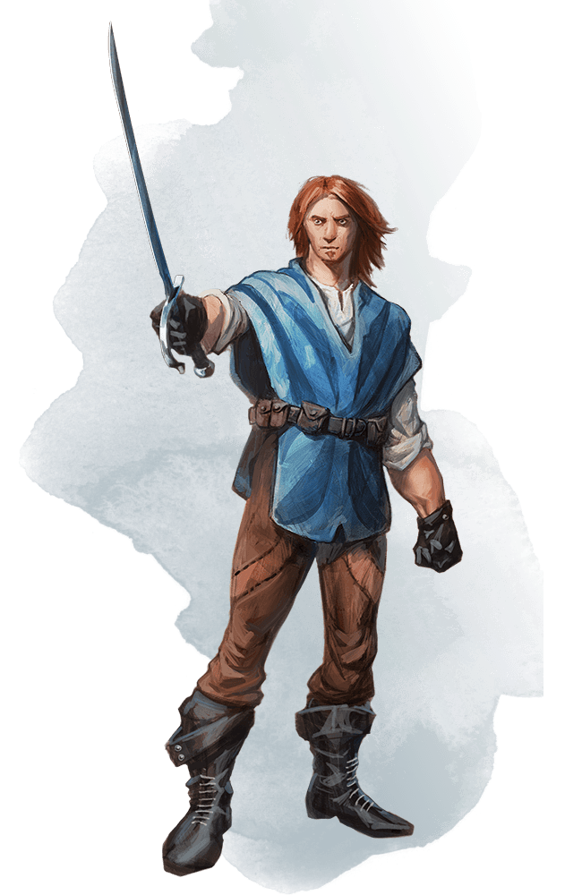

#### Game Statistics

Renaer Neverember is an Illuskan human who has the statistics of a [**swashbuckler**](#swashbuckler) (see below), with these changes:

*   Renaer is chaotic good.
*   He speaks Common.

### Saeth Cromley

Saeth Cromley is a retired sergeant of the City Watch, a likable fellow with a sharp, sarcastic wit. He occasionally comes out of retirement at the request of [Barnibus Blastwind](https://www.dndbeyond.com/monsters/149820-barnibus-blastwind), and he assists the mage in investigating unusual crimes in the city. Cromley helps Barnibus relate to the common folk, and he is good at coaxing information out of them. Though Cromley was once a strict proponent of Watch regulations and dress codes, he has grown a bit lax in both matters now that he’s officially retired.

#### Game Statistics

[Saeth Cromley](https://www.dndbeyond.com/monsters/280428-saeth-cromley) is an Illuskan human [**veteran**](https://www.dndbeyond.com/monsters/17045-veteran), with these changes:

*   Saeth is lawful good.
*   He has a Charisma of 14 and [Intimidation](https://www.dndbeyond.com/sources/dnd/free-rules/playing-the-game#Skills) +4.
*   He speaks Common.

### Swashbuckler

Swashbucklers are charming ne’er-do-wells who live by their own codes of honor. They crave notoriety, often indulge in romantic trysts, and eke out livings as pirates and corsairs, rarely staying in one place for too long.

> [Swashbuckler](https://www.dndbeyond.com/monsters/17340-swashbuckler) 
> Medium humanoid (any race), any non-lawful alignment
>
> ---
> **Armor Class**  17 (leather armor)
> **Hit Points**  66 (12d8 + 12)
> **Speed**   30 ft.
> |STR|DEX|CON|INT|WIS|CHA|
> |-|-|-|-|-|-|
> |12 (+1)|18 (+4)|12 (+1)|14 (+2)|11 (+0)|15 (+2)|
>
> ---
> **Skills** [Acrobatics](https://www.dndbeyond.com/sources/dnd/free-rules/playing-the-game#Skills) +8, [Athletics](https://www.dndbeyond.com/sources/dnd/free-rules/playing-the-game#Skills) +5, [Persuasion](https://www.dndbeyond.com/sources/dnd/free-rules/playing-the-game#Skills) +6
> **Senses** passive Perception 10
> **Languages** any one language (usually Common)
> **Challenge** 3 (700 XP)
>
> ---
> ***Lightfooted.*** The swashbuckler can take the Dash or [Disengage](https://www.dndbeyond.com/sources/dnd/free-rules/rules-glossary#DisengageAction) action as a bonus action on each of its turns.
>
> ***Suave Defense.*** While the swashbuckler is wearing light or no armor and wielding no shield, its AC includes its Charisma modifier.
>
> Actions
> ---
> ***Multiattack.*** The swashbuckler makes three attacks: one with a dagger and two with its rapier.
>
> ***Dagger.*** *Melee or Ranged Weapon Attack: *+6 to hit, reach 5 ft. or range 20/60 ft., one target. *Hit:* 6 (1d4 + 4) piercing damage.
>
> ***Rapier.*** *Melee Weapon Attack: *+6 to hit, reach 5 ft., one target. *Hit:* 8 (1d8 + 4) piercing damage.

### Thorvin Twinbeard

Thorvin serves as Xanathar’s chief engineer and trapsmith. He also serves the Harpers as a paid informant, keeping that faction apprised of Xanathar’s plans as well as he can. Thorvin uses the ruse of maintenance inspections to cover up secret meetings he holds with Harper spies in Skullport and elsewhere.

Thorvin wears iron-rimmed spectacles and carries a large, heavy wrench that doubles as a club. He also carries mason’s tools, smith’s tools, and thieves’ tools, and has proficiency with all three.

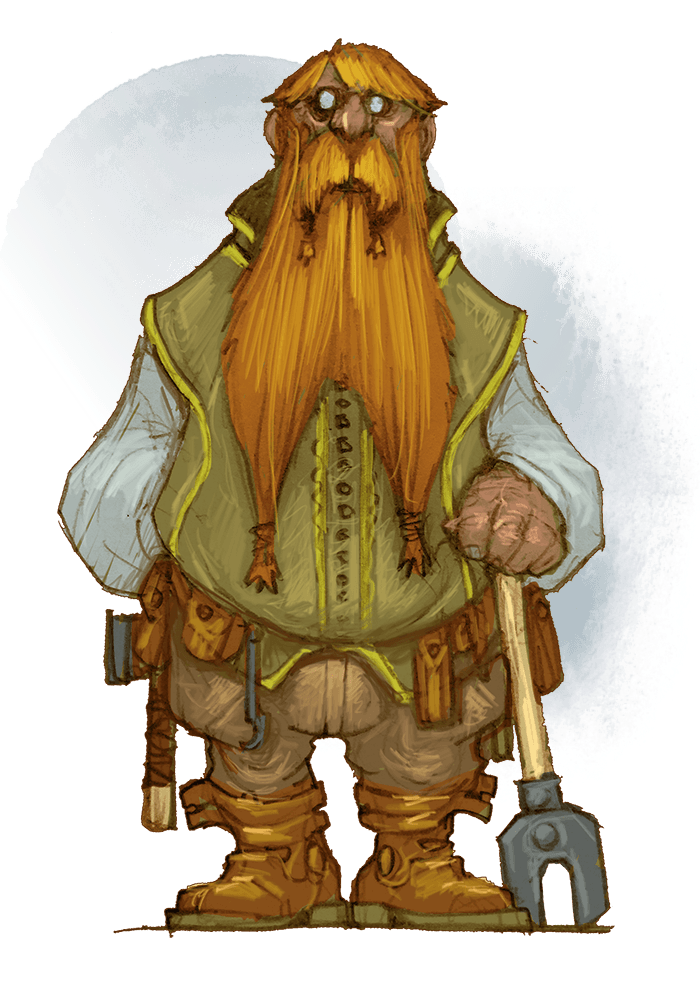

#### Game Statistics

[Thorvin](https://www.dndbeyond.com/monsters/280432-thorvin-twinbeard) is a shield dwarf [**commoner**](https://www.dndbeyond.com/monsters/16829-commoner), with these changes:

*   Thorvin is lawful neutral.
*   He has these racial traits: His walking speed is 25 feet. He has advantage on saving throws against poison and resistance to poison damage. He has [darkvision](https://www.dndbeyond.com/sources/dnd/free-rules/rules-glossary#Darkvision) out to a range of 60 feet. He speaks Common and Dwarvish.
*   He has an Intelligence of 16 (+3).

### Urstul Floxin

Urstul Floxin works for Manshoon, and he is the highest-ranking member of the Zhentarim squad stationed at House Gralhund. Urstul is a glorified thug with all the charm and breeding of a snake, but the Gralhunds tolerate him because he feeds them useful information culled from his spies throughout the city. Urstul takes his orders from Manshoon’s current simulacrum, which comes and goes from House Gralhund by way of a [*teleportation circle*](https://www.dndbeyond.com/spells/2276-teleportation-circle) (connected to the circle in Kolat Towers).

Urstul is a large, heavyset man in his forties. He storms about House Gralhund like he owns the place. He has a collection of black **[flying snake](https://www.dndbeyond.com/monsters/16864-flying-snake)s **that he uses as couriers to deliver messages to underlings throughout the city.

#### Game Statistics

[Urstul Floxin](https://www.dndbeyond.com/monsters/280435-urstul-floxin) is an Illuskan human [**assassin**](https://www.dndbeyond.com/monsters/16790-assassin), with these changes:

*   Urstul is lawful evil.
*   He speaks Common and Orc and knows thieves’ cant.

### Vajra Safahr

Vajra is a capable wizard in her mid-thirties, the youngest person ever to hold the position of Blackstaff. As the High Wizard of Waterdeep, she is charged with using all the magic and resources at her disposal to defend the city against threats. She was handpicked for the job by Khelben Arunsun, and wields the [*Blackstaff*](https://www.dndbeyond.com/magic-items/253576-blackstaff) from which Khelben derived his name and the title of the office. Vajra isn’t the city’s most powerful wizard, but she can hold her own. Despite her many gifts, she still questions her ability to meet the demands of her role, and she rarely makes a decision without first soliciting the advice of the [*Blackstaff*](https://www.dndbeyond.com/magic-items/253576-blackstaff), which contains Khelben Arunsun’s spirit as well as the spirits of all the other Blackstaffs who preceded her. She also gets intelligence from many other sources, both through her own network of spies and from Harper agents.

Vajra runs Blackstaff Academy, a school for mages, out of Blackstaff Tower in the Castle Ward. She is also in charge of Force Grey, an order of highly skilled adventurers who are called upon to defend the city in times of need. Vajra is always looking for new adventurers to fill the ranks of Force Grey, and she is particularly interested in those who can bring unique skills, abilities, or spells to the mix.

Several of the older and more seasoned wizards in Waterdeep consider Vajra an upstart, but they are smart enough not to challenge her. Only the Open Lord, currently Laeral Silverhand, can strip Vajra of her title.

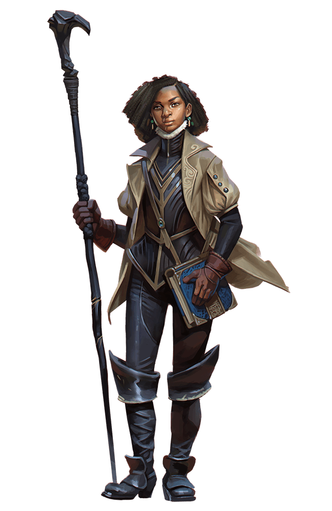

> [Vajra Safahr](https://www.dndbeyond.com/monsters/149116-vajra-safahr) 
> Medium humanoid (human), lawful neutral
>
> ---
> **Armor Class**  14 (_[Blackstaff](https://www.dndbeyond.com/magic-items/253576-blackstaff)_; 17 with [*mage armor*](https://www.dndbeyond.com/spells/2172-mage-armor))
> **Hit Points**  126 (23d8 + 23)
> **Speed**   30 ft.
> |STR|DEX|CON|INT|WIS|CHA|
> |-|-|-|-|-|-|
> |10 (+0)|14 (+2)|12 (+1)|20 (+5)|11 (+0)|16 (+3)|
>
> ---
> **Saving Throws** Str +2, Dex +4, Con +3, Int +12, Wis +7, Cha +5
> **Skills** [Arcana](https://www.dndbeyond.com/sources/dnd/free-rules/playing-the-game#Skills) +10, [History](https://www.dndbeyond.com/sources/dnd/free-rules/playing-the-game#Skills) +10
> **Senses** passive Perception 10
> **Languages** Common, Dwarvish, Elvish, Giant, Halfling, Undercommon
> **Challenge** 13 (10,000 XP)
>
> ---
> ***Special Equipment.*** Vajra wields the [*Blackstaff*](https://www.dndbeyond.com/magic-items/253576-blackstaff) (see [appendix A](./Magic-Items.md#blackstaff)), accounted for in her statistics. Roll 2d10 to determine how many charges the staff has remaining.
>
> ***Magic Resistance.*** Vajra has advantage on saving throws against spells and other magical effects.
>
> ***Spellcasting.*** Vajra is an 18th-level spellcaster. Her spellcasting ability is Intelligence (spell save DC 18, +12 to hit with spell attacks). She has the following wizard spells prepared:
>
> Cantrips (at will): [*fire bolt*](https://www.dndbeyond.com/spells/2103-fire-bolt), [*light*](https://www.dndbeyond.com/spells/2166-light), [*mage hand*](https://www.dndbeyond.com/spells/2173-mage-hand), [*message*](https://www.dndbeyond.com/spells/2188-message), [prestidigitation](https://www.dndbeyond.com/spells/2213-prestidigitation)
>
> 1st level (4 slots): [*detect magic*](https://www.dndbeyond.com/spells/2065-detect-magic), [*identify*](https://www.dndbeyond.com/spells/2152-identify), [*mage armor*](https://www.dndbeyond.com/spells/2172-mage-armor), [thunderwave](https://www.dndbeyond.com/spells/2278-thunderwave)
>
> 2nd level (3 slots): [*invisibility*](https://www.dndbeyond.com/spells/2159-invisibility), [misty step](https://www.dndbeyond.com/spells/2195-misty-step), [*web*](https://www.dndbeyond.com/spells/2299-web)
>
> 3rd level (3 slots): [*counterspell*](https://www.dndbeyond.com/spells/2051-counterspell), [fly](https://www.dndbeyond.com/spells/2111-fly), [*sending*](https://www.dndbeyond.com/spells/2243-sending)
>
> 4th level (3 slots): [*banishment*](https://www.dndbeyond.com/spells/2010-banishment), [*fire shield*](https://www.dndbeyond.com/spells/2104-fire-shield), [*stoneskin*](https://www.dndbeyond.com/spells/2266-stoneskin)
>
> 5th level (3 slots): [Bigby’s hand](https://www.dndbeyond.com/spells/2352-bigbys-hand), [*geas*](https://www.dndbeyond.com/spells/2120-geas), [telekinesis](https://www.dndbeyond.com/spells/2273-telekinesis)
>
> 6th level (1 slot): [*chain lightning*](https://www.dndbeyond.com/spells/2024-chain-lightning), [globe of invulnerability](https://www.dndbeyond.com/spells/2124-globe-of-invulnerability)
>
> 7th level (1 slot): [*forcecage*](https://www.dndbeyond.com/spells/2114-forcecage), [prismatic spray](https://www.dndbeyond.com/spells/2214-prismatic-spray)
>
> 8th level (1 slot): [*antimagic field*](https://www.dndbeyond.com/spells/1999-antimagic-field), [power word stun](https://www.dndbeyond.com/spells/2211-power-word-stun)
>
> 9th level (1 slot): [imprisonment](https://www.dndbeyond.com/spells/2154-imprisonment)
>
> Actions
> ---
> ***Blackstaff.*** *Melee Weapon Attack:* +7 to hit, reach 5 ft., one target. *Hit:* 5 (1d6 + 2) bludgeoning damage, or 6 (1d8 + 2) bludgeoning damage when used with two hands. Vajra can expend 1 of the staff’s charges to deal an extra 3 (1d6) force damage on a hit.

### Victoro Cassalanter

The lord of House Cassalanter is a devilishly handsome half-elf who likes coin and power. He and his wife gained both by cutting a deal with Asmodeus — which involved trading away the souls of their three children.

Victoro is a priest of Asmodeus, though his devotion to the Lord of the Nine Hells is a secret known only to his wife and his closest friends. Most Waterdavians know him as a successful banker, philanthropist, and worshiper of Lathander. Some of his business profits go toward feeding and sheltering the poor. But behind this veneer of generosity, Victoro is a self-serving beast.

The soul of Victoro’s eldest son, Osvaldo, is forever lost and can’t be saved. To allay his guilt, Victoro has forged a plan to win back the souls of his young twins, Terenzio and Elzerina. Under the terms of the contract, their souls will be forfeit on their ninth birthdays, and that day is fast approaching. But Victoro can buy his way out of the obligation by providing, as the contract states, “one shy of a million gold coins and the sacrifice of one shy of a hundred unfortunate souls.”

Victoro is well schooled, suave, slow to anger, and blessed with good health, long life, and immunity to disease. He dresses in the latest fashions and walks with a ruby-tipped cane, though not because he needs to. This cane has the magical properties of a [rod of rulership](https://www.dndbeyond.com/magic-items/4747-rod-of-rulership).

> [Victoro Cassalanter](https://www.dndbeyond.com/monsters/149477-victoro-cassalanter) 
> Medium humanoid (half-elf), lawful evil
>
> ---
> **Armor Class**  15 (_[glamoured studded leather](https://www.dndbeyond.com/magic-items/4645-glamoured-studded-leather)_, [*ring of protection*](https://www.dndbeyond.com/magic-items/4726-ring-of-protection))
> **Hit Points**  97 (15d8 + 30)
> **Speed**   30 ft.
> |STR|DEX|CON|INT|WIS|CHA|
> |-|-|-|-|-|-|
> |13 (+1)|13 (+1)|14 (+2)|16 (+3)|17 (+3)|18 (+4)|
>
> ---
> **Saving Throws** Con +6, Wis +7
> **Skills** [History](https://www.dndbeyond.com/sources/dnd/free-rules/playing-the-game#Skills) +7, [Insight](https://www.dndbeyond.com/sources/dnd/free-rules/playing-the-game#Skills) +7, [Persuasion](https://www.dndbeyond.com/sources/dnd/free-rules/playing-the-game#Skills) +8, [Religion](https://www.dndbeyond.com/sources/dnd/free-rules/playing-the-game#Skills) +7
> **Damage Immunities** poison
> **Condition Immunities** [poisoned](https://www.dndbeyond.com/sources/dnd/free-rules/rules-glossary#PoisonedCondition)
> **Senses** [darkvision](https://www.dndbeyond.com/sources/dnd/free-rules/rules-glossary#Darkvision) 60 ft., passive Perception 13
> **Languages** Common, Draconic, Elvish, Infernal
> **Challenge** 10 (5,900 XP)
>
> ---
> ***Special Equipment.*** Victoro wears a *[ring of protection](https://www.dndbeyond.com/magic-items/4726-ring-of-protection) *and [*glamoured studded leather*](https://www.dndbeyond.com/magic-items/4645-glamoured-studded-leather) disguised to look like fine clothing. He carries a [*rod of rulership*](https://www.dndbeyond.com/magic-items/4747-rod-of-rulership) shaped like a ruby-tipped cane.
>
> ***Fey Ancestry.*** Victoro has advantage on saving throws against being [charmed](https://www.dndbeyond.com/sources/dnd/free-rules/rules-glossary#CharmedCondition), and magic can’t put him to sleep.
>
> ***Spellcasting.*** Victoro is a 15th-level spellcaster. His spellcasting ability is Wisdom (spell save DC 15, +7 to hit with spell attacks). Victoro has the following cleric spells prepared:
>
> Cantrips (at will): [*guidance*](https://www.dndbeyond.com/spells/2132-guidance), [*light*](https://www.dndbeyond.com/spells/2166-light), [*mending*](https://www.dndbeyond.com/spells/2187-mending), [*spare the dying*](https://www.dndbeyond.com/spells/2257-spare-the-dying), [thaumaturgy](https://www.dndbeyond.com/spells/2277-thaumaturgy)
>
> 1st level (4 slots): [*charm person*](https://www.dndbeyond.com/spells/2025-charm-person), [*command*](https://www.dndbeyond.com/spells/2032-command), [*detect magic*](https://www.dndbeyond.com/spells/2065-detect-magic), [*disguise self*](https://www.dndbeyond.com/spells/2069-disguise-self), [*protection from evil and good*](https://www.dndbeyond.com/spells/2221-protection-from-evil-and-good), [*sanctuary*](https://www.dndbeyond.com/spells/2237-sanctuary)
>
> 2nd level (3 slots): [*augury*](https://www.dndbeyond.com/spells/2007-augury), [*lesser restoration*](https://www.dndbeyond.com/spells/2164-lesser-restoration), [*mirror image*](https://www.dndbeyond.com/spells/2193-mirror-image), [*pass without trace*](https://www.dndbeyond.com/spells/2201-pass-without-trace), [spiritual weapon](https://www.dndbeyond.com/spells/2263-spiritual-weapon)
>
> 3rd level (3 slots): [*blink*](https://www.dndbeyond.com/spells/2019-blink), [*clairvoyance*](https://www.dndbeyond.com/spells/2028-clairvoyance), [*dispel magic*](https://www.dndbeyond.com/spells/2072-dispel-magic), [*magic circle*](https://www.dndbeyond.com/spells/2174-magic-circle), [protection from energy](https://www.dndbeyond.com/spells/2220-protection-from-energy)
>
> 4th level (3 slots): [*banishment*](https://www.dndbeyond.com/spells/2010-banishment), [*dimension door*](https://www.dndbeyond.com/spells/2068-dimension-door), [*divination*](https://www.dndbeyond.com/spells/2073-divination), [*freedom of movement*](https://www.dndbeyond.com/spells/2116-freedom-of-movement), [*polymorph*](https://www.dndbeyond.com/spells/2209-polymorph)
>
> 5th level (2 slots): [*dominate person*](https://www.dndbeyond.com/spells/2078-dominate-person), [*flame strike*](https://www.dndbeyond.com/spells/2107-flame-strike), [*modify memory*](https://www.dndbeyond.com/spells/2196-modify-memory), [insect plague](https://www.dndbeyond.com/spells/2157-insect-plague)
>
> 6th level (1 slot): [*heal*](https://www.dndbeyond.com/spells/2139-heal)
>
> 7th level (1 slot): [divine word](https://www.dndbeyond.com/spells/2075-divine-word)
>
> 8th level (1 slot): [*earthquake*](https://www.dndbeyond.com/spells/2081-earthquake)
>
> Actions
> ---
> ***Multiattack.*** Victoro makes two attacks with his rapier.
>
> ***Rapier.*** *Melee Weapon Attack:* +5 to hit, reach 5 ft., one target. *Hit:* 5 (1d8 + 1) piercing damage.
>
> ***Cloak of Shadows (2/Day).*** Victoro becomes [invisible](https://www.dndbeyond.com/sources/dnd/free-rules/rules-glossary#InvisibleCondition) until the end of his next turn. He becomes visible early immediately after he attacks or casts a spell.
>
> ***Summon Devil (Recharges after 9 Days).*** Victoro summons a [**barbed devil**](https://www.dndbeyond.com/monsters/16800-barbed-devil). The devil appears in an unoccupied space within 30 feet of Victoro, acts as Victoro’s ally, and can’t summon other devils. It remains for 1 minute, until it or Victoro dies, or until Victoro dismisses it as an action.

### Volothamp Geddarm

The bombastic world traveler Volothamp Geddarm is enjoying some downtime in Waterdeep following a successful book tour promoting his latest work, [Volo’s Guide to Monsters](https://www.dndbeyond.com/compendium/rules/vgtm). He spends most of his free time in the taproom of the Yawning Portal, reuniting with old friends and mulling over his next book project.

Volo has an inflated opinion of himself and his importance in the world, but he’s not without his charm. There is nothing he won’t do to help a friend in need.

> [Volothamp “Volo” Geddarm](https://www.dndbeyond.com/monsters/33269-volothamp-volo-geddarm) 
> Medium humanoid (human), chaotic good
>
> ---
> **Armor Class**  11
> **Hit Points**  31 (7d8)
> **Speed**   30 ft.
> |STR|DEX|CON|INT|WIS|CHA|
> |-|-|-|-|-|-|
> |9 (-1)|12 (+1)|10 (+0)|15 (+2)|11 (+0)|16 (+3)|
>
> ---
> **Saving Throws** Con +2, Wis +2
> **Skills** [Animal Handling](https://www.dndbeyond.com/sources/dnd/free-rules/playing-the-game#Skills) +4, [Arcana](https://www.dndbeyond.com/sources/dnd/free-rules/playing-the-game#Skills) +4, [Deception](https://www.dndbeyond.com/sources/dnd/free-rules/playing-the-game#Skills) +5, [History](https://www.dndbeyond.com/sources/dnd/free-rules/playing-the-game#Skills) +4, [Insight](https://www.dndbeyond.com/sources/dnd/free-rules/playing-the-game#Skills) +2, [Investigation](https://www.dndbeyond.com/sources/dnd/free-rules/playing-the-game#Skills) +4, [Perception](https://www.dndbeyond.com/sources/dnd/free-rules/playing-the-game#Skills) +2, [Performance](https://www.dndbeyond.com/sources/dnd/free-rules/playing-the-game#Skills) +7, [Persuasion](https://www.dndbeyond.com/sources/dnd/free-rules/playing-the-game#Skills) +7, [Sleight of Hand](https://www.dndbeyond.com/sources/dnd/free-rules/playing-the-game#Skills) +3, [Survival](https://www.dndbeyond.com/sources/dnd/free-rules/playing-the-game#Skills) +2
> **Senses** passive Perception 12
> **Languages** Common, Dwarvish, Elvish
> **Challenge** 1/4 (50 XP)
>
> ---
> ***Spellcasting.*** Volo is a 1st-level spellcaster. His spellcasting ability is Intelligence (spell save DC 12, +4 to hit with spell attacks). He has the following wizard spells prepared:
>
> Cantrips (at will): [*friends*](https://www.dndbeyond.com/spells/2308-friends), [*mending*](https://www.dndbeyond.com/spells/2187-mending), [prestidigitation](https://www.dndbeyond.com/spells/2213-prestidigitation)
>
> 1st level (2 slots): [*comprehend languages*](https://www.dndbeyond.com/spells/2035-comprehend-languages), [*detect magic*](https://www.dndbeyond.com/spells/2065-detect-magic), [disguise self](https://www.dndbeyond.com/spells/2069-disguise-self)
>
> Actions
> ---
> ***Dagger.*** *Melee or Ranged Weapon Attack:* +3 to hit, reach 5 ft. or range 20/60 ft., one target. *Hit:* 3 (1d4 + 1) piercing damage.

### Walking Statues of Waterdeep

Scattered throughout Waterdeep are eight enormous statues that can defend the city in times of great peril. Because they are so destructive, the walking statues are used only to fend off armies and seemingly insurmountable foes.

Each statue has a name and a unique appearance (see “[The Walking Statues](./09.Volos-Waterdeep-Enchiridion.md#the-walking-statues),” in chapter 9), but in terms of statistics they are similar. The statue known as the Swordmaiden is too broken to be animated, and only the wielder of the [*Blackstaff*](https://www.dndbeyond.com/magic-items/253576-blackstaff) (see [appendix A](./Magic-Items.md#blackstaff)) can animate the other seven.

***Landmarks.*** Over the years, Waterdavians have built structures around and on top of several of the statues, believing them to be little more than landmarks at this point. In their inanimate state, the statues pose little danger — but any structures attached to a walking statue are destroyed the first time it animates.

***Constructed Nature.*** A walking statue doesn’t require air, food, drink, or sleep.

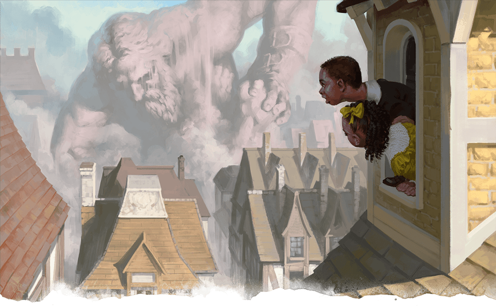

> [Walking Statue of Waterdeep](https://www.dndbeyond.com/monsters/149497-walking-statue-of-waterdeep) 
> Gargantuan construct, unaligned
>
> ---
> **Armor Class**  17 (natural armor)
> **Hit Points**  314 (17d20 + 136)
> **Speed**   60 ft.
> |STR|DEX|CON|INT|WIS|CHA|
> |-|-|-|-|-|-|
> |30 (+10)|8 (-1)|27 (+8)|1 (-5)|10 (+0)|1 (-5)|
>
> ---
> **Saving Throws** Con +14
> **Damage Immunities** cold, fire, poison, psychic; bludgeoning, piercing, and slashing from nonmagical attacks not made with adamantine weapons
> **Condition Immunities** [charmed](https://www.dndbeyond.com/sources/dnd/free-rules/rules-glossary#CharmedCondition), [exhaustion](https://www.dndbeyond.com/sources/dnd/free-rules/rules-glossary#ExhaustionCondition), [frightened](https://www.dndbeyond.com/sources/dnd/free-rules/rules-glossary#FrightenedCondition), [paralyzed](https://www.dndbeyond.com/sources/dnd/free-rules/rules-glossary#ParalyzedCondition), [petrified](https://www.dndbeyond.com/sources/dnd/free-rules/rules-glossary#PetrifiedCondition), [poisoned](https://www.dndbeyond.com/sources/dnd/free-rules/rules-glossary#PoisonedCondition), [stunned](https://www.dndbeyond.com/sources/dnd/free-rules/rules-glossary#StunnedCondition)
> **Senses** [truesight](https://www.dndbeyond.com/sources/dnd/free-rules/rules-glossary#Truesight) 120 ft., passive Perception 10
> **Languages** —
> **Challenge** 18 (20 ,000 XP)
>
> ---
>
> ***Crumbling Colossus.*** When the statue drops to 0 hit points, it crumbles and is destroyed. Any creature on the ground within 30 feet of the crumbling statue must make a DC 22 Dexterity saving throw, taking 22 (4d10) bludgeoning damage on a failed save, or half as much damage on a successful one.
>
> ***Immutable Form.*** The statue is immune to any spell or effect that would alter its form.
>
> ***Magic Resistance.*** The statue has advantage on saving throws against spells and other magical effects.
>
> ***Siege Monster.*** The statue deals double damage to objects and structures.
>
> Actions
> ---
> ***Multiattack.*** The statue makes two melee attacks.
>
> ***Slam.** Melee Weapon Attack:* +16 to hit, reach 5 ft., one target. *Hit:* 29 (3d12 + 10) bludgeoning damage.
>
> ***Hurled Stone.** Ranged Weapon Attack:* +16 to hit, range 200/800 ft., one target. *Hit:* 43 (6d10 + 10) bludgeoning damage.

### Xanathar

Xanathar is the name given to the beholder crime lord that lives in the dungeons under Waterdeep. It isn’t the first beholder to claim this mantle, nor will it be the last.

Like all beholders, Xanathar is a paranoid tyrant that charms and bullies its minions into servitude. The Xanathar Guild is made up of some of Waterdeep’s most disreputable folk, as well as monsters forced into subservience or drawn to the beholder by the promise of treasure, food, or power. Treachery within the ranks of the guild is common as servants vie for the beholder’s favor and affection. Such boons are fleeting, though, as the beholder is quick to distrust those who finagle their way into its good graces.

Xanathar lives in a dungeon under Skullport, a subterranean settlement connected to Undermountain’s third level. The place resembles a ramshackle town, built inside a giant cavern connected to an underground river. Members of the Xanathar Guild haunt Skullport’s dilapidated buildings, and flameskulls patrol its streets.

The only creature Xanathar truly cares about aside from itself is a fish, named Sylgar, that it keeps in a large glass tank. Xanathar has minions that look after the fish constantly, but even their ministrations can’t keep such a creature alive forever. Whenever the fish dies, panic spreads through the occupants of the lair as minions try to replace the fish before Xanathar realizes what has happened. Luckily for them, the beholder can’t tell one fish from another.

Xanathar is extremely fond of gold. A few years ago, its spies stole the [*Stone of Golorr*](https://www.dndbeyond.com/magic-items/254348-stone-of-golorr), which contained information that led to the discovery of a dwarven vault under Waterdeep. Xanathar was able to open the vault, but was forced out by the dragon inside the place. Recently, someone stole the [*Stone of Golorr*](https://www.dndbeyond.com/magic-items/254348-stone-of-golorr) from where it was hidden inside its lair, and the beholder is convinced that the Black Network is behind the theft.

The beholder is caught up in the unbreakable grip of its own paranoia. It sees enemies everywhere, and lashes out at anyone it suspects of being a Zhentarim spy or assassin. Adventurers who attract its attention by dealing with known or suspected Black Network operatives are quickly branded as enemies that must be destroyed.

#### Game Statistics

Xanathar is a [**beholder**](https://www.dndbeyond.com/monsters/17099-beholder) that wears magic rings on three of its eyestalks. It is attuned to all three rings, which don’t alter the beholder’s challenge rating. It wears a [ring of invisibility](https://www.dndbeyond.com/magic-items/4723-ring-of-invisibility) on its fear ray eyestalk, a [ring of mind shielding](https://www.dndbeyond.com/magic-items/4725-ring-of-mind-shielding) on its sleep ray eyestalk, and a [ring of resistance](https://www.dndbeyond.com/magic-items/5420-ring-of-resistance) (force) on its slowing ray eyestalk.

Xanathar’s beloved fish, Sylgar, has the statistics of a [**quipper**](https://www.dndbeyond.com/monsters/16989-quipper), except that it lacks the Blood Frenzy trait.

### Yalah Gralhund

The lady of House Gralhund is no fool. She has a keen mind and the wisdom to discern friend from foe. She also has a husband who worships her (see “[Orond Gralhund](#OrondGralhund)”) and a house that has the resources of the Black Network at its disposal.

Yalah stays abreast of events in the city, keeps a tight rein on her children, and uses her station and her family’s wealth to pry secrets from the lips of nobles, guildmasters, and commoners alike. Though her previous attempts to become a Masked Lord have been thwarted, she believes it’s only a matter of time until that honor is bestowed on her. Once she knows the identities and secrets of enough Masked Lords, Yalah is confident that she can bribe, blackmail, or extort her way into their ranks. From there, she plans to effect changes in the government that will ensure House Gralhund’s prosperity for generations to come.

Yalah shares the services of a half-orc bodyguard with her husband, although Hrabbaz (see “[Hrabbaz](#Hrabbaz)”) is more loyal to her than to him. She also uses the Zhentarim who are based in House Gralhund as her personal spy network, not realizing that the Zhents’ true master is Manshoon. Most of her dealings are with the Zhent master assassin [Urstul Floxin](https://www.dndbeyond.com/monsters/280435-urstul-floxin) (see “[Urstul Floxin](#UrstulFloxin)”), whom she treats as an underling.

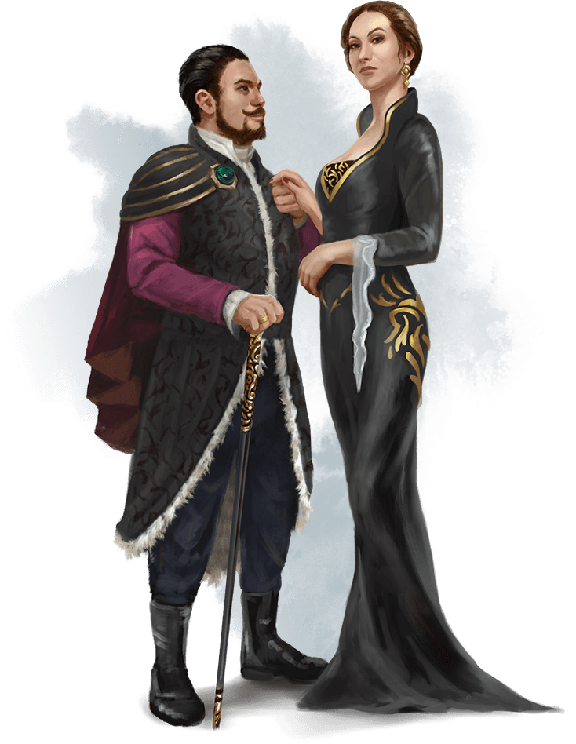

#### Game Statistics

[Yalah Gralhund](https://www.dndbeyond.com/monsters/280438-yalah-gralhund) is a Tethyrian human [**noble**](https://www.dndbeyond.com/monsters/16966-noble), with these changes:

*   Yalah is neutral evil.
*   She has an Intelligence of 16 (+3).
*   She speaks Common and Infernal.
    